# InfraGuard Design Document

## Overview

InfraGuard is an AI-powered AIOps (Artificial Intelligence for IT Operations) tool that provides intelligent infrastructure monitoring and predictive failure detection. The system continuously collects metrics from Prometheus, applies machine learning algorithms to detect statistical anomalies, predicts infrastructure failures before user impact, and automatically creates actionable alerts with contextual runbooks.

### Problem Statement

Traditional infrastructure monitoring relies on static threshold-based alerting (e.g., "alert if CPU > 80%"), which leads to:
- High false positive rates causing alert fatigue
- Missed anomalies that fall within static thresholds but deviate from normal patterns
- Reactive rather than proactive incident response
- Manual ticket creation and runbook lookup during incidents

InfraGuard addresses these challenges by:
- Using unsupervised machine learning to learn dynamic "normal" behavior patterns
- Detecting statistical deviations that static thresholds would miss
- Predicting failures 15 minutes before user impact
- Automating incident tracking and providing contextual remediation guidance

### Key Design Principles

1. **Intelligent Detection**: Replace static thresholds with ML-based anomaly detection
2. **Predictive Analysis**: Forecast failures before they impact users
3. **Automation First**: Minimize manual intervention in incident response
4. **Contextual Alerting**: Provide actionable information with every alert
5. **Operational Simplicity**: Deploy as a single containerized service

## Architecture

### High-Level System Architecture

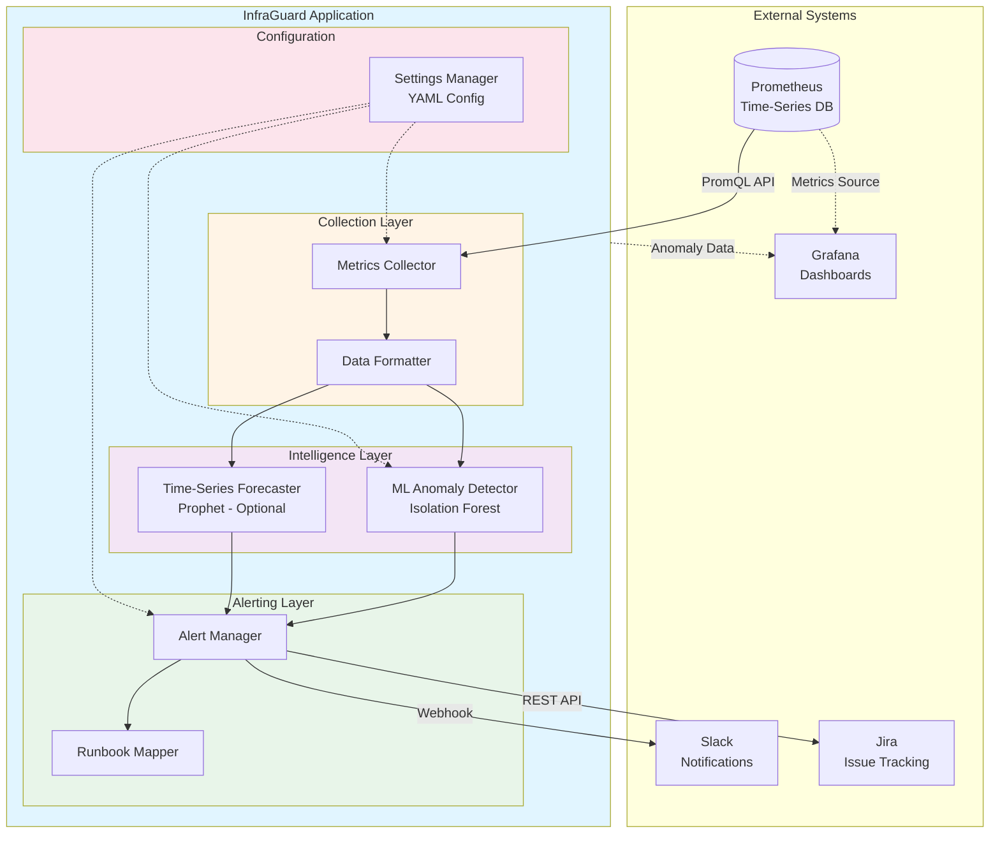

### Component Interaction Sequence

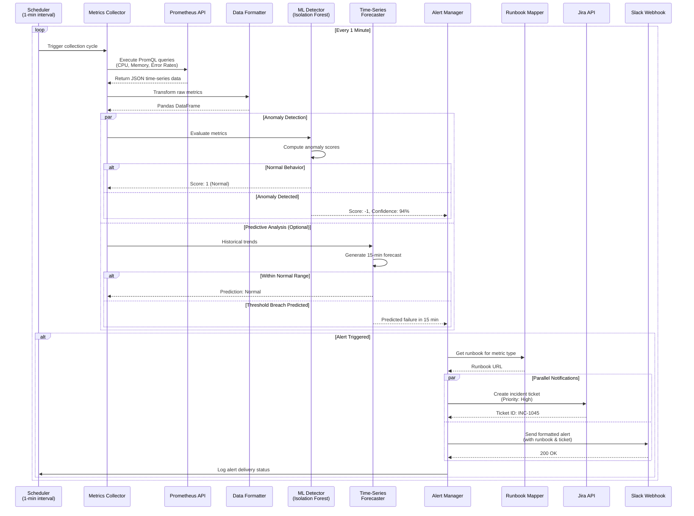

### Data Flow Architecture

```mermaid
flowchart LR
    subgraph Input["Data Input"]
        P1[Prometheus<br/>Metrics]
    end
    
    subgraph Transform["Data Transformation"]
        Q1[PromQL<br/>Queries]
        J1[JSON<br/>Response]
        DF[Pandas<br/>DataFrame]
    end
    
    subgraph Process["Processing Pipeline"]
        direction TB
        N1[Normalize<br/>Timestamps]
        N2[Feature<br/>Engineering]
        N3[Sliding<br/>Window]
    end
    
    subgraph ML["ML Pipeline"]
        direction TB
        T1[Load Pre-trained<br/>Model]
        T2[Compute<br/>Anomaly Scores]
        T3[Apply<br/>Threshold]
    end
    
    subgraph Output["Alert Output"]
        direction TB
        A1[Anomaly<br/>Metadata]
        A2[Runbook<br/>Context]
        A3[Alert<br/>Payload]
    end
    
    subgraph Delivery["Delivery Channels"]
        S1[Slack]
        J2[Jira]
    end
    
    P1 --> Q1
    Q1 --> J1
    J1 --> DF
    DF --> N1
    N1 --> N2
    N2 --> N3
    N3 --> T1
    T1 --> T2
    T2 --> T3
    T3 --> A1
    A1 --> A2
    A2 --> A3
    A3 --> S1
    A3 --> J2
    
    style Input fill:#e3f2fd
    style Transform fill:#fff3e0
    style Process fill:#f3e5f5
    style ML fill:#e8f5e9
    style Output fill:#fce4ec
    style Delivery fill:#fff9c4
```


### ML Pipeline Architecture

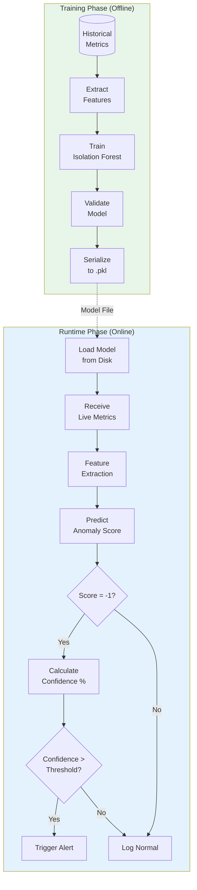

### Alert Routing Flow

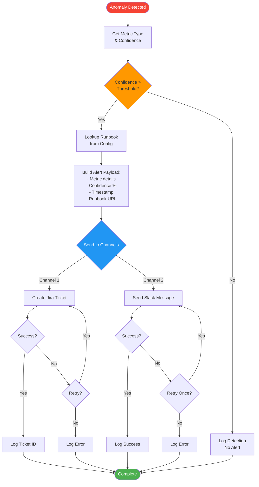

### Deployment Architecture

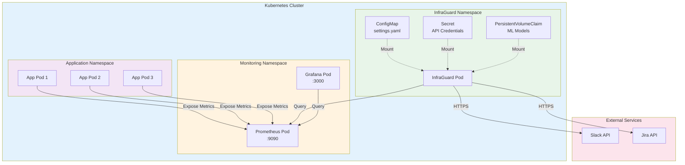

### Local Development Environment

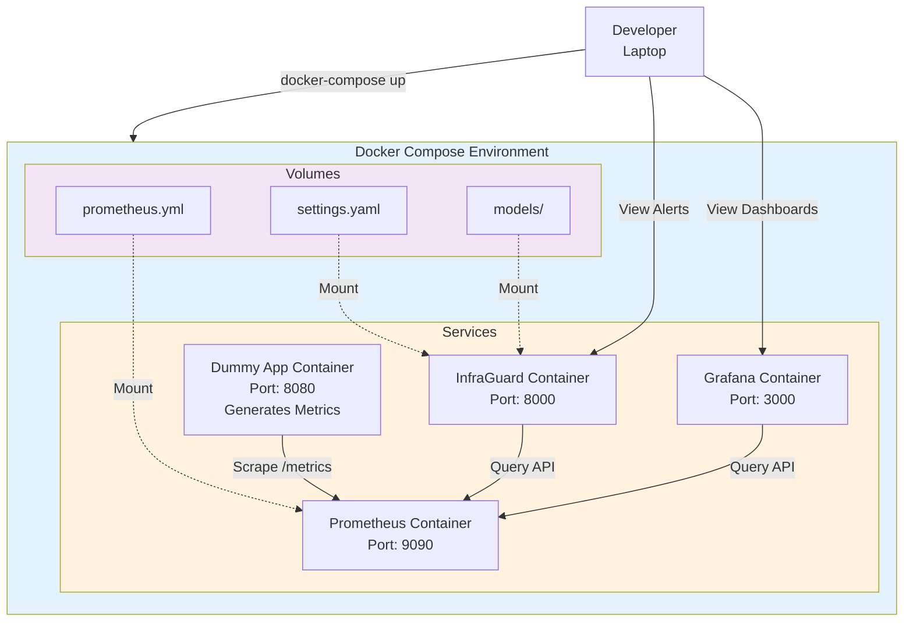

## Components and Interfaces

### 1. Metrics Collector Component

**Module**: `src/collector/prometheus.py`

**Responsibility**: Query Prometheus API and retrieve time-series metrics data.

**Class Structure**:

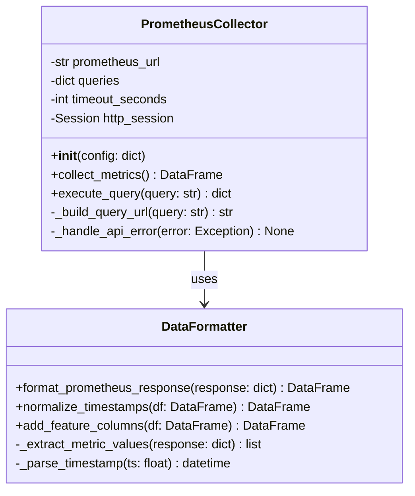

**Interface Specification**:

```python
class PrometheusCollector:
    """
    Collects metrics from Prometheus API using PromQL queries.
    
    Attributes:
        prometheus_url (str): Base URL of Prometheus API (e.g., 'http://prometheus:9090')
        queries (dict): Mapping of metric names to PromQL query strings
        timeout_seconds (int): HTTP request timeout (default: 30)
    """
    
    def __init__(self, config: dict) -> None:
        """
        Initialize the collector with configuration.
        
        Args:
            config: Dictionary containing:
                - prometheus_url: str
                - queries: dict[str, str]
                - timeout: int (optional)
        
        Raises:
            ValueError: If required config fields are missing
        """
        pass
    
    def collect_metrics(self) -> pd.DataFrame:
        """
        Execute all configured PromQL queries and return formatted data.
        
        Returns:
            DataFrame with columns: timestamp, metric_name, value, labels
        
        Raises:
            PrometheusConnectionError: If API is unreachable
            PrometheusQueryError: If query execution fails
        """
        pass
    
    def execute_query(self, query: str) -> dict:
        """
        Execute a single PromQL query.
        
        Args:
            query: PromQL query string
        
        Returns:
            Raw JSON response from Prometheus API
        
        Raises:
            PrometheusQueryError: If query fails
        """
        pass
```

**Example PromQL Queries**:

```python
QUERIES = {
    "cpu_utilization": 'rate(node_cpu_seconds_total{mode!="idle"}[5m])',
    "memory_utilization": 'node_memory_Active_bytes / node_memory_MemTotal_bytes',
    "http_error_rate": 'rate(http_requests_total{status=~"5.."}[5m])',
    "disk_io_wait": 'rate(node_disk_io_time_seconds_total[5m])',
}
```

### 2. Data Formatter Component

**Module**: `src/collector/formatter.py`

**Responsibility**: Transform Prometheus JSON responses into normalized Pandas DataFrames suitable for ML processing.

**Interface Specification**:

```python
class DataFormatter:
    """
    Transforms Prometheus API responses into ML-ready DataFrames.
    """
    
    @staticmethod
    def format_prometheus_response(response: dict) -> pd.DataFrame:
        """
        Convert Prometheus JSON response to DataFrame.
        
        Args:
            response: Raw JSON response from Prometheus API with structure:
                {
                    "status": "success",
                    "data": {
                        "resultType": "matrix",
                        "result": [
                            {
                                "metric": {"__name__": "cpu", "instance": "host1"},
                                "values": [[timestamp, value], ...]
                            }
                        ]
                    }
                }
        
        Returns:
            DataFrame with columns:
                - timestamp: datetime64
                - metric_name: str
                - value: float64
                - instance: str
                - labels: dict
        
        Raises:
            DataFormatError: If response structure is invalid
        """
        pass
    
    @staticmethod
    def normalize_timestamps(df: pd.DataFrame) -> pd.DataFrame:
        """
        Ensure all timestamps are aligned to 1-second precision.
        
        Args:
            df: DataFrame with 'timestamp' column
        
        Returns:
            DataFrame with normalized timestamps
        """
        pass
    
    @staticmethod
    def add_feature_columns(df: pd.DataFrame) -> pd.DataFrame:
        """
        Add derived features for ML model.
        
        Features added:
            - rolling_mean_5m: 5-minute rolling average
            - rolling_std_5m: 5-minute rolling standard deviation
            - rate_of_change: First derivative of value
            - hour_of_day: Hour extracted from timestamp (0-23)
            - day_of_week: Day extracted from timestamp (0-6)
        
        Args:
            df: DataFrame with 'timestamp' and 'value' columns
        
        Returns:
            DataFrame with additional feature columns
        """
        pass
```


### 3. ML Anomaly Detector Component

**Module**: `src/ml/isolation_forest.py`

**Responsibility**: Detect statistical anomalies using the Isolation Forest algorithm.

**Class Structure**:

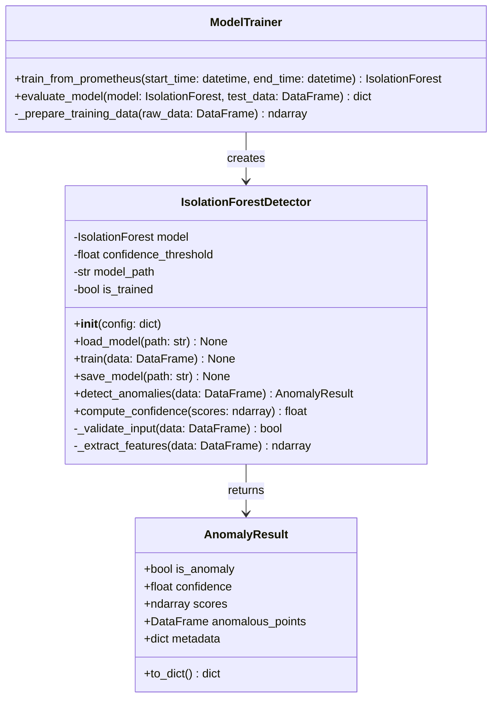

**Interface Specification**:

```python
from sklearn.ensemble import IsolationForest
import numpy as np
import pandas as pd
from dataclasses import dataclass
from typing import Optional

@dataclass
class AnomalyResult:
    """
    Result of anomaly detection.
    
    Attributes:
        is_anomaly: Whether any anomalies were detected
        confidence: Confidence percentage (0-100)
        scores: Raw anomaly scores from model (-1 for anomaly, 1 for normal)
        anomalous_points: DataFrame containing only anomalous data points
        metadata: Additional context (metric names, timestamps, etc.)
    """
    is_anomaly: bool
    confidence: float
    scores: np.ndarray
    anomalous_points: pd.DataFrame
    metadata: dict
    
    def to_dict(self) -> dict:
        """Convert result to dictionary for serialization."""
        return {
            "is_anomaly": self.is_anomaly,
            "confidence": self.confidence,
            "anomalous_count": len(self.anomalous_points),
            "metadata": self.metadata
        }


class IsolationForestDetector:
    """
    Anomaly detector using Isolation Forest algorithm.
    
    The Isolation Forest algorithm works by:
    1. Randomly selecting a feature
    2. Randomly selecting a split value between min and max of that feature
    3. Recursively partitioning the data
    4. Anomalies require fewer splits to isolate (shorter path length)
    
    Attributes:
        model: Trained sklearn IsolationForest instance
        confidence_threshold: Minimum confidence to trigger alerts (0-100)
        model_path: Path to serialized model file
        is_trained: Whether model has been trained/loaded
    """
    
    def __init__(self, config: dict) -> None:
        """
        Initialize detector with configuration.
        
        Args:
            config: Dictionary containing:
                - confidence_threshold: float (default: 85.0)
                - model_path: str (default: 'models/pretrained/isolation_forest.pkl')
                - contamination: float (expected proportion of anomalies, default: 0.1)
                - n_estimators: int (number of trees, default: 100)
                - max_samples: int (samples per tree, default: 256)
                - random_state: int (for reproducibility, default: 42)
        """
        self.confidence_threshold = config.get('confidence_threshold', 85.0)
        self.model_path = config.get('model_path', 'models/pretrained/isolation_forest.pkl')
        
        # Initialize Isolation Forest with parameters
        self.model = IsolationForest(
            contamination=config.get('contamination', 0.1),
            n_estimators=config.get('n_estimators', 100),
            max_samples=config.get('max_samples', 256),
            random_state=config.get('random_state', 42),
            n_jobs=-1  # Use all CPU cores
        )
        self.is_trained = False
    
    def load_model(self, path: Optional[str] = None) -> None:
        """
        Load pre-trained model from disk.
        
        Args:
            path: Path to .pkl file (uses self.model_path if None)
        
        Raises:
            FileNotFoundError: If model file doesn't exist
            ModelLoadError: If model file is corrupted
        """
        import pickle
        
        model_file = path or self.model_path
        with open(model_file, 'rb') as f:
            self.model = pickle.load(f)
        self.is_trained = True
    
    def train(self, data: pd.DataFrame) -> None:
        """
        Train the Isolation Forest model on historical data.
        
        Args:
            data: DataFrame with feature columns (from DataFormatter.add_feature_columns)
                Expected columns:
                    - value: float
                    - rolling_mean_5m: float
                    - rolling_std_5m: float
                    - rate_of_change: float
                    - hour_of_day: int
                    - day_of_week: int
        
        Raises:
            ValueError: If data is empty or missing required columns
        """
        if not self._validate_input(data):
            raise ValueError("Invalid training data")
        
        features = self._extract_features(data)
        self.model.fit(features)
        self.is_trained = True
    
    def save_model(self, path: Optional[str] = None) -> None:
        """
        Serialize trained model to disk.
        
        Args:
            path: Path to save .pkl file (uses self.model_path if None)
        
        Raises:
            RuntimeError: If model hasn't been trained
        """
        if not self.is_trained:
            raise RuntimeError("Cannot save untrained model")
        
        import pickle
        
        model_file = path or self.model_path
        with open(model_file, 'wb') as f:
            pickle.dump(self.model, f)
    
    def detect_anomalies(self, data: pd.DataFrame) -> AnomalyResult:
        """
        Detect anomalies in incoming metrics data.
        
        Args:
            data: DataFrame with same structure as training data
        
        Returns:
            AnomalyResult containing detection results
        
        Raises:
            RuntimeError: If model hasn't been trained/loaded
            ValueError: If data is invalid
        """
        if not self.is_trained:
            raise RuntimeError("Model must be trained or loaded before detection")
        
        if not self._validate_input(data):
            raise ValueError("Invalid input data")
        
        features = self._extract_features(data)
        
        # Predict: -1 for anomalies, 1 for normal points
        predictions = self.model.predict(features)
        
        # Get anomaly scores (more negative = more anomalous)
        scores = self.model.score_samples(features)
        
        # Identify anomalous points
        anomaly_mask = predictions == -1
        anomalous_points = data[anomaly_mask].copy()
        anomalous_points['anomaly_score'] = scores[anomaly_mask]
        
        # Compute confidence percentage
        confidence = self.compute_confidence(scores[anomaly_mask]) if anomaly_mask.any() else 0.0
        
        return AnomalyResult(
            is_anomaly=anomaly_mask.any(),
            confidence=confidence,
            scores=scores,
            anomalous_points=anomalous_points,
            metadata={
                'total_points': len(data),
                'anomalous_count': anomaly_mask.sum(),
                'threshold': self.confidence_threshold
            }
        )
    
    def compute_confidence(self, scores: np.ndarray) -> float:
        """
        Convert anomaly scores to confidence percentage.
        
        Isolation Forest scores are negative (more negative = more anomalous).
        We normalize to 0-100 scale where 100 = highest confidence anomaly.
        
        Args:
            scores: Array of anomaly scores from model
        
        Returns:
            Confidence percentage (0-100)
        """
        if len(scores) == 0:
            return 0.0
        
        # Get the most anomalous score (most negative)
        min_score = np.min(scores)
        
        # Normalize to 0-100 scale
        # Typical scores range from -0.5 (very anomalous) to 0.5 (normal)
        # We map -0.5 -> 100, 0 -> 50, 0.5 -> 0
        confidence = max(0, min(100, (0.5 - min_score) * 100))
        
        return confidence
    
    def _validate_input(self, data: pd.DataFrame) -> bool:
        """Validate that DataFrame has required columns."""
        required_columns = [
            'value', 'rolling_mean_5m', 'rolling_std_5m',
            'rate_of_change', 'hour_of_day', 'day_of_week'
        ]
        return all(col in data.columns for col in required_columns)
    
    def _extract_features(self, data: pd.DataFrame) -> np.ndarray:
        """Extract feature matrix for model input."""
        feature_columns = [
            'value', 'rolling_mean_5m', 'rolling_std_5m',
            'rate_of_change', 'hour_of_day', 'day_of_week'
        ]
        return data[feature_columns].values
```

**Algorithm Explanation**:

The Isolation Forest algorithm is ideal for anomaly detection because:

1. **Unsupervised**: Doesn't require labeled training data
2. **Efficient**: O(n log n) complexity, suitable for real-time processing
3. **Effective**: Isolates anomalies by exploiting their "few and different" nature

**How it works**:
- Normal points require many random splits to isolate (deep in tree)
- Anomalies require few splits to isolate (shallow in tree)
- Path length to isolate a point indicates its anomaly score


### 4. Time-Series Forecaster Component (Optional)

**Module**: `src/ml/forecaster.py`

**Responsibility**: Predict future metric values to enable proactive alerting.

**Class Structure**:

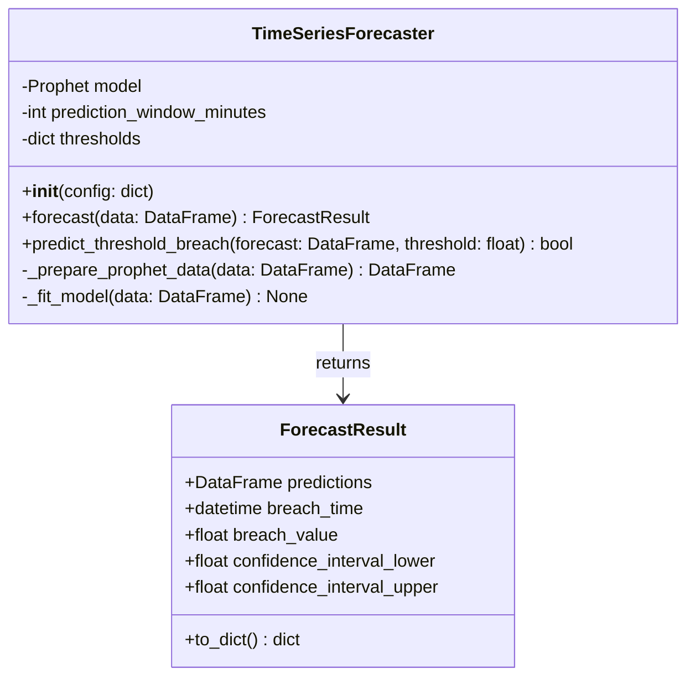

**Interface Specification**:

```python
from prophet import Prophet
import pandas as pd
from dataclasses import dataclass
from typing import Optional
from datetime import datetime, timedelta

@dataclass
class ForecastResult:
    """
    Result of time-series forecasting.
    
    Attributes:
        predictions: DataFrame with columns [ds, yhat, yhat_lower, yhat_upper]
        breach_time: Timestamp when threshold breach is predicted (None if no breach)
        breach_value: Predicted value at breach time
        confidence_interval_lower: Lower bound of prediction confidence interval
        confidence_interval_upper: Upper bound of prediction confidence interval
    """
    predictions: pd.DataFrame
    breach_time: Optional[datetime]
    breach_value: Optional[float]
    confidence_interval_lower: Optional[float]
    confidence_interval_upper: Optional[float]
    
    def to_dict(self) -> dict:
        """Convert result to dictionary for serialization."""
        return {
            "breach_predicted": self.breach_time is not None,
            "breach_time": self.breach_time.isoformat() if self.breach_time else None,
            "breach_value": self.breach_value,
            "confidence_lower": self.confidence_interval_lower,
            "confidence_upper": self.confidence_interval_upper
        }


class TimeSeriesForecaster:
    """
    Forecasts future metric values using Facebook Prophet.
    
    Prophet is designed for business time-series with:
    - Strong seasonal patterns (daily, weekly)
    - Multiple seasons of historical data
    - Missing data and outliers
    - Trend changes
    
    Attributes:
        model: Prophet model instance
        prediction_window_minutes: How far ahead to forecast (default: 15)
        thresholds: Dict mapping metric names to critical threshold values
    """
    
    def __init__(self, config: dict) -> None:
        """
        Initialize forecaster with configuration.
        
        Args:
            config: Dictionary containing:
                - prediction_window_minutes: int (default: 15)
                - thresholds: dict[str, float] (metric name -> threshold value)
                - seasonality_mode: str ('additive' or 'multiplicative', default: 'additive')
                - changepoint_prior_scale: float (flexibility of trend, default: 0.05)
        """
        self.prediction_window_minutes = config.get('prediction_window_minutes', 15)
        self.thresholds = config.get('thresholds', {})
        
        # Initialize Prophet with parameters
        self.model = Prophet(
            seasonality_mode=config.get('seasonality_mode', 'additive'),
            changepoint_prior_scale=config.get('changepoint_prior_scale', 0.05),
            daily_seasonality=True,
            weekly_seasonality=True,
            yearly_seasonality=False  # Not enough data typically
        )
    
    def forecast(self, data: pd.DataFrame, metric_name: str) -> ForecastResult:
        """
        Generate forecast for the next prediction window.
        
        Args:
            data: Historical metrics DataFrame with columns [timestamp, value]
            metric_name: Name of metric being forecasted (for threshold lookup)
        
        Returns:
            ForecastResult containing predictions and breach analysis
        
        Raises:
            ValueError: If data is insufficient for forecasting (< 2 days)
        """
        if len(data) < 2880:  # 2 days at 1-minute intervals
            raise ValueError("Insufficient historical data for forecasting (need >= 2 days)")
        
        # Prepare data in Prophet format
        prophet_data = self._prepare_prophet_data(data)
        
        # Fit model
        self._fit_model(prophet_data)
        
        # Create future dataframe for prediction window
        future = self.model.make_future_dataframe(
            periods=self.prediction_window_minutes,
            freq='T'  # Minute frequency
        )
        
        # Generate forecast
        forecast = self.model.predict(future)
        
        # Extract only future predictions
        future_forecast = forecast.tail(self.prediction_window_minutes)
        
        # Check for threshold breach
        threshold = self.thresholds.get(metric_name)
        breach_time = None
        breach_value = None
        confidence_lower = None
        confidence_upper = None
        
        if threshold is not None:
            breach_mask = future_forecast['yhat'] > threshold
            if breach_mask.any():
                breach_idx = breach_mask.idxmax()
                breach_time = future_forecast.loc[breach_idx, 'ds']
                breach_value = future_forecast.loc[breach_idx, 'yhat']
                confidence_lower = future_forecast.loc[breach_idx, 'yhat_lower']
                confidence_upper = future_forecast.loc[breach_idx, 'yhat_upper']
        
        return ForecastResult(
            predictions=future_forecast,
            breach_time=breach_time,
            breach_value=breach_value,
            confidence_interval_lower=confidence_lower,
            confidence_interval_upper=confidence_upper
        )
    
    def predict_threshold_breach(self, forecast: pd.DataFrame, threshold: float) -> bool:
        """
        Check if any predicted value exceeds threshold.
        
        Args:
            forecast: DataFrame from Prophet with 'yhat' column
            threshold: Critical threshold value
        
        Returns:
            True if breach is predicted, False otherwise
        """
        return (forecast['yhat'] > threshold).any()
    
    def _prepare_prophet_data(self, data: pd.DataFrame) -> pd.DataFrame:
        """
        Convert metrics DataFrame to Prophet format.
        
        Prophet requires columns named 'ds' (datetime) and 'y' (value).
        
        Args:
            data: DataFrame with columns [timestamp, value]
        
        Returns:
            DataFrame with columns [ds, y]
        """
        prophet_data = pd.DataFrame({
            'ds': pd.to_datetime(data['timestamp']),
            'y': data['value']
        })
        return prophet_data
    
    def _fit_model(self, data: pd.DataFrame) -> None:
        """
        Fit Prophet model to historical data.
        
        Args:
            data: DataFrame in Prophet format [ds, y]
        """
        self.model.fit(data)
```

### 5. Alert Manager Component

**Module**: `src/alerter/alert_manager.py`

**Responsibility**: Route anomaly notifications to external systems (Slack, Jira).

**Class Structure**:

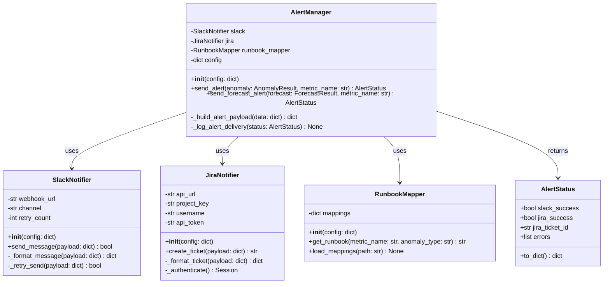

**Interface Specification**:

```python
from dataclasses import dataclass, field
from typing import Optional
import requests
import logging

@dataclass
class AlertStatus:
    """
    Status of alert delivery to external systems.
    
    Attributes:
        slack_success: Whether Slack notification succeeded
        jira_success: Whether Jira ticket creation succeeded
        jira_ticket_id: Jira ticket identifier (e.g., 'INC-1045')
        errors: List of error messages encountered
    """
    slack_success: bool = False
    jira_success: bool = False
    jira_ticket_id: Optional[str] = None
    errors: list = field(default_factory=list)
    
    def to_dict(self) -> dict:
        """Convert status to dictionary for logging."""
        return {
            "slack_success": self.slack_success,
            "jira_success": self.jira_success,
            "jira_ticket_id": self.jira_ticket_id,
            "errors": self.errors
        }


class AlertManager:
    """
    Manages alert routing to external notification systems.
    
    Attributes:
        slack: SlackNotifier instance
        jira: JiraNotifier instance
        runbook_mapper: RunbookMapper instance
        config: Configuration dictionary
    """
    
    def __init__(self, config: dict) -> None:
        """
        Initialize alert manager with configuration.
        
        Args:
            config: Dictionary containing:
                - slack: dict (webhook_url, channel)
                - jira: dict (api_url, project_key, username, api_token)
                - runbooks: dict (metric mappings)
        """
        self.config = config
        self.slack = SlackNotifier(config.get('slack', {}))
        self.jira = JiraNotifier(config.get('jira', {}))
        self.runbook_mapper = RunbookMapper(config.get('runbooks', {}))
        self.logger = logging.getLogger(__name__)
    
    def send_alert(self, anomaly: AnomalyResult, metric_name: str) -> AlertStatus:
        """
        Send anomaly alert to all configured channels.
        
        Args:
            anomaly: AnomalyResult from ML detector
            metric_name: Name of the metric that triggered the anomaly
        
        Returns:
            AlertStatus indicating delivery success/failure
        """
        status = AlertStatus()
        
        # Get runbook URL
        runbook_url = self.runbook_mapper.get_runbook(metric_name, 'anomaly')
        
        # Build alert payload
        payload = self._build_alert_payload({
            'type': 'anomaly',
            'metric_name': metric_name,
            'confidence': anomaly.confidence,
            'anomalous_count': len(anomaly.anomalous_points),
            'metadata': anomaly.metadata,
            'runbook_url': runbook_url
        })
        
        # Send to Jira (first, to get ticket ID)
        try:
            ticket_id = self.jira.create_ticket(payload)
            status.jira_success = True
            status.jira_ticket_id = ticket_id
            payload['jira_ticket_id'] = ticket_id
        except Exception as e:
            self.logger.error(f"Jira ticket creation failed: {e}")
            status.errors.append(f"Jira: {str(e)}")
        
        # Send to Slack
        try:
            slack_success = self.slack.send_message(payload)
            status.slack_success = slack_success
            if not slack_success:
                status.errors.append("Slack: Message delivery failed")
        except Exception as e:
            self.logger.error(f"Slack notification failed: {e}")
            status.errors.append(f"Slack: {str(e)}")
        
        # Log delivery status
        self._log_alert_delivery(status)
        
        return status
    
    def send_forecast_alert(self, forecast: ForecastResult, metric_name: str) -> AlertStatus:
        """
        Send predictive alert for forecasted threshold breach.
        
        Args:
            forecast: ForecastResult from time-series forecaster
            metric_name: Name of the metric being forecasted
        
        Returns:
            AlertStatus indicating delivery success/failure
        """
        status = AlertStatus()
        
        if forecast.breach_time is None:
            self.logger.info("No threshold breach predicted, skipping alert")
            return status
        
        # Get runbook URL
        runbook_url = self.runbook_mapper.get_runbook(metric_name, 'prediction')
        
        # Calculate minutes until breach
        from datetime import datetime
        minutes_until_breach = (forecast.breach_time - datetime.now()).total_seconds() / 60
        
        # Build alert payload
        payload = self._build_alert_payload({
            'type': 'prediction',
            'metric_name': metric_name,
            'breach_time': forecast.breach_time.isoformat(),
            'breach_value': forecast.breach_value,
            'minutes_until_breach': int(minutes_until_breach),
            'confidence_lower': forecast.confidence_interval_lower,
            'confidence_upper': forecast.confidence_interval_upper,
            'runbook_url': runbook_url
        })
        
        # Send to Jira
        try:
            ticket_id = self.jira.create_ticket(payload)
            status.jira_success = True
            status.jira_ticket_id = ticket_id
            payload['jira_ticket_id'] = ticket_id
        except Exception as e:
            self.logger.error(f"Jira ticket creation failed: {e}")
            status.errors.append(f"Jira: {str(e)}")
        
        # Send to Slack
        try:
            slack_success = self.slack.send_message(payload)
            status.slack_success = slack_success
            if not slack_success:
                status.errors.append("Slack: Message delivery failed")
        except Exception as e:
            self.logger.error(f"Slack notification failed: {e}")
            status.errors.append(f"Slack: {str(e)}")
        
        self._log_alert_delivery(status)
        
        return status
    
    def _build_alert_payload(self, data: dict) -> dict:
        """
        Build standardized alert payload.
        
        Args:
            data: Dictionary with alert-specific data
        
        Returns:
            Standardized payload dictionary
        """
        from datetime import datetime
        
        return {
            'timestamp': datetime.now().isoformat(),
            'source': 'InfraGuard',
            **data
        }
    
    def _log_alert_delivery(self, status: AlertStatus) -> None:
        """Log alert delivery status."""
        self.logger.info(f"Alert delivery status: {status.to_dict()}")
```


### 6. Slack Notifier Component

**Module**: `src/alerter/slack.py`

**Interface Specification**:

```python
import requests
import logging
from typing import Optional

class SlackNotifier:
    """
    Sends formatted notifications to Slack via webhook.
    
    Attributes:
        webhook_url: Slack incoming webhook URL
        channel: Target Slack channel (e.g., '#ops-alerts')
        retry_count: Number of retry attempts on failure
    """
    
    def __init__(self, config: dict) -> None:
        """
        Initialize Slack notifier.
        
        Args:
            config: Dictionary containing:
                - webhook_url: str (required)
                - channel: str (optional, default: '#ops-alerts')
                - retry_count: int (optional, default: 1)
        
        Raises:
            ValueError: If webhook_url is missing
        """
        if 'webhook_url' not in config:
            raise ValueError("Slack webhook_url is required")
        
        self.webhook_url = config['webhook_url']
        self.channel = config.get('channel', '#ops-alerts')
        self.retry_count = config.get('retry_count', 1)
        self.logger = logging.getLogger(__name__)
    
    def send_message(self, payload: dict) -> bool:
        """
        Send formatted message to Slack.
        
        Args:
            payload: Alert payload from AlertManager
        
        Returns:
            True if message was delivered successfully, False otherwise
        """
        slack_message = self._format_message(payload)
        
        try:
            response = requests.post(
                self.webhook_url,
                json=slack_message,
                timeout=10
            )
            
            if response.status_code == 200:
                self.logger.info("Slack message sent successfully")
                return True
            else:
                self.logger.error(f"Slack API error: {response.status_code} - {response.text}")
                return self._retry_send(slack_message)
        
        except requests.exceptions.RequestException as e:
            self.logger.error(f"Slack request failed: {e}")
            return self._retry_send(slack_message)
    
    def _format_message(self, payload: dict) -> dict:
        """
        Format alert payload into Slack message blocks.
        
        Args:
            payload: Alert payload dictionary
        
        Returns:
            Slack message with blocks formatting
        """
        alert_type = payload.get('type', 'unknown')
        
        if alert_type == 'anomaly':
            return self._format_anomaly_message(payload)
        elif alert_type == 'prediction':
            return self._format_prediction_message(payload)
        else:
            return self._format_generic_message(payload)
    
    def _format_anomaly_message(self, payload: dict) -> dict:
        """Format anomaly detection alert."""
        metric_name = payload.get('metric_name', 'Unknown')
        confidence = payload.get('confidence', 0)
        anomalous_count = payload.get('anomalous_count', 0)
        runbook_url = payload.get('runbook_url', '')
        jira_ticket_id = payload.get('jira_ticket_id', 'N/A')
        
        # Determine severity emoji
        if confidence >= 95:
            emoji = "🔴"
            severity = "CRITICAL"
        elif confidence >= 85:
            emoji = "⚠️"
            severity = "HIGH"
        else:
            emoji = "⚡"
            severity = "MEDIUM"
        
        return {
            "channel": self.channel,
            "blocks": [
                {
                    "type": "header",
                    "text": {
                        "type": "plain_text",
                        "text": f"{emoji} InfraGuard Anomaly Detected"
                    }
                },
                {
                    "type": "section",
                    "fields": [
                        {
                            "type": "mrkdwn",
                            "text": f"*Severity:*\n{severity}"
                        },
                        {
                            "type": "mrkdwn",
                            "text": f"*Confidence:*\n{confidence:.1f}%"
                        },
                        {
                            "type": "mrkdwn",
                            "text": f"*Metric:*\n`{metric_name}`"
                        },
                        {
                            "type": "mrkdwn",
                            "text": f"*Anomalous Points:*\n{anomalous_count}"
                        }
                    ]
                },
                {
                    "type": "section",
                    "text": {
                        "type": "mrkdwn",
                        "text": f"*Jira Ticket:* {jira_ticket_id}\n*Runbook:* <{runbook_url}|View Remediation Steps>"
                    }
                },
                {
                    "type": "context",
                    "elements": [
                        {
                            "type": "mrkdwn",
                            "text": f"Detected at {payload.get('timestamp', 'N/A')}"
                        }
                    ]
                }
            ]
        }
    
    def _format_prediction_message(self, payload: dict) -> dict:
        """Format predictive alert."""
        metric_name = payload.get('metric_name', 'Unknown')
        minutes_until_breach = payload.get('minutes_until_breach', 0)
        breach_value = payload.get('breach_value', 0)
        runbook_url = payload.get('runbook_url', '')
        jira_ticket_id = payload.get('jira_ticket_id', 'N/A')
        
        return {
            "channel": self.channel,
            "blocks": [
                {
                    "type": "header",
                    "text": {
                        "type": "plain_text",
                        "text": "🔮 InfraGuard Predictive Alert"
                    }
                },
                {
                    "type": "section",
                    "text": {
                        "type": "mrkdwn",
                        "text": f"*Predicted threshold breach in {minutes_until_breach} minutes*"
                    }
                },
                {
                    "type": "section",
                    "fields": [
                        {
                            "type": "mrkdwn",
                            "text": f"*Metric:*\n`{metric_name}`"
                        },
                        {
                            "type": "mrkdwn",
                            "text": f"*Predicted Value:*\n{breach_value:.2f}"
                        }
                    ]
                },
                {
                    "type": "section",
                    "text": {
                        "type": "mrkdwn",
                        "text": f"*Jira Ticket:* {jira_ticket_id}\n*Runbook:* <{runbook_url}|View Proactive Steps>"
                    }
                },
                {
                    "type": "context",
                    "elements": [
                        {
                            "type": "mrkdwn",
                            "text": f"Predicted at {payload.get('timestamp', 'N/A')}"
                        }
                    ]
                }
            ]
        }
    
    def _format_generic_message(self, payload: dict) -> dict:
        """Format generic alert message."""
        return {
            "channel": self.channel,
            "text": f"InfraGuard Alert: {payload}"
        }
    
    def _retry_send(self, message: dict) -> bool:
        """
        Retry sending message once after 10-second delay.
        
        Args:
            message: Slack message dictionary
        
        Returns:
            True if retry succeeded, False otherwise
        """
        import time
        
        if self.retry_count < 1:
            return False
        
        self.logger.info("Retrying Slack message delivery in 10 seconds...")
        time.sleep(10)
        
        try:
            response = requests.post(
                self.webhook_url,
                json=message,
                timeout=10
            )
            
            if response.status_code == 200:
                self.logger.info("Slack message sent successfully on retry")
                return True
            else:
                self.logger.error(f"Slack retry failed: {response.status_code}")
                return False
        
        except requests.exceptions.RequestException as e:
            self.logger.error(f"Slack retry request failed: {e}")
            return False
```

### 7. Jira Notifier Component

**Module**: `src/alerter/jira.py`

**Interface Specification**:

```python
import requests
from requests.auth import HTTPBasicAuth
import logging
from typing import Optional

class JiraNotifier:
    """
    Creates incident tickets in Jira via REST API.
    
    Attributes:
        api_url: Jira instance base URL (e.g., 'https://company.atlassian.net')
        project_key: Jira project key (e.g., 'INC')
        username: Jira username/email
        api_token: Jira API token
    """
    
    def __init__(self, config: dict) -> None:
        """
        Initialize Jira notifier.
        
        Args:
            config: Dictionary containing:
                - api_url: str (required)
                - project_key: str (required)
                - username: str (required)
                - api_token: str (required)
        
        Raises:
            ValueError: If required fields are missing
        """
        required_fields = ['api_url', 'project_key', 'username', 'api_token']
        for field in required_fields:
            if field not in config:
                raise ValueError(f"Jira {field} is required")
        
        self.api_url = config['api_url'].rstrip('/')
        self.project_key = config['project_key']
        self.username = config['username']
        self.api_token = config['api_token']
        self.logger = logging.getLogger(__name__)
    
    def create_ticket(self, payload: dict) -> str:
        """
        Create a Jira incident ticket.
        
        Args:
            payload: Alert payload from AlertManager
        
        Returns:
            Jira ticket identifier (e.g., 'INC-1045')
        
        Raises:
            JiraAPIError: If ticket creation fails
        """
        jira_issue = self._format_ticket(payload)
        
        endpoint = f"{self.api_url}/rest/api/3/issue"
        
        try:
            response = requests.post(
                endpoint,
                json=jira_issue,
                auth=HTTPBasicAuth(self.username, self.api_token),
                headers={"Content-Type": "application/json"},
                timeout=30
            )
            
            if response.status_code == 201:
                ticket_data = response.json()
                ticket_id = ticket_data['key']
                self.logger.info(f"Jira ticket created: {ticket_id}")
                return ticket_id
            else:
                error_msg = f"Jira API error: {response.status_code} - {response.text}"
                self.logger.error(error_msg)
                raise JiraAPIError(error_msg)
        
        except requests.exceptions.RequestException as e:
            error_msg = f"Jira request failed: {e}"
            self.logger.error(error_msg)
            raise JiraAPIError(error_msg)
    
    def _format_ticket(self, payload: dict) -> dict:
        """
        Format alert payload into Jira issue structure.
        
        Args:
            payload: Alert payload dictionary
        
        Returns:
            Jira issue creation payload
        """
        alert_type = payload.get('type', 'unknown')
        
        if alert_type == 'anomaly':
            return self._format_anomaly_ticket(payload)
        elif alert_type == 'prediction':
            return self._format_prediction_ticket(payload)
        else:
            return self._format_generic_ticket(payload)
    
    def _format_anomaly_ticket(self, payload: dict) -> dict:
        """Format anomaly detection ticket."""
        metric_name = payload.get('metric_name', 'Unknown')
        confidence = payload.get('confidence', 0)
        anomalous_count = payload.get('anomalous_count', 0)
        runbook_url = payload.get('runbook_url', '')
        timestamp = payload.get('timestamp', 'N/A')
        
        # Determine priority based on confidence
        if confidence >= 95:
            priority = "Highest"
        elif confidence >= 85:
            priority = "High"
        else:
            priority = "Medium"
        
        summary = f"InfraGuard Anomaly: {metric_name} ({confidence:.1f}% confidence)"
        
        description = f"""
h2. Anomaly Detection Alert

*Metric:* {{code}}{metric_name}{{code}}
*Confidence:* {confidence:.1f}%
*Anomalous Data Points:* {anomalous_count}
*Detected At:* {timestamp}

h3. Remediation Steps

Please refer to the runbook for detailed remediation steps:
[View Runbook|{runbook_url}]

h3. Investigation Checklist

# Review metric graphs in Grafana
# Check application logs for errors
# Verify infrastructure health (CPU, memory, disk)
# Follow runbook procedures
# Update ticket with findings

---
_This ticket was automatically created by InfraGuard AIOps._
        """.strip()
        
        return {
            "fields": {
                "project": {
                    "key": self.project_key
                },
                "summary": summary,
                "description": {
                    "type": "doc",
                    "version": 1,
                    "content": [
                        {
                            "type": "paragraph",
                            "content": [
                                {
                                    "type": "text",
                                    "text": description
                                }
                            ]
                        }
                    ]
                },
                "issuetype": {
                    "name": "Incident"
                },
                "priority": {
                    "name": priority
                },
                "labels": [
                    "infraguard",
                    "anomaly",
                    "automated"
                ]
            }
        }
    
    def _format_prediction_ticket(self, payload: dict) -> dict:
        """Format predictive alert ticket."""
        metric_name = payload.get('metric_name', 'Unknown')
        minutes_until_breach = payload.get('minutes_until_breach', 0)
        breach_value = payload.get('breach_value', 0)
        runbook_url = payload.get('runbook_url', '')
        timestamp = payload.get('timestamp', 'N/A')
        
        summary = f"InfraGuard Prediction: {metric_name} threshold breach in {minutes_until_breach} min"
        
        description = f"""
h2. Predictive Alert

*Metric:* {{code}}{metric_name}{{code}}
*Predicted Breach Time:* {minutes_until_breach} minutes from now
*Predicted Value:* {breach_value:.2f}
*Predicted At:* {timestamp}

h3. Proactive Actions

This is a predictive alert. You have approximately {minutes_until_breach} minutes to take proactive action before user impact.

Please refer to the runbook for proactive remediation:
[View Runbook|{runbook_url}]

h3. Recommended Actions

# Scale infrastructure resources preemptively
# Review recent deployments or changes
# Monitor metric trends closely
# Prepare incident response team

---
_This ticket was automatically created by InfraGuard AIOps._
        """.strip()
        
        return {
            "fields": {
                "project": {
                    "key": self.project_key
                },
                "summary": summary,
                "description": {
                    "type": "doc",
                    "version": 1,
                    "content": [
                        {
                            "type": "paragraph",
                            "content": [
                                {
                                    "type": "text",
                                    "text": description
                                }
                            ]
                        }
                    ]
                },
                "issuetype": {
                    "name": "Incident"
                },
                "priority": {
                    "name": "High"
                },
                "labels": [
                    "infraguard",
                    "prediction",
                    "automated"
                ]
            }
        }
    
    def _format_generic_ticket(self, payload: dict) -> dict:
        """Format generic ticket."""
        return {
            "fields": {
                "project": {
                    "key": self.project_key
                },
                "summary": "InfraGuard Alert",
                "description": {
                    "type": "doc",
                    "version": 1,
                    "content": [
                        {
                            "type": "paragraph",
                            "content": [
                                {
                                    "type": "text",
                                    "text": str(payload)
                                }
                            ]
                        }
                    ]
                },
                "issuetype": {
                    "name": "Incident"
                },
                "priority": {
                    "name": "Medium"
                }
            }
        }


class JiraAPIError(Exception):
    """Exception raised for Jira API errors."""
    pass
```


### 8. Runbook Mapper Component

**Module**: `src/alerter/runbook_mapper.py`

**Interface Specification**:

```python
import logging
from typing import Optional

class RunbookMapper:
    """
    Maps detected anomalies to remediation runbook URLs.
    
    Attributes:
        mappings: Dictionary mapping (metric_name, anomaly_type) to runbook URLs
    """
    
    def __init__(self, config: dict) -> None:
        """
        Initialize runbook mapper with configuration.
        
        Args:
            config: Dictionary containing runbook mappings:
                {
                    "cpu_utilization": {
                        "anomaly": "https://wiki.internal/runbooks/cpu-spike",
                        "prediction": "https://wiki.internal/runbooks/cpu-scale"
                    },
                    "memory_utilization": {
                        "anomaly": "https://wiki.internal/runbooks/memory-leak",
                        "prediction": "https://wiki.internal/runbooks/memory-scale"
                    },
                    "default": "https://wiki.internal/runbooks/general-troubleshooting"
                }
        """
        self.mappings = config
        self.default_runbook = config.get('default', 'https://wiki.internal/runbooks/default')
        self.logger = logging.getLogger(__name__)
    
    def get_runbook(self, metric_name: str, anomaly_type: str = 'anomaly') -> str:
        """
        Retrieve runbook URL for a specific metric and anomaly type.
        
        Args:
            metric_name: Name of the metric (e.g., 'cpu_utilization')
            anomaly_type: Type of anomaly ('anomaly' or 'prediction')
        
        Returns:
            Runbook URL string
        """
        # Check if metric has specific mapping
        if metric_name in self.mappings:
            metric_mappings = self.mappings[metric_name]
            
            # Check if anomaly type has specific runbook
            if isinstance(metric_mappings, dict) and anomaly_type in metric_mappings:
                runbook_url = metric_mappings[anomaly_type]
                self.logger.info(f"Found runbook for {metric_name}/{anomaly_type}: {runbook_url}")
                return runbook_url
            
            # If metric mapping is a string, use it directly
            elif isinstance(metric_mappings, str):
                self.logger.info(f"Found runbook for {metric_name}: {metric_mappings}")
                return metric_mappings
        
        # Fall back to default runbook
        self.logger.warning(f"No specific runbook for {metric_name}/{anomaly_type}, using default")
        return self.default_runbook
    
    def load_mappings(self, path: str) -> None:
        """
        Load runbook mappings from YAML file.
        
        Args:
            path: Path to YAML configuration file
        
        Raises:
            FileNotFoundError: If file doesn't exist
            yaml.YAMLError: If file is invalid YAML
        """
        import yaml
        
        with open(path, 'r') as f:
            config = yaml.safe_load(f)
        
        if 'runbooks' in config:
            self.mappings = config['runbooks']
            self.default_runbook = self.mappings.get('default', self.default_runbook)
            self.logger.info(f"Loaded {len(self.mappings)} runbook mappings from {path}")
```

### 9. Configuration Manager Component

**Module**: `src/config/settings.py`

**Interface Specification**:

```python
import yaml
import logging
from typing import Any, Optional
from pathlib import Path

class ConfigurationManager:
    """
    Manages application configuration from YAML file.
    
    Attributes:
        config: Parsed configuration dictionary
        config_path: Path to configuration file
    """
    
    def __init__(self, config_path: str = 'src/config/settings.yaml') -> None:
        """
        Initialize configuration manager.
        
        Args:
            config_path: Path to YAML configuration file
        
        Raises:
            FileNotFoundError: If config file doesn't exist
            ConfigurationError: If config is invalid
        """
        self.config_path = Path(config_path)
        self.logger = logging.getLogger(__name__)
        self.config = self._load_config()
        self._validate_config()
    
    def _load_config(self) -> dict:
        """
        Load configuration from YAML file.
        
        Returns:
            Parsed configuration dictionary
        
        Raises:
            FileNotFoundError: If config file doesn't exist
            yaml.YAMLError: If YAML is invalid
        """
        if not self.config_path.exists():
            raise FileNotFoundError(f"Configuration file not found: {self.config_path}")
        
        try:
            with open(self.config_path, 'r') as f:
                config = yaml.safe_load(f)
            
            self.logger.info(f"Loaded configuration from {self.config_path}")
            return config
        
        except yaml.YAMLError as e:
            raise ConfigurationError(f"Invalid YAML in {self.config_path}: {e}")
    
    def _validate_config(self) -> None:
        """
        Validate required configuration fields.
        
        Raises:
            ConfigurationError: If required fields are missing
        """
        required_sections = ['prometheus', 'ml', 'alerting']
        
        for section in required_sections:
            if section not in self.config:
                raise ConfigurationError(f"Missing required config section: {section}")
        
        # Validate Prometheus config
        prom_config = self.config['prometheus']
        if 'url' not in prom_config:
            raise ConfigurationError("Missing prometheus.url in config")
        if 'queries' not in prom_config:
            raise ConfigurationError("Missing prometheus.queries in config")
        
        # Validate ML config
        ml_config = self.config['ml']
        if 'model_path' not in ml_config:
            raise ConfigurationError("Missing ml.model_path in config")
        
        # Validate Alerting config
        alert_config = self.config['alerting']
        if 'slack' not in alert_config and 'jira' not in alert_config:
            self.logger.warning("No alerting channels configured (slack or jira)")
        
        self.logger.info("Configuration validation passed")
    
    def get(self, key: str, default: Any = None) -> Any:
        """
        Get configuration value by dot-notation key.
        
        Args:
            key: Configuration key in dot notation (e.g., 'prometheus.url')
            default: Default value if key doesn't exist
        
        Returns:
            Configuration value or default
        
        Example:
            >>> config.get('prometheus.url')
            'http://prometheus:9090'
            >>> config.get('ml.confidence_threshold', 85.0)
            85.0
        """
        keys = key.split('.')
        value = self.config
        
        for k in keys:
            if isinstance(value, dict) and k in value:
                value = value[k]
            else:
                return default
        
        return value
    
    def get_prometheus_config(self) -> dict:
        """Get Prometheus-specific configuration."""
        return self.config.get('prometheus', {})
    
    def get_ml_config(self) -> dict:
        """Get ML-specific configuration."""
        return self.config.get('ml', {})
    
    def get_alerting_config(self) -> dict:
        """Get alerting-specific configuration."""
        return self.config.get('alerting', {})
    
    def get_collection_interval(self) -> int:
        """Get metrics collection interval in seconds."""
        return self.config.get('collection_interval_seconds', 60)


class ConfigurationError(Exception):
    """Exception raised for configuration errors."""
    pass
```

**Example Configuration File** (`src/config/settings.yaml`):

```yaml
# InfraGuard Configuration

# Prometheus connection settings
prometheus:
  url: "http://prometheus:9090"
  timeout_seconds: 30
  queries:
    cpu_utilization: 'rate(node_cpu_seconds_total{mode!="idle"}[5m])'
    memory_utilization: 'node_memory_Active_bytes / node_memory_MemTotal_bytes'
    http_error_rate: 'rate(http_requests_total{status=~"5.."}[5m])'
    disk_io_wait: 'rate(node_disk_io_time_seconds_total[5m])'

# Machine Learning settings
ml:
  model_path: "models/pretrained/isolation_forest.pkl"
  confidence_threshold: 85.0
  contamination: 0.1
  n_estimators: 100
  max_samples: 256
  random_state: 42

# Time-series forecasting (optional)
forecasting:
  enabled: false
  prediction_window_minutes: 15
  thresholds:
    cpu_utilization: 0.9
    memory_utilization: 0.85
    http_error_rate: 0.05

# Alerting configuration
alerting:
  slack:
    webhook_url: "https://hooks.slack.com/services/YOUR/WEBHOOK/URL"
    channel: "#ops-alerts"
    retry_count: 1
  
  jira:
    api_url: "https://your-company.atlassian.net"
    project_key: "INC"
    username: "infraguard@company.com"
    api_token: "${JIRA_API_TOKEN}"  # Use environment variable
  
  runbooks:
    cpu_utilization:
      anomaly: "https://wiki.internal/runbooks/cpu-spike"
      prediction: "https://wiki.internal/runbooks/cpu-scale"
    memory_utilization:
      anomaly: "https://wiki.internal/runbooks/memory-leak"
      prediction: "https://wiki.internal/runbooks/memory-scale"
    http_error_rate:
      anomaly: "https://wiki.internal/runbooks/http-errors"
      prediction: "https://wiki.internal/runbooks/http-capacity"
    default: "https://wiki.internal/runbooks/general-troubleshooting"

# Collection interval
collection_interval_seconds: 60

# Logging configuration
logging:
  level: "INFO"
  format: "%(asctime)s - %(name)s - %(levelname)s - %(message)s"
  file: "logs/infraguard.log"
```

### 10. Main Application Component

**Module**: `main.py`

**Interface Specification**:

```python
#!/usr/bin/env python3
"""
InfraGuard - AI-Powered AIOps Monitoring Tool

Main entry point for the InfraGuard application.
Orchestrates metrics collection, anomaly detection, and alerting.
"""

import logging
import signal
import sys
import time
from datetime import datetime
from typing import Optional

from src.config.settings import ConfigurationManager, ConfigurationError
from src.collector.prometheus import PrometheusCollector
from src.collector.formatter import DataFormatter
from src.ml.isolation_forest import IsolationForestDetector
from src.ml.forecaster import TimeSeriesForecaster
from src.alerter.alert_manager import AlertManager


class InfraGuard:
    """
    Main InfraGuard application orchestrator.
    
    Attributes:
        config: ConfigurationManager instance
        collector: PrometheusCollector instance
        formatter: DataFormatter instance
        detector: IsolationForestDetector instance
        forecaster: Optional TimeSeriesForecaster instance
        alert_manager: AlertManager instance
        running: Flag indicating if application is running
    """
    
    def __init__(self, config_path: str = 'src/config/settings.yaml') -> None:
        """
        Initialize InfraGuard application.
        
        Args:
            config_path: Path to configuration file
        
        Raises:
            ConfigurationError: If configuration is invalid
        """
        # Load configuration
        self.config = ConfigurationManager(config_path)
        
        # Setup logging
        self._setup_logging()
        self.logger = logging.getLogger(__name__)
        self.logger.info("Initializing InfraGuard...")
        
        # Initialize components
        self.collector = PrometheusCollector(self.config.get_prometheus_config())
        self.formatter = DataFormatter()
        self.detector = IsolationForestDetector(self.config.get_ml_config())
        
        # Load pre-trained model
        try:
            self.detector.load_model()
            self.logger.info("Loaded pre-trained ML model")
        except FileNotFoundError:
            self.logger.warning("No pre-trained model found, operating in training mode")
        
        # Initialize forecaster if enabled
        forecasting_config = self.config.get('forecasting', {})
        if forecasting_config.get('enabled', False):
            self.forecaster = TimeSeriesForecaster(forecasting_config)
            self.logger.info("Time-series forecasting enabled")
        else:
            self.forecaster = None
            self.logger.info("Time-series forecasting disabled")
        
        # Initialize alert manager
        self.alert_manager = AlertManager(self.config.get_alerting_config())
        
        # Application state
        self.running = False
        
        # Setup signal handlers for graceful shutdown
        signal.signal(signal.SIGTERM, self._signal_handler)
        signal.signal(signal.SIGINT, self._signal_handler)
        
        self.logger.info("InfraGuard initialization complete")
    
    def _setup_logging(self) -> None:
        """Configure logging based on configuration."""
        log_config = self.config.get('logging', {})
        log_level = log_config.get('level', 'INFO')
        log_format = log_config.get('format', '%(asctime)s - %(name)s - %(levelname)s - %(message)s')
        
        logging.basicConfig(
            level=getattr(logging, log_level),
            format=log_format,
            handlers=[
                logging.StreamHandler(sys.stdout),
                logging.FileHandler(log_config.get('file', 'logs/infraguard.log'))
            ]
        )
    
    def _signal_handler(self, signum: int, frame) -> None:
        """Handle shutdown signals gracefully."""
        self.logger.info(f"Received signal {signum}, initiating graceful shutdown...")
        self.running = False
    
    def run(self) -> None:
        """
        Main application loop.
        
        Continuously collects metrics, detects anomalies, and sends alerts
        at the configured interval.
        """
        self.running = True
        collection_interval = self.config.get_collection_interval()
        
        self.logger.info(f"Starting InfraGuard main loop (interval: {collection_interval}s)")
        
        while self.running:
            cycle_start = time.time()
            
            try:
                self._execute_collection_cycle()
            except Exception as e:
                self.logger.error(f"Error in collection cycle: {e}", exc_info=True)
            
            # Sleep for remaining interval time
            cycle_duration = time.time() - cycle_start
            sleep_time = max(0, collection_interval - cycle_duration)
            
            if sleep_time > 0:
                time.sleep(sleep_time)
        
        self.logger.info("InfraGuard shutdown complete")
    
    def _execute_collection_cycle(self) -> None:
        """Execute a single metrics collection and analysis cycle."""
        self.logger.debug("Starting collection cycle")
        
        # Collect metrics from Prometheus
        raw_metrics = self.collector.collect_metrics()
        
        if raw_metrics.empty:
            self.logger.warning("No metrics collected, skipping cycle")
            return
        
        # Format metrics for ML processing
        formatted_metrics = self.formatter.add_feature_columns(raw_metrics)
        
        # Detect anomalies
        anomaly_result = self.detector.detect_anomalies(formatted_metrics)
        
        if anomaly_result.is_anomaly:
            self.logger.warning(
                f"Anomaly detected! Confidence: {anomaly_result.confidence:.1f}%, "
                f"Anomalous points: {len(anomaly_result.anomalous_points)}"
            )
            
            # Check if confidence exceeds threshold
            if anomaly_result.confidence >= self.detector.confidence_threshold:
                # Send alerts for each affected metric
                for metric_name in anomaly_result.anomalous_points['metric_name'].unique():
                    alert_status = self.alert_manager.send_alert(anomaly_result, metric_name)
                    self.logger.info(f"Alert sent for {metric_name}: {alert_status.to_dict()}")
            else:
                self.logger.info(
                    f"Anomaly confidence ({anomaly_result.confidence:.1f}%) below threshold "
                    f"({self.detector.confidence_threshold}%), not alerting"
                )
        else:
            self.logger.debug("No anomalies detected")
        
        # Run forecasting if enabled
        if self.forecaster is not None:
            self._execute_forecasting(formatted_metrics)
    
    def _execute_forecasting(self, metrics: 'pd.DataFrame') -> None:
        """
        Execute time-series forecasting for predictive alerts.
        
        Args:
            metrics: Formatted metrics DataFrame
        """
        self.logger.debug("Running time-series forecasting")
        
        # Group by metric name and forecast each
        for metric_name in metrics['metric_name'].unique():
            metric_data = metrics[metrics['metric_name'] == metric_name]
            
            try:
                forecast_result = self.forecaster.forecast(metric_data, metric_name)
                
                if forecast_result.breach_time is not None:
                    self.logger.warning(
                        f"Predicted threshold breach for {metric_name} at {forecast_result.breach_time}"
                    )
                    
                    # Send predictive alert
                    alert_status = self.alert_manager.send_forecast_alert(forecast_result, metric_name)
                    self.logger.info(f"Predictive alert sent for {metric_name}: {alert_status.to_dict()}")
            
            except Exception as e:
                self.logger.error(f"Forecasting failed for {metric_name}: {e}")


def main() -> None:
    """Main entry point."""
    try:
        app = InfraGuard()
        app.run()
    except ConfigurationError as e:
        logging.error(f"Configuration error: {e}")
        sys.exit(1)
    except KeyboardInterrupt:
        logging.info("Interrupted by user")
        sys.exit(0)
    except Exception as e:
        logging.error(f"Fatal error: {e}", exc_info=True)
        sys.exit(1)


if __name__ == '__main__':
    main()
```


## Data Models

### Metrics Data Model

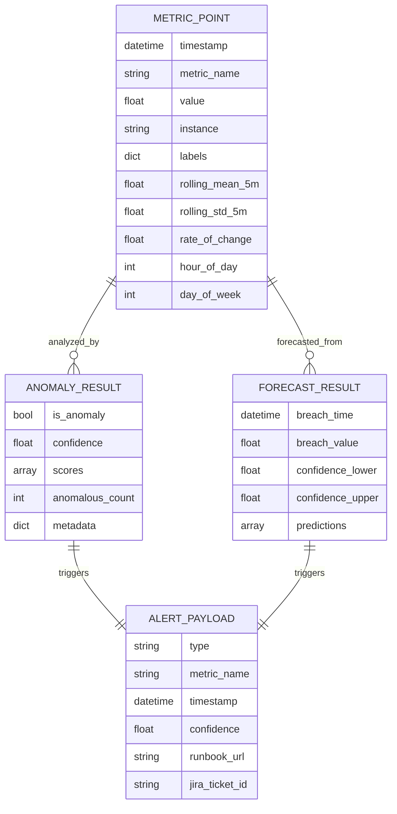

### Data Structures

**MetricPoint**:
```python
from dataclasses import dataclass
from datetime import datetime
from typing import Dict, Optional

@dataclass
class MetricPoint:
    """
    Represents a single metric data point.
    
    Attributes:
        timestamp: When the metric was recorded
        metric_name: Name of the metric (e.g., 'cpu_utilization')
        value: Raw metric value
        instance: Source instance identifier (e.g., 'host1', 'pod-abc')
        labels: Additional Prometheus labels
        rolling_mean_5m: 5-minute rolling average (computed)
        rolling_std_5m: 5-minute rolling standard deviation (computed)
        rate_of_change: First derivative of value (computed)
        hour_of_day: Hour extracted from timestamp (0-23)
        day_of_week: Day extracted from timestamp (0-6)
    """
    timestamp: datetime
    metric_name: str
    value: float
    instance: str
    labels: Dict[str, str]
    rolling_mean_5m: Optional[float] = None
    rolling_std_5m: Optional[float] = None
    rate_of_change: Optional[float] = None
    hour_of_day: Optional[int] = None
    day_of_week: Optional[int] = None
```

**Configuration Schema**:
```python
from typing import Dict, List, Optional
from pydantic import BaseModel, HttpUrl, validator

class PrometheusConfig(BaseModel):
    """Prometheus connection configuration."""
    url: HttpUrl
    timeout_seconds: int = 30
    queries: Dict[str, str]
    
    @validator('queries')
    def validate_queries(cls, v):
        if not v:
            raise ValueError("At least one PromQL query is required")
        return v

class MLConfig(BaseModel):
    """Machine learning configuration."""
    model_path: str
    confidence_threshold: float = 85.0
    contamination: float = 0.1
    n_estimators: int = 100
    max_samples: int = 256
    random_state: int = 42
    
    @validator('confidence_threshold')
    def validate_threshold(cls, v):
        if not 0 <= v <= 100:
            raise ValueError("Confidence threshold must be between 0 and 100")
        return v

class ForecastingConfig(BaseModel):
    """Time-series forecasting configuration."""
    enabled: bool = False
    prediction_window_minutes: int = 15
    thresholds: Dict[str, float] = {}
    seasonality_mode: str = 'additive'
    changepoint_prior_scale: float = 0.05

class SlackConfig(BaseModel):
    """Slack notification configuration."""
    webhook_url: HttpUrl
    channel: str = '#ops-alerts'
    retry_count: int = 1

class JiraConfig(BaseModel):
    """Jira integration configuration."""
    api_url: HttpUrl
    project_key: str
    username: str
    api_token: str

class AlertingConfig(BaseModel):
    """Alerting configuration."""
    slack: Optional[SlackConfig] = None
    jira: Optional[JiraConfig] = None
    runbooks: Dict[str, any] = {}

class InfraGuardConfig(BaseModel):
    """Complete InfraGuard configuration."""
    prometheus: PrometheusConfig
    ml: MLConfig
    forecasting: ForecastingConfig = ForecastingConfig()
    alerting: AlertingConfig
    collection_interval_seconds: int = 60
    logging: Dict[str, str] = {
        'level': 'INFO',
        'format': '%(asctime)s - %(name)s - %(levelname)s - %(message)s'
    }
```

## Correctness Properties

Before implementing InfraGuard, I need to analyze which acceptance criteria from the requirements are suitable for property-based testing.


### Property Reflection

After analyzing all acceptance criteria, I've identified the following properties suitable for property-based testing. Let me review for redundancy:

**Data Transformation Properties:**
- 1.3: JSON to DataFrame transformation preserves data
- 1.6: Timestamp precision preservation
- These are distinct - one tests structure, one tests precision

**ML Detection Properties:**
- 2.2: Anomaly scores computed for all points
- 2.3: Confidence percentage calculation
- 2.4: Alert triggering based on threshold
- These are distinct stages of the detection pipeline

**Model Persistence:**
- 3.2: Model serialization round-trip
- This is a standalone property

**Forecasting Properties:**
- 4.2: Predictions cover prediction window
- 4.3: Alert triggering for threshold breaches
- 4.4: Confidence intervals in payloads
- These are distinct aspects of forecasting

**Alert Formatting Properties:**
- 5.2: Priority mapping based on confidence
- 5.3: Required fields in Jira tickets
- 5.6: Prometheus links in tickets
- 6.2: Required fields in Slack messages
- 6.3: Runbook URLs in messages
- 6.4: Severity formatting
- 6.6: Prediction window in messages
- Properties 5.3 and 6.2 could be combined into a single "alert payload completeness" property
- Properties 5.6, 6.3 could be combined into "contextual links in alerts"

**Runbook Mapping Properties:**
- 7.2: Runbook URL retrieval
- 7.4: Default URL fallback
- These can be combined into one property about runbook resolution

**Configuration Validation:**
- 8.5: Required field validation
- This is a standalone property

**Logging Properties:**
- 11.1: Anomaly detection logging
- 11.2: Alert delivery logging
- These are distinct logging requirements

**Consolidated Properties:**
After reflection, I'll combine:
- 5.3 + 6.2 → "Alert payloads contain all required fields"
- 5.6 + 6.3 → "Alerts include contextual links (runbooks, graphs)"
- 7.2 + 7.4 → "Runbook resolution with fallback"

A property is a characteristic or behavior that should hold true across all valid executions of a system—essentially, a formal statement about what the system should do. Properties serve as the bridge between human-readable specifications and machine-verifiable correctness guarantees.

### Property 1: Prometheus Response Transformation Preserves Data

For any valid Prometheus JSON response, transforming it to a Pandas DataFrame SHALL preserve all metric values, timestamps, and labels without data loss.

**Validates: Requirements 1.3**

### Property 2: Timestamp Precision Preservation

For any metric timestamp, the transformation pipeline SHALL maintain second-level precision throughout all processing stages.

**Validates: Requirements 1.6**

### Property 3: Query Execution Completeness

For any set of configured PromQL queries, the Metrics_Collector SHALL execute all queries and return results for each query.

**Validates: Requirements 1.2**

### Property 4: Anomaly Score Computation Completeness

For any formatted metrics DataFrame, the ML_Detector SHALL compute an anomaly score for every data point in the input.

**Validates: Requirements 2.2**

### Property 5: Confidence Percentage Validity

For any anomaly score, the computed confidence percentage SHALL be a valid number in the range [0, 100].

**Validates: Requirements 2.3**

### Property 6: Threshold-Based Alert Triggering

For any anomaly result with confidence C and threshold T, an alert SHALL be triggered if and only if C >= T.

**Validates: Requirements 2.4**

### Property 7: Model Serialization Round-Trip

For any trained Isolation Forest model, serializing to disk and then deserializing SHALL produce a model that generates identical predictions on the same input data.

**Validates: Requirements 3.2**

### Property 8: Forecast Prediction Window Coverage

For any historical metrics data and prediction window W, the Time_Series_Forecaster SHALL generate predictions that cover exactly W minutes into the future.

**Validates: Requirements 4.2**

### Property 9: Forecast Threshold Breach Detection

For any forecast with predicted values V and threshold T, an alert SHALL be triggered if and only if any value in V exceeds T.

**Validates: Requirements 4.3**

### Property 10: Forecast Confidence Intervals Presence

For any forecast result, the output SHALL include both lower and upper confidence interval bounds for all predictions.

**Validates: Requirements 4.4**

### Property 11: Alert Payload Completeness

For any anomaly or forecast alert, the generated payload SHALL contain all required fields: type, metric_name, timestamp, confidence (for anomalies) or breach_time (for predictions), and runbook_url.

**Validates: Requirements 5.3, 6.2**

### Property 12: Priority Mapping Consistency

For any anomaly with confidence C, the Jira ticket priority SHALL be "Highest" if C >= 95, "High" if 85 <= C < 95, and "Medium" if C < 85.

**Validates: Requirements 5.2**

### Property 13: Contextual Links in Alerts

For any alert (Jira or Slack), the formatted output SHALL include both a runbook URL and a Prometheus graph link.

**Validates: Requirements 5.6, 6.3**

### Property 14: Severity-Based Message Formatting

For any Slack alert with confidence C, the message SHALL include the emoji "🔴" if C >= 95, "⚠️" if 85 <= C < 95, or "⚡" if C < 85.

**Validates: Requirements 6.4**

### Property 15: Prediction Window in Forecast Alerts

For any prediction-based alert with breach time B and current time T, the Slack message SHALL include the time difference (B - T) in minutes.

**Validates: Requirements 6.6**

### Property 16: Runbook Resolution with Fallback

For any metric name M and anomaly type A, the Runbook_Mapper SHALL return either a specific runbook URL if a mapping exists for (M, A), or the default runbook URL otherwise.

**Validates: Requirements 7.2, 7.4**

### Property 17: Configuration Validation Completeness

For any configuration dictionary, the validation process SHALL detect and report all missing required fields from the set {prometheus.url, prometheus.queries, ml.model_path}.

**Validates: Requirements 8.5**

### Property 18: Anomaly Detection Logging Completeness

For any detected anomaly, the log entry SHALL contain the timestamp, metric name, and confidence score.

**Validates: Requirements 11.1**

### Property 19: Alert Delivery Status Logging

For any alert delivery attempt, the log SHALL record the delivery status (success or failure) for each configured channel (Slack, Jira).

**Validates: Requirements 11.2**


## Error Handling

### Error Handling Strategy

InfraGuard implements a layered error handling approach to ensure resilience and observability:

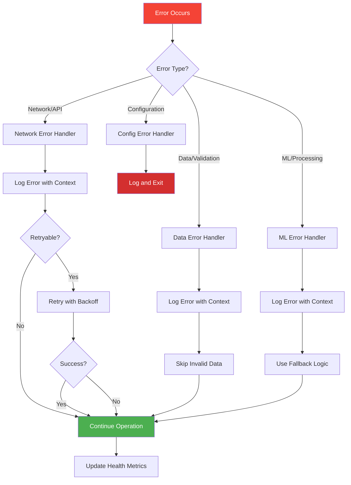

### Error Categories and Handling

#### 1. Network and API Errors

**Prometheus Connection Errors**:
```python
class PrometheusConnectionError(Exception):
    """Raised when Prometheus API is unreachable."""
    pass

# Handling in collector
try:
    response = requests.get(prometheus_url, timeout=timeout_seconds)
    response.raise_for_status()
except requests.exceptions.ConnectionError as e:
    logger.error(f"Prometheus connection failed: {e}")
    # Log error and retry after 30 seconds
    time.sleep(30)
    raise PrometheusConnectionError(f"Cannot connect to Prometheus: {e}")
except requests.exceptions.Timeout as e:
    logger.error(f"Prometheus request timeout: {e}")
    raise PrometheusConnectionError(f"Prometheus timeout: {e}")
```

**Slack Webhook Errors**:
```python
try:
    response = requests.post(webhook_url, json=message, timeout=10)
    if response.status_code != 200:
        logger.error(f"Slack webhook failed: {response.status_code} - {response.text}")
        # Retry once after 10 seconds
        return self._retry_send(message)
except requests.exceptions.RequestException as e:
    logger.error(f"Slack request failed: {e}")
    # Log error but don't fail the entire alert cycle
    return False
```

**Jira API Errors**:
```python
try:
    response = requests.post(jira_endpoint, json=issue, auth=auth, timeout=30)
    if response.status_code != 201:
        raise JiraAPIError(f"Jira API error: {response.status_code} - {response.text}")
except requests.exceptions.RequestException as e:
    logger.error(f"Jira request failed: {e}")
    # Log error and continue with other notification channels
    raise JiraAPIError(f"Jira request failed: {e}")
```

#### 2. Data Validation Errors

**Invalid Prometheus Response**:
```python
class DataFormatError(Exception):
    """Raised when data format is invalid."""
    pass

def format_prometheus_response(response: dict) -> pd.DataFrame:
    try:
        if response.get('status') != 'success':
            raise DataFormatError(f"Prometheus query failed: {response.get('error')}")
        
        if 'data' not in response or 'result' not in response['data']:
            raise DataFormatError("Invalid Prometheus response structure")
        
        # Process data...
    except KeyError as e:
        logger.error(f"Missing required field in Prometheus response: {e}")
        raise DataFormatError(f"Invalid response structure: {e}")
```

**Invalid Metrics Data**:
```python
def _validate_input(self, data: pd.DataFrame) -> bool:
    """Validate DataFrame has required columns."""
    required_columns = [
        'value', 'rolling_mean_5m', 'rolling_std_5m',
        'rate_of_change', 'hour_of_day', 'day_of_week'
    ]
    
    missing_columns = [col for col in required_columns if col not in data.columns]
    
    if missing_columns:
        logger.error(f"Missing required columns: {missing_columns}")
        return False
    
    # Check for NaN values
    if data[required_columns].isnull().any().any():
        logger.warning("Input data contains NaN values")
        # Fill NaN with appropriate defaults
        data.fillna(method='ffill', inplace=True)
    
    return True
```

#### 3. ML Processing Errors

**Model Loading Errors**:
```python
class ModelLoadError(Exception):
    """Raised when model loading fails."""
    pass

def load_model(self, path: Optional[str] = None) -> None:
    model_file = path or self.model_path
    
    try:
        with open(model_file, 'rb') as f:
            self.model = pickle.load(f)
        self.is_trained = True
        logger.info(f"Loaded model from {model_file}")
    except FileNotFoundError:
        logger.error(f"Model file not found: {model_file}")
        raise ModelLoadError(f"Model file not found: {model_file}")
    except (pickle.UnpicklingError, EOFError) as e:
        logger.error(f"Model file corrupted: {e}")
        raise ModelLoadError(f"Cannot load model: {e}")
```

**Prediction Errors**:
```python
def detect_anomalies(self, data: pd.DataFrame) -> AnomalyResult:
    if not self.is_trained:
        raise RuntimeError("Model must be trained or loaded before detection")
    
    try:
        if not self._validate_input(data):
            raise ValueError("Invalid input data")
        
        features = self._extract_features(data)
        predictions = self.model.predict(features)
        scores = self.model.score_samples(features)
        
        # Process results...
    except ValueError as e:
        logger.error(f"Invalid data for prediction: {e}")
        # Return empty result instead of crashing
        return AnomalyResult(
            is_anomaly=False,
            confidence=0.0,
            scores=np.array([]),
            anomalous_points=pd.DataFrame(),
            metadata={'error': str(e)}
        )
```

**Forecasting Errors**:
```python
def forecast(self, data: pd.DataFrame, metric_name: str) -> ForecastResult:
    try:
        if len(data) < 2880:  # 2 days at 1-minute intervals
            raise ValueError("Insufficient historical data for forecasting (need >= 2 days)")
        
        prophet_data = self._prepare_prophet_data(data)
        self._fit_model(prophet_data)
        
        # Generate forecast...
    except ValueError as e:
        logger.error(f"Forecasting failed for {metric_name}: {e}")
        # Return empty forecast result
        return ForecastResult(
            predictions=pd.DataFrame(),
            breach_time=None,
            breach_value=None,
            confidence_interval_lower=None,
            confidence_interval_upper=None
        )
```

#### 4. Configuration Errors

**Missing Configuration**:
```python
class ConfigurationError(Exception):
    """Raised for configuration errors."""
    pass

def _load_config(self) -> dict:
    if not self.config_path.exists():
        logger.error(f"Configuration file not found: {self.config_path}")
        raise FileNotFoundError(f"Configuration file not found: {self.config_path}")
    
    try:
        with open(self.config_path, 'r') as f:
            config = yaml.safe_load(f)
        return config
    except yaml.YAMLError as e:
        logger.error(f"Invalid YAML in {self.config_path}: {e}")
        raise ConfigurationError(f"Invalid YAML: {e}")
```

**Invalid Configuration Values**:
```python
def _validate_config(self) -> None:
    required_sections = ['prometheus', 'ml', 'alerting']
    
    for section in required_sections:
        if section not in self.config:
            raise ConfigurationError(f"Missing required config section: {section}")
    
    # Validate Prometheus URL
    prom_url = self.config['prometheus'].get('url')
    if not prom_url:
        raise ConfigurationError("Missing prometheus.url in config")
    
    # Validate confidence threshold range
    threshold = self.config['ml'].get('confidence_threshold', 85.0)
    if not 0 <= threshold <= 100:
        raise ConfigurationError(f"Invalid confidence_threshold: {threshold} (must be 0-100)")
```

### Error Recovery Strategies

#### Retry with Exponential Backoff

```python
def retry_with_backoff(func, max_retries=3, base_delay=1):
    """
    Retry a function with exponential backoff.
    
    Args:
        func: Function to retry
        max_retries: Maximum number of retry attempts
        base_delay: Base delay in seconds (doubles each retry)
    
    Returns:
        Function result if successful
    
    Raises:
        Last exception if all retries fail
    """
    for attempt in range(max_retries):
        try:
            return func()
        except Exception as e:
            if attempt == max_retries - 1:
                raise
            
            delay = base_delay * (2 ** attempt)
            logger.warning(f"Attempt {attempt + 1} failed: {e}. Retrying in {delay}s...")
            time.sleep(delay)
```

#### Circuit Breaker Pattern

```python
class CircuitBreaker:
    """
    Circuit breaker to prevent cascading failures.
    
    States:
    - CLOSED: Normal operation, requests pass through
    - OPEN: Failures exceeded threshold, requests fail fast
    - HALF_OPEN: Testing if service recovered
    """
    
    def __init__(self, failure_threshold=5, timeout=60):
        self.failure_threshold = failure_threshold
        self.timeout = timeout
        self.failure_count = 0
        self.last_failure_time = None
        self.state = 'CLOSED'
    
    def call(self, func):
        if self.state == 'OPEN':
            if time.time() - self.last_failure_time > self.timeout:
                self.state = 'HALF_OPEN'
            else:
                raise CircuitBreakerOpenError("Circuit breaker is OPEN")
        
        try:
            result = func()
            self.on_success()
            return result
        except Exception as e:
            self.on_failure()
            raise
    
    def on_success(self):
        self.failure_count = 0
        self.state = 'CLOSED'
    
    def on_failure(self):
        self.failure_count += 1
        self.last_failure_time = time.time()
        
        if self.failure_count >= self.failure_threshold:
            self.state = 'OPEN'
            logger.error(f"Circuit breaker opened after {self.failure_count} failures")
```

### Graceful Degradation

InfraGuard implements graceful degradation to maintain partial functionality when components fail:

1. **Alert Channel Failures**: If Slack fails, Jira still works (and vice versa)
2. **Forecasting Failures**: If forecasting fails, anomaly detection continues
3. **Single Metric Failures**: If one metric fails to collect, others continue
4. **Model Loading Failures**: System logs warning and operates in training mode

```python
def _execute_collection_cycle(self) -> None:
    """Execute collection cycle with graceful degradation."""
    try:
        raw_metrics = self.collector.collect_metrics()
    except PrometheusConnectionError as e:
        logger.error(f"Metrics collection failed: {e}")
        return  # Skip this cycle, try again next interval
    
    try:
        formatted_metrics = self.formatter.add_feature_columns(raw_metrics)
    except DataFormatError as e:
        logger.error(f"Data formatting failed: {e}")
        return
    
    # Anomaly detection (critical path)
    try:
        anomaly_result = self.detector.detect_anomalies(formatted_metrics)
        if anomaly_result.is_anomaly and anomaly_result.confidence >= self.detector.confidence_threshold:
            self._send_alerts(anomaly_result)
    except Exception as e:
        logger.error(f"Anomaly detection failed: {e}", exc_info=True)
    
    # Forecasting (optional, failures don't stop the cycle)
    if self.forecaster is not None:
        try:
            self._execute_forecasting(formatted_metrics)
        except Exception as e:
            logger.warning(f"Forecasting failed: {e}")
            # Continue without forecasting
```


## Testing Strategy

### Overview

InfraGuard employs a comprehensive testing strategy combining property-based testing, unit testing, integration testing, and end-to-end testing to ensure correctness and reliability.

### Testing Pyramid

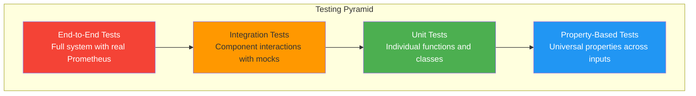

### 1. Property-Based Testing

InfraGuard uses property-based testing to verify universal properties across a wide range of generated inputs. We use the **Hypothesis** library for Python.

**Installation**:
```bash
pip install hypothesis pytest
```

**Configuration**:
```python
# conftest.py
from hypothesis import settings, Verbosity

# Configure Hypothesis for all tests
settings.register_profile("default", max_examples=100, verbosity=Verbosity.normal)
settings.register_profile("ci", max_examples=200, verbosity=Verbosity.verbose)
settings.load_profile("default")
```

**Property Test Examples**:

```python
# tests/property/test_data_transformation.py
from hypothesis import given, strategies as st
import pandas as pd
from src.collector.formatter import DataFormatter

@given(
    timestamps=st.lists(st.datetimes(), min_size=1, max_size=100),
    values=st.lists(st.floats(min_value=0, max_value=100), min_size=1, max_size=100)
)
def test_property_1_prometheus_transformation_preserves_data(timestamps, values):
    """
    Property 1: Prometheus Response Transformation Preserves Data
    
    Feature: infraguard-aiops, Property 1: For any valid Prometheus JSON response,
    transforming it to a Pandas DataFrame SHALL preserve all metric values,
    timestamps, and labels without data loss.
    """
    # Arrange: Create mock Prometheus response
    prometheus_response = {
        "status": "success",
        "data": {
            "resultType": "matrix",
            "result": [
                {
                    "metric": {"__name__": "cpu", "instance": "host1"},
                    "values": [[ts.timestamp(), val] for ts, val in zip(timestamps, values)]
                }
            ]
        }
    }
    
    # Act: Transform to DataFrame
    formatter = DataFormatter()
    df = formatter.format_prometheus_response(prometheus_response)
    
    # Assert: All values preserved
    assert len(df) == len(values)
    assert all(df['value'] == values)
    assert all(df['metric_name'] == 'cpu')
    assert all(df['instance'] == 'host1')


@given(
    timestamps=st.lists(
        st.datetimes(min_value=datetime(2020, 1, 1), max_value=datetime(2025, 1, 1)),
        min_size=1,
        max_size=100
    )
)
def test_property_2_timestamp_precision_preservation(timestamps):
    """
    Property 2: Timestamp Precision Preservation
    
    Feature: infraguard-aiops, Property 2: For any metric timestamp,
    the transformation pipeline SHALL maintain second-level precision
    throughout all processing stages.
    """
    # Arrange: Create DataFrame with timestamps
    df = pd.DataFrame({
        'timestamp': timestamps,
        'value': [1.0] * len(timestamps)
    })
    
    # Act: Normalize timestamps
    formatter = DataFormatter()
    normalized_df = formatter.normalize_timestamps(df)
    
    # Assert: Second-level precision maintained
    for original, normalized in zip(timestamps, normalized_df['timestamp']):
        assert original.replace(microsecond=0) == normalized


@given(
    data=st.data(),
    n_points=st.integers(min_value=10, max_value=100)
)
def test_property_4_anomaly_score_computation_completeness(data, n_points):
    """
    Property 4: Anomaly Score Computation Completeness
    
    Feature: infraguard-aiops, Property 4: For any formatted metrics DataFrame,
    the ML_Detector SHALL compute an anomaly score for every data point in the input.
    """
    from src.ml.isolation_forest import IsolationForestDetector
    
    # Arrange: Create formatted metrics DataFrame
    df = pd.DataFrame({
        'value': data.draw(st.lists(st.floats(min_value=0, max_value=100), min_size=n_points, max_size=n_points)),
        'rolling_mean_5m': data.draw(st.lists(st.floats(min_value=0, max_value=100), min_size=n_points, max_size=n_points)),
        'rolling_std_5m': data.draw(st.lists(st.floats(min_value=0, max_value=10), min_size=n_points, max_size=n_points)),
        'rate_of_change': data.draw(st.lists(st.floats(min_value=-10, max_value=10), min_size=n_points, max_size=n_points)),
        'hour_of_day': data.draw(st.lists(st.integers(min_value=0, max_value=23), min_size=n_points, max_size=n_points)),
        'day_of_week': data.draw(st.lists(st.integers(min_value=0, max_value=6), min_size=n_points, max_size=n_points))
    })
    
    # Train a simple model
    detector = IsolationForestDetector({'confidence_threshold': 85.0})
    detector.train(df)
    
    # Act: Detect anomalies
    result = detector.detect_anomalies(df)
    
    # Assert: Score computed for every point
    assert len(result.scores) == n_points


@given(
    anomaly_scores=st.lists(st.floats(min_value=-1.0, max_value=1.0), min_size=1, max_size=100)
)
def test_property_5_confidence_percentage_validity(anomaly_scores):
    """
    Property 5: Confidence Percentage Validity
    
    Feature: infraguard-aiops, Property 5: For any anomaly score,
    the computed confidence percentage SHALL be a valid number in the range [0, 100].
    """
    from src.ml.isolation_forest import IsolationForestDetector
    import numpy as np
    
    # Arrange
    detector = IsolationForestDetector({'confidence_threshold': 85.0})
    scores = np.array(anomaly_scores)
    
    # Act
    confidence = detector.compute_confidence(scores)
    
    # Assert
    assert 0 <= confidence <= 100
    assert not np.isnan(confidence)
    assert not np.isinf(confidence)


@given(
    confidence=st.floats(min_value=0, max_value=100),
    threshold=st.floats(min_value=0, max_value=100)
)
def test_property_6_threshold_based_alert_triggering(confidence, threshold):
    """
    Property 6: Threshold-Based Alert Triggering
    
    Feature: infraguard-aiops, Property 6: For any anomaly result with confidence C
    and threshold T, an alert SHALL be triggered if and only if C >= T.
    """
    from src.ml.isolation_forest import AnomalyResult
    import numpy as np
    import pandas as pd
    
    # Arrange
    anomaly_result = AnomalyResult(
        is_anomaly=True,
        confidence=confidence,
        scores=np.array([-0.5]),
        anomalous_points=pd.DataFrame({'value': [1.0]}),
        metadata={}
    )
    
    # Act: Determine if alert should trigger
    should_trigger = confidence >= threshold
    
    # Assert: This property is verified in the main application logic
    # Here we just verify the comparison logic
    assert should_trigger == (confidence >= threshold)


@given(
    metric_name=st.text(min_size=1, max_size=50),
    anomaly_type=st.sampled_from(['anomaly', 'prediction'])
)
def test_property_16_runbook_resolution_with_fallback(metric_name, anomaly_type):
    """
    Property 16: Runbook Resolution with Fallback
    
    Feature: infraguard-aiops, Property 16: For any metric name M and anomaly type A,
    the Runbook_Mapper SHALL return either a specific runbook URL if a mapping exists
    for (M, A), or the default runbook URL otherwise.
    """
    from src.alerter.runbook_mapper import RunbookMapper
    
    # Arrange
    config = {
        'cpu_utilization': {
            'anomaly': 'https://wiki.internal/cpu-spike',
            'prediction': 'https://wiki.internal/cpu-scale'
        },
        'default': 'https://wiki.internal/default'
    }
    mapper = RunbookMapper(config)
    
    # Act
    runbook_url = mapper.get_runbook(metric_name, anomaly_type)
    
    # Assert: Always returns a valid URL (either specific or default)
    assert runbook_url is not None
    assert runbook_url.startswith('https://')
    
    # If metric is in config, should return specific URL
    if metric_name in config and isinstance(config[metric_name], dict):
        if anomaly_type in config[metric_name]:
            assert runbook_url == config[metric_name][anomaly_type]
        else:
            assert runbook_url == config['default']
    else:
        assert runbook_url == config['default']
```

**Property Test Configuration**:
- Minimum 100 iterations per property test
- Each test tagged with feature name and property number
- Tests run in CI/CD pipeline with increased iterations (200)

### 2. Unit Testing

Unit tests verify specific behaviors of individual components with concrete examples.

```python
# tests/unit/test_collector.py
import pytest
from src.collector.prometheus import PrometheusCollector, PrometheusConnectionError

def test_collector_initialization():
    """Test PrometheusCollector initializes correctly."""
    config = {
        'url': 'http://prometheus:9090',
        'queries': {'cpu': 'rate(cpu[5m])'},
        'timeout': 30
    }
    collector = PrometheusCollector(config)
    
    assert collector.prometheus_url == 'http://prometheus:9090'
    assert 'cpu' in collector.queries
    assert collector.timeout_seconds == 30


def test_collector_missing_url_raises_error():
    """Test PrometheusCollector raises error when URL is missing."""
    config = {'queries': {'cpu': 'rate(cpu[5m])'}}
    
    with pytest.raises(ValueError, match="prometheus_url is required"):
        PrometheusCollector(config)


def test_execute_query_with_mock_response(mocker):
    """Test execute_query with mocked Prometheus response."""
    config = {
        'url': 'http://prometheus:9090',
        'queries': {'cpu': 'rate(cpu[5m])'}
    }
    collector = PrometheusCollector(config)
    
    # Mock requests.get
    mock_response = mocker.Mock()
    mock_response.status_code = 200
    mock_response.json.return_value = {
        'status': 'success',
        'data': {'result': []}
    }
    mocker.patch('requests.get', return_value=mock_response)
    
    # Execute query
    result = collector.execute_query('rate(cpu[5m])')
    
    assert result['status'] == 'success'


# tests/unit/test_ml_detector.py
def test_detector_load_model_file_not_found():
    """Test detector raises error when model file doesn't exist."""
    from src.ml.isolation_forest import IsolationForestDetector, ModelLoadError
    
    detector = IsolationForestDetector({'model_path': 'nonexistent.pkl'})
    
    with pytest.raises(ModelLoadError, match="Model file not found"):
        detector.load_model()


def test_detector_confidence_calculation():
    """Test confidence percentage calculation."""
    from src.ml.isolation_forest import IsolationForestDetector
    import numpy as np
    
    detector = IsolationForestDetector({'confidence_threshold': 85.0})
    
    # Very anomalous scores (very negative)
    scores = np.array([-0.5, -0.4, -0.3])
    confidence = detector.compute_confidence(scores)
    assert confidence >= 90  # Should be high confidence
    
    # Normal scores (positive)
    scores = np.array([0.3, 0.4, 0.5])
    confidence = detector.compute_confidence(scores)
    assert confidence <= 20  # Should be low confidence


# tests/unit/test_alert_manager.py
def test_alert_manager_builds_payload_correctly():
    """Test alert manager builds correct payload structure."""
    from src.alerter.alert_manager import AlertManager
    from src.ml.isolation_forest import AnomalyResult
    import pandas as pd
    import numpy as np
    
    config = {
        'slack': {'webhook_url': 'https://hooks.slack.com/test'},
        'jira': {
            'api_url': 'https://jira.test',
            'project_key': 'INC',
            'username': 'test',
            'api_token': 'token'
        },
        'runbooks': {'default': 'https://wiki.test/default'}
    }
    
    manager = AlertManager(config)
    
    anomaly = AnomalyResult(
        is_anomaly=True,
        confidence=95.0,
        scores=np.array([-0.5]),
        anomalous_points=pd.DataFrame({'value': [1.0]}),
        metadata={}
    )
    
    payload = manager._build_alert_payload({
        'type': 'anomaly',
        'metric_name': 'cpu_utilization',
        'confidence': anomaly.confidence,
        'runbook_url': 'https://wiki.test/cpu'
    })
    
    assert payload['type'] == 'anomaly'
    assert payload['metric_name'] == 'cpu_utilization'
    assert payload['confidence'] == 95.0
    assert 'timestamp' in payload
    assert 'source' in payload
```

### 3. Integration Testing

Integration tests verify component interactions with mocked external dependencies.

```python
# tests/integration/test_collection_pipeline.py
import pytest
from src.collector.prometheus import PrometheusCollector
from src.collector.formatter import DataFormatter

def test_collection_to_formatting_pipeline(mocker):
    """Test full pipeline from collection to formatted DataFrame."""
    # Mock Prometheus response
    mock_response = mocker.Mock()
    mock_response.status_code = 200
    mock_response.json.return_value = {
        'status': 'success',
        'data': {
            'resultType': 'matrix',
            'result': [
                {
                    'metric': {'__name__': 'cpu', 'instance': 'host1'},
                    'values': [[1609459200, '0.5'], [1609459260, '0.6']]
                }
            ]
        }
    }
    mocker.patch('requests.get', return_value=mock_response)
    
    # Collect metrics
    collector = PrometheusCollector({
        'url': 'http://prometheus:9090',
        'queries': {'cpu': 'rate(cpu[5m])'}
    })
    raw_metrics = collector.collect_metrics()
    
    # Format metrics
    formatter = DataFormatter()
    formatted_metrics = formatter.add_feature_columns(raw_metrics)
    
    # Verify pipeline output
    assert not formatted_metrics.empty
    assert 'value' in formatted_metrics.columns
    assert 'rolling_mean_5m' in formatted_metrics.columns
    assert 'hour_of_day' in formatted_metrics.columns


# tests/integration/test_alert_delivery.py
def test_alert_delivery_to_slack_and_jira(mocker):
    """Test alert delivery to both Slack and Jira."""
    from src.alerter.alert_manager import AlertManager
    from src.ml.isolation_forest import AnomalyResult
    import pandas as pd
    import numpy as np
    
    # Mock Slack webhook
    mock_slack_response = mocker.Mock()
    mock_slack_response.status_code = 200
    
    # Mock Jira API
    mock_jira_response = mocker.Mock()
    mock_jira_response.status_code = 201
    mock_jira_response.json.return_value = {'key': 'INC-1045'}
    
    mocker.patch('requests.post', side_effect=[mock_jira_response, mock_slack_response])
    
    # Create alert manager
    config = {
        'slack': {'webhook_url': 'https://hooks.slack.com/test', 'channel': '#test'},
        'jira': {
            'api_url': 'https://jira.test',
            'project_key': 'INC',
            'username': 'test',
            'api_token': 'token'
        },
        'runbooks': {'cpu_utilization': {'anomaly': 'https://wiki.test/cpu'}}
    }
    manager = AlertManager(config)
    
    # Send alert
    anomaly = AnomalyResult(
        is_anomaly=True,
        confidence=95.0,
        scores=np.array([-0.5]),
        anomalous_points=pd.DataFrame({'value': [1.0]}),
        metadata={}
    )
    
    status = manager.send_alert(anomaly, 'cpu_utilization')
    
    # Verify both channels succeeded
    assert status.slack_success
    assert status.jira_success
    assert status.jira_ticket_id == 'INC-1045'
```

### 4. End-to-End Testing

E2E tests verify the complete system with real Prometheus (in Docker).

```python
# tests/e2e/test_full_system.py
import pytest
import time
import docker

@pytest.fixture(scope="module")
def docker_environment():
    """Start Prometheus and dummy app in Docker."""
    client = docker.from_env()
    
    # Start Prometheus
    prometheus = client.containers.run(
        'prom/prometheus:latest',
        detach=True,
        ports={'9090/tcp': 9090},
        volumes={
            './tests/e2e/prometheus.yml': {'bind': '/etc/prometheus/prometheus.yml', 'mode': 'ro'}
        }
    )
    
    # Wait for Prometheus to be ready
    time.sleep(5)
    
    yield prometheus
    
    # Cleanup
    prometheus.stop()
    prometheus.remove()


def test_full_anomaly_detection_cycle(docker_environment, mocker):
    """Test complete cycle from metrics collection to alert delivery."""
    from main import InfraGuard
    
    # Mock alert delivery to avoid external calls
    mock_slack = mocker.patch('src.alerter.slack.SlackNotifier.send_message', return_value=True)
    mock_jira = mocker.patch('src.alerter.jira.JiraNotifier.create_ticket', return_value='INC-TEST')
    
    # Create InfraGuard instance
    app = InfraGuard('tests/e2e/test_config.yaml')
    
    # Execute one collection cycle
    app._execute_collection_cycle()
    
    # Verify metrics were collected (check logs or internal state)
    # This is a simplified test - real E2E would verify full behavior
    assert True  # Placeholder
```

### 5. Test Coverage Requirements

- **Overall Coverage**: Minimum 80%
- **Critical Components**: Minimum 90%
  - `src/ml/isolation_forest.py`
  - `src/collector/prometheus.py`
  - `src/alerter/alert_manager.py`

**Coverage Measurement**:
```bash
pytest --cov=src --cov-report=html --cov-report=term
```

### 6. CI/CD Testing Pipeline

```yaml
# .github/workflows/ci.yml
name: InfraGuard CI

on: [push, pull_request]

jobs:
  test:
    runs-on: ubuntu-latest
    
    steps:
      - uses: actions/checkout@v2
      
      - name: Set up Python
        uses: actions/setup-python@v2
        with:
          python-version: '3.9'
      
      - name: Install dependencies
        run: |
          pip install -r requirements.txt
          pip install pytest pytest-cov hypothesis pytest-mock
      
      - name: Run linting
        run: flake8 src/ tests/
      
      - name: Run unit tests
        run: pytest tests/unit/ -v
      
      - name: Run property-based tests
        run: pytest tests/property/ -v --hypothesis-profile=ci
      
      - name: Run integration tests
        run: pytest tests/integration/ -v
      
      - name: Generate coverage report
        run: pytest --cov=src --cov-report=xml --cov-report=term
      
      - name: Upload coverage to Codecov
        uses: codecov/codecov-action@v2
        with:
          file: ./coverage.xml
      
      - name: Build Docker image
        run: docker build -t infraguard:test .
      
      - name: Run E2E tests
        run: |
          docker-compose -f tests/e2e/docker-compose.test.yml up -d
          pytest tests/e2e/ -v
          docker-compose -f tests/e2e/docker-compose.test.yml down
```

### Test Organization

```
tests/
├── conftest.py                 # Shared fixtures and configuration
├── unit/                       # Unit tests
│   ├── test_collector.py
│   ├── test_formatter.py
│   ├── test_ml_detector.py
│   ├── test_forecaster.py
│   ├── test_alert_manager.py
│   ├── test_slack.py
│   ├── test_jira.py
│   └── test_runbook_mapper.py
├── property/                   # Property-based tests
│   ├── test_data_transformation.py
│   ├── test_ml_properties.py
│   ├── test_alert_properties.py
│   └── test_config_properties.py
├── integration/                # Integration tests
│   ├── test_collection_pipeline.py
│   ├── test_ml_pipeline.py
│   └── test_alert_delivery.py
└── e2e/                        # End-to-end tests
    ├── docker-compose.test.yml
    ├── prometheus.yml
    ├── test_config.yaml
    └── test_full_system.py
```


## Deployment and Operations

### Container Image

**Dockerfile**:
```dockerfile
FROM python:3.9-slim

# Set working directory
WORKDIR /app

# Install system dependencies
RUN apt-get update && apt-get install -y \
    gcc \
    && rm -rf /var/lib/apt/lists/*

# Copy requirements and install Python dependencies
COPY requirements.txt .
RUN pip install --no-cache-dir -r requirements.txt

# Copy application code
COPY src/ ./src/
COPY main.py .

# Create directories for models and logs
RUN mkdir -p models/pretrained logs

# Set environment variables
ENV PYTHONUNBUFFERED=1
ENV LOG_LEVEL=INFO

# Expose health check port
EXPOSE 8000

# Run as non-root user
RUN useradd -m -u 1000 infraguard && chown -R infraguard:infraguard /app
USER infraguard

# Health check
HEALTHCHECK --interval=30s --timeout=10s --start-period=5s --retries=3 \
    CMD python -c "import sys; sys.exit(0)"

# Run application
CMD ["python", "main.py"]
```

### Kubernetes Deployment

```yaml
# k8s/deployment.yaml
apiVersion: apps/v1
kind: Deployment
metadata:
  name: infraguard
  namespace: monitoring
  labels:
    app: infraguard
spec:
  replicas: 1
  selector:
    matchLabels:
      app: infraguard
  template:
    metadata:
      labels:
        app: infraguard
    spec:
      containers:
      - name: infraguard
        image: infraguard:latest
        imagePullPolicy: Always
        env:
        - name: LOG_LEVEL
          value: "INFO"
        - name: JIRA_API_TOKEN
          valueFrom:
            secretKeyRef:
              name: infraguard-secrets
              key: jira-api-token
        volumeMounts:
        - name: config
          mountPath: /app/src/config/settings.yaml
          subPath: settings.yaml
        - name: models
          mountPath: /app/models/pretrained
        - name: logs
          mountPath: /app/logs
        resources:
          requests:
            memory: "512Mi"
            cpu: "250m"
          limits:
            memory: "1Gi"
            cpu: "500m"
        livenessProbe:
          exec:
            command:
            - python
            - -c
            - "import sys; sys.exit(0)"
          initialDelaySeconds: 30
          periodSeconds: 30
        readinessProbe:
          exec:
            command:
            - python
            - -c
            - "import sys; sys.exit(0)"
          initialDelaySeconds: 10
          periodSeconds: 10
      volumes:
      - name: config
        configMap:
          name: infraguard-config
      - name: models
        persistentVolumeClaim:
          claimName: infraguard-models
      - name: logs
        emptyDir: {}
---
apiVersion: v1
kind: ConfigMap
metadata:
  name: infraguard-config
  namespace: monitoring
data:
  settings.yaml: |
    prometheus:
      url: "http://prometheus-server.monitoring.svc.cluster.local:9090"
      timeout_seconds: 30
      queries:
        cpu_utilization: 'rate(node_cpu_seconds_total{mode!="idle"}[5m])'
        memory_utilization: 'node_memory_Active_bytes / node_memory_MemTotal_bytes'
        http_error_rate: 'rate(http_requests_total{status=~"5.."}[5m])'
    
    ml:
      model_path: "models/pretrained/isolation_forest.pkl"
      confidence_threshold: 85.0
    
    alerting:
      slack:
        webhook_url: "https://hooks.slack.com/services/YOUR/WEBHOOK/URL"
        channel: "#ops-alerts"
      jira:
        api_url: "https://your-company.atlassian.net"
        project_key: "INC"
        username: "infraguard@company.com"
        api_token: "${JIRA_API_TOKEN}"
      runbooks:
        cpu_utilization:
          anomaly: "https://wiki.internal/runbooks/cpu-spike"
        default: "https://wiki.internal/runbooks/default"
    
    collection_interval_seconds: 60
---
apiVersion: v1
kind: Secret
metadata:
  name: infraguard-secrets
  namespace: monitoring
type: Opaque
stringData:
  jira-api-token: "your-jira-api-token-here"
---
apiVersion: v1
kind: PersistentVolumeClaim
metadata:
  name: infraguard-models
  namespace: monitoring
spec:
  accessModes:
    - ReadWriteOnce
  resources:
    requests:
      storage: 1Gi
```

### Docker Compose for Local Development

```yaml
# docker-compose.yaml
version: '3.8'

services:
  prometheus:
    image: prom/prometheus:latest
    container_name: infraguard-prometheus
    ports:
      - "9090:9090"
    volumes:
      - ./config/prometheus.yml:/etc/prometheus/prometheus.yml
      - prometheus-data:/prometheus
    command:
      - '--config.file=/etc/prometheus/prometheus.yml'
      - '--storage.tsdb.path=/prometheus'
    networks:
      - infraguard-network

  dummy-app:
    build:
      context: ./dummy-app
      dockerfile: Dockerfile
    container_name: infraguard-dummy-app
    ports:
      - "8080:8080"
    environment:
      - SPIKE_PROBABILITY=0.1
      - SPIKE_MAGNITUDE=2.0
    networks:
      - infraguard-network

  infraguard:
    build:
      context: .
      dockerfile: Dockerfile
    container_name: infraguard-app
    depends_on:
      - prometheus
      - dummy-app
    volumes:
      - ./src/config/settings.yaml:/app/src/config/settings.yaml
      - ./models:/app/models
      - ./logs:/app/logs
    environment:
      - LOG_LEVEL=DEBUG
      - JIRA_API_TOKEN=${JIRA_API_TOKEN}
    networks:
      - infraguard-network

  grafana:
    image: grafana/grafana:latest
    container_name: infraguard-grafana
    ports:
      - "3000:3000"
    volumes:
      - ./dashboards:/etc/grafana/provisioning/dashboards
      - grafana-data:/var/lib/grafana
    environment:
      - GF_SECURITY_ADMIN_PASSWORD=admin
      - GF_INSTALL_PLUGINS=
    networks:
      - infraguard-network

networks:
  infraguard-network:
    driver: bridge

volumes:
  prometheus-data:
  grafana-data:
```

### Monitoring and Observability

InfraGuard exposes metrics about its own operation:

```python
# src/observability/metrics.py
from prometheus_client import Counter, Histogram, Gauge, start_http_server

# Metrics
metrics_collected = Counter('infraguard_metrics_collected_total', 'Total metrics collected')
anomalies_detected = Counter('infraguard_anomalies_detected_total', 'Total anomalies detected')
alerts_sent = Counter('infraguard_alerts_sent_total', 'Total alerts sent', ['channel', 'status'])
collection_duration = Histogram('infraguard_collection_duration_seconds', 'Collection cycle duration')
ml_inference_duration = Histogram('infraguard_ml_inference_duration_seconds', 'ML inference duration')
last_collection_timestamp = Gauge('infraguard_last_collection_timestamp', 'Timestamp of last collection')

def start_metrics_server(port=8000):
    """Start Prometheus metrics server."""
    start_http_server(port)
```

### Operational Runbooks

**Runbook: InfraGuard Not Collecting Metrics**

1. Check Prometheus connectivity:
   ```bash
   kubectl exec -it infraguard-pod -- curl http://prometheus:9090/-/healthy
   ```

2. Check InfraGuard logs:
   ```bash
   kubectl logs -f deployment/infraguard -n monitoring
   ```

3. Verify configuration:
   ```bash
   kubectl get configmap infraguard-config -n monitoring -o yaml
   ```

**Runbook: High False Positive Rate**

1. Review anomaly confidence threshold in configuration
2. Retrain model with more recent historical data
3. Adjust Isolation Forest contamination parameter
4. Review metric selection and feature engineering

**Runbook: Alerts Not Reaching Slack/Jira**

1. Verify webhook URLs and API credentials
2. Check network connectivity from InfraGuard pod
3. Review alert delivery logs
4. Test webhooks manually with curl

## Performance Considerations

### Scalability

- **Single Instance**: Handles up to 100 metrics at 1-minute intervals
- **Horizontal Scaling**: Not currently supported (stateful ML model)
- **Vertical Scaling**: Increase CPU/memory for more metrics or shorter intervals

### Optimization Opportunities

1. **Batch Processing**: Collect and process multiple metrics in parallel
2. **Model Caching**: Keep model in memory to avoid repeated disk I/O
3. **Async I/O**: Use asyncio for concurrent API calls
4. **Database Backend**: Store historical anomalies in TimescaleDB for analysis

### Resource Requirements

**Minimum**:
- CPU: 250m (0.25 cores)
- Memory: 512Mi
- Storage: 1Gi (for models and logs)

**Recommended**:
- CPU: 500m (0.5 cores)
- Memory: 1Gi
- Storage: 5Gi

## Security Considerations

### Secrets Management

- Store API tokens in Kubernetes Secrets or external secret managers (Vault, AWS Secrets Manager)
- Never commit credentials to version control
- Rotate credentials regularly

### Network Security

- Use TLS for all external API calls (Prometheus, Slack, Jira)
- Implement network policies to restrict pod-to-pod communication
- Use service mesh (Istio) for mTLS between services

### Access Control

- Run container as non-root user
- Use read-only root filesystem where possible
- Implement RBAC for Kubernetes resources

## Future Enhancements

1. **Multi-Metric Correlation**: Detect anomalies across multiple related metrics
2. **Automated Remediation**: Trigger auto-scaling or restarts based on predictions
3. **Custom ML Models**: Support for user-provided models and algorithms
4. **Web UI**: Dashboard for viewing anomalies and managing configuration
5. **Multi-Tenancy**: Support for monitoring multiple environments/clusters
6. **Advanced Forecasting**: LSTM/GRU models for complex time-series patterns
7. **Anomaly Explanation**: Provide explanations for why anomalies were detected
8. **Integration with PagerDuty**: Additional alerting channel
9. **Historical Analysis**: Query and visualize past anomalies
10. **A/B Testing**: Compare different ML models and configurations

## Conclusion

This design document provides a comprehensive blueprint for implementing InfraGuard, an AI-powered AIOps monitoring tool. The architecture emphasizes:

- **Modularity**: Clear separation of concerns across components
- **Reliability**: Comprehensive error handling and graceful degradation
- **Testability**: Property-based testing for correctness guarantees
- **Operability**: Container-native deployment with observability built-in
- **Extensibility**: Plugin architecture for new metrics, models, and alert channels

The implementation follows industry best practices for Python development, machine learning operations, and cloud-native applications. The detailed specifications, code examples, and diagrams provide a clear roadmap for development teams to build and deploy InfraGuard successfully.

