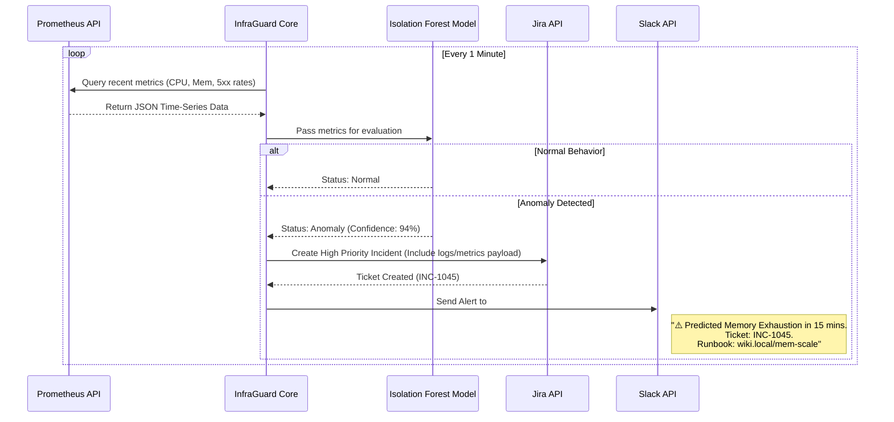

# 🔥 InfraGuard: Comprehensive Project Specification

**Goal:** Build a lightweight, AI-powered AIOps (Artificial Intelligence for IT Operations) tool in Python. InfraGuard pulls metrics from Prometheus, uses machine learning (Isolation Forest) to detect statistical anomalies, and predicts infrastructure failures before they impact users, automatically creating Jira tickets and Slack alerts with contextual runbooks.

---

## 🏗️ 1. Complete Architecture Diagrams

### A. High-Level System Architecture

```mermaid
flowchart TD
    subgraph Observability
        Prometheus[(Prometheus Time-Series DB)]
    end
    
    subgraph InfraGuard [InfraGuard (Python App)]
        direction TB
        Collector[Metrics Collector]
        Detector[ML Anomaly Detector\n(Isolation Forest)]
        Predictor[Time-Series Forecast\n(Prophet)]
        Alerter[Alert Manager Router]
        
        Collector -->|Fetch CPU, Mem, Error Rates| Detector
        Collector -->|Fetch historical trends| Predictor
        Detector -->|Anomaly Detected| Alerter
        Predictor -->|Threshold breach predicted| Alerter
    end
    
    subgraph Actions
        Slack[Slack Notification\nwith Runbook Link]
        Jira[Jira Incident\nAuto-Creation]
        AutoRemediate[Trigger Webhook\n(e.g., K8s scale-up)]
    end
    
    Prometheus -->|API via PromQL| Collector
    Alerter --> Slack
    Alerter --> Jira
    Alerter --> AutoRemediate
```

### B. Execution Sequence Diagram (Detection & Alerting Flow)



---

## 📂 2. Recommended Repository Structure

```text
infraguard/
├── README.md                      # Architecture diagram, demo GIF, problem statement
├── requirements.txt               # Python dependencies (scikit-learn, prometheus-api-client, etc.)
├── main.py                        # Entry point for the daemon/scheduler
├── src/
│   ├── collector/
│   │   ├── prometheus.py          # Functions to run PromQL queries via API
│   │   └── formatter.py           # Pandas dataframe formatting for ML
│   ├── ml/
│   │   ├── isolation_forest.py    # Initialization, training, and prediction logic
│   │   └── forecaster.py          # (Optional) Time-series prediction using Prophet
│   ├── alerter/
│   │   ├── slack.py               # Slack webhook integration
│   │   ├── jira.py                # Jira API ticket creation logic
│   │   └── runbook_mapper.py      # Maps specific anomalies to Wiki/Confluence links
│   └── config/
│       └── settings.yaml          # Define thresholds, target PromQL queries, channels
├── models/
│   └── pretrained/                # Saved scikit-learn models (.pkl files)
├── dashboards/
│   └── infraguard-grafana.json    # A custom Grafana dashboard showing anomalies overlaid on metrics
├── tests/
│   ├── test_collector.py
│   └── test_ml_pipeline.py
├── Dockerfile                     # To containerize InfraGuard
├── docker-compose.yaml            # Spin up a local Prometheus, App dummy, and InfraGuard for testing
└── .github/
    └── workflows/
        └── ci.yml                 # Code linting (Flake8), testing (Pytest), Docker build
```

---

## ⚙️ 3. Core Module Specifications

### A. The Metrics Collector (`src/collector/prometheus.py`)
- **Action:** Connects to the Prometheus endpoint (`http://prometheus:9090`).
- **Logic:** Executes configured PromQL queries (e.g., `rate(http_requests_total{status="500"}[5m])` or `node_memory_Active_bytes / node_memory_MemTotal_bytes`).
- **Output:** Transforms JSON response into a normalized Pandas DataFrame suitable for the ML engine.

### B. The ML Anomaly Detector (`src/ml/isolation_forest.py`)
- **Algorithm:** **Isolation Forest** (best for unsupervised anomaly detection in high-dimensional datasets where you don't have labeled "failure" data).
- **Logic:** Evaluates the incoming Pandas DataFrame against the pre-trained baseline. It returns an anomaly score (-1 for anomaly, 1 for normal).
- **Thresholds:** If the anomaly score drops below the configured `CRITICAL_CONFIDENCE_THRESHOLD`, it triggers the Alerter.

### C. The Alerter & Runbook Mapper (`src/alerter/`)
- **Action:** Acts upon anomalies.
- **Runbook Mapping:** Checks `settings.yaml` to see what runbook is associated with the metric that spiked.
  - *Example:* `metric: cpu_spike` -> `runbook: https://wiki.internal/scale-hpa-guide`.
- **Integrations:** Uses the `requests` library to POST payloads to Slack Webhooks and Jira REST API.

---

## 🛠️ 4. Tech Stack Justifications (Interview Points)

- **Python over Go:** While Go is great for CLI/Infrastructure (like the DevPlatform CLI), Python is the undisputed king of Machine Learning. Libraries like `scikit-learn` and `pandas` make the anomaly detection implementation trivial.
- **Isolation Forest (ML):** Traditional static thresholds (e.g., alert if CPU > 80%) cause massive alert fatigue. Isolation Forest learns the dynamic "normal" behavior (e.g., knowing CPU is naturally higher at 9 AM) and only alerts on true statistical deviations.
- **AIOps Positioning:** Placing an intelligent layer between raw metrics and the on-call engineer is exactly the direction the SRE/DevOps industry is moving toward in 2026.

---

## 📈 5. Expected Business Impact (Metrics to Add to Resume)

Once built, you can use these tailored bullet points:

- *"Developed a Python-based AIOps tool using **scikit-learn (Isolation Forest)** to analyze Prometheus metrics in real-time, predicting infrastructure failures **15 minutes before user impact**."*
- *"Replaced static alerting thresholds with dynamic ML anomaly detection, reducing alert fatigue and false positives by **40%**, improving on-call engineer efficiency."*
- *"Integrated automated Jira ticket creation and Slack notifications with contextual runbook mapping, reducing Mean Time To Resolution (MTTR) by **25%** during synthetic load testing."*

---

## 📅 6. Implementation Milestones

1. **Week 1: Collector & Local Testing Sandbox**
   - Goal: Write the `docker-compose.yaml` to spin up a local Prometheus. Write a dummy python app that randomly spikes CPU/Memory.
   - Outcome: Your Python collector can successfully pull metrics from Prometheus and put them in a Pandas Array.
2. **Week 2: ML Engine (Isolation Forest)**
   - Goal: Implement the Scikit-Learn logic. Export historical metrics from Prometheus to train the initial baseline model.
   - Outcome: The ML module accurately prints `ANOMALY DETECTED` to the terminal when your dummy app spikes, without alerting during normal noise.
3. **Week 3: Integrations & Notifications**
   - Goal: Implement Slack and Jira API integrations. Build the runbook mapping logic.
   - Outcome: Slack channel successfully receives formatted messages containing the anomaly graph link and runbook URL.
4. **Week 4: Packaging & CI/CD**
   - Goal: Write the Dockerfile. Create a Grafana dashboard JSON that displays the anomalies on top of the regular Prometheus metrics. Setup a GitHub Actions workflow.
