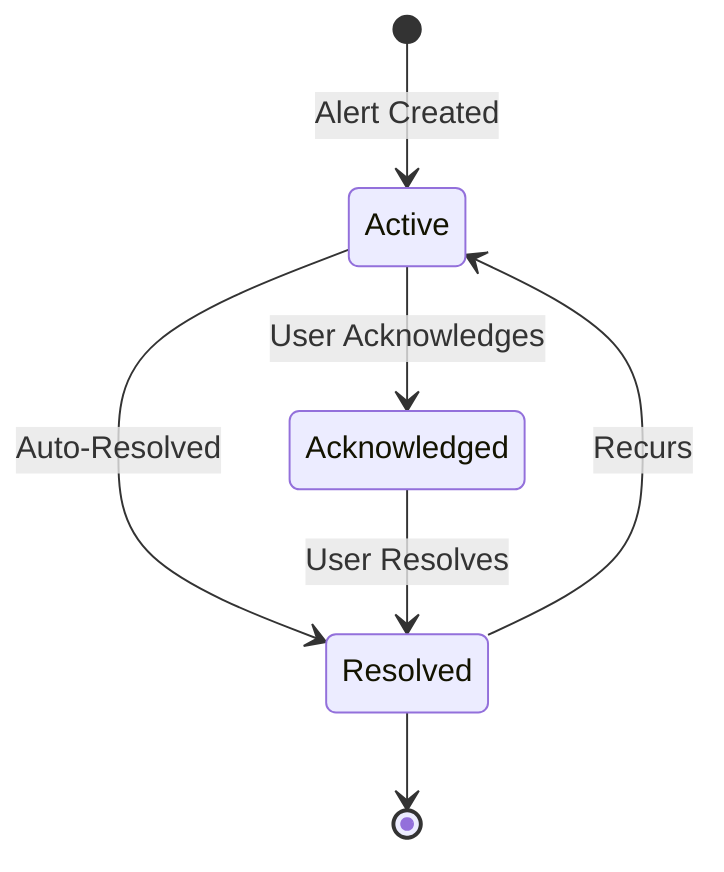

## Overview

The Alerter API manages alert creation, routing, acknowledgment, and lifecycle.

## Endpoints

### Send Alert

```http
POST /api/alerter/alert
```

Create and send a new alert.

<ParamField body="severity" type="string" required>
  Alert severity: critical, warning, info
</ParamField>

<ParamField body="title" type="string" required>
  Alert title
</ParamField>

<ParamField body="metric_name" type="string" required>
  Associated metric name
</ParamField>

<ParamField body="current_value" type="number" required>
  Current metric value
</ParamField>

<ParamField body="threshold" type="number">
  Threshold that was exceeded
</ParamField>

<ParamField body="context" type="object">
  Additional context information
</ParamField>

<ResponseExample>
```json
{
  "alert_id": "alert_20260406_103000_cpu",
  "status": "sent",
  "channels_notified": ["slack", "jira"],
  "timestamp": "2026-04-06T10:30:00Z"
}
```
</ResponseExample>

### Get Alerts

```http
GET /api/alerter/alerts
```

Retrieve alerts with optional filtering.

<ParamField query="severity" type="string">
  Filter by severity
</ParamField>

<ParamField query="status" type="string">
  Filter by status: active, acknowledged, resolved
</ParamField>

<ParamField query="start_time" type="string">
  Start time (ISO 8601)
</ParamField>

<ParamField query="end_time" type="string">
  End time (ISO 8601)
</ParamField>

<ResponseExample>
```json
{
  "alerts": [
    {
      "alert_id": "alert_20260406_103000_cpu",
      "severity": "critical",
      "title": "High CPU Usage",
      "metric_name": "cpu_usage_percent",
      "current_value": 94.5,
      "threshold": 90.0,
      "status": "active",
      "created_at": "2026-04-06T10:30:00Z",
      "acknowledged_at": null,
      "acknowledged_by": null
    }
  ],
  "total": 1
}
```
</ResponseExample>

### Acknowledge Alert

```http
POST /api/alerter/alerts/{alert_id}/acknowledge
```

Acknowledge an alert.

<ParamField body="acknowledged_by" type="string" required>
  User who acknowledged the alert
</ParamField>

<ParamField body="notes" type="string">
  Acknowledgment notes
</ParamField>

<ResponseExample>
```json
{
  "status": "success",
  "alert_id": "alert_20260406_103000_cpu",
  "acknowledged_at": "2026-04-06T10:35:00Z",
  "acknowledged_by": "john.doe"
}
```
</ResponseExample>

### Resolve Alert

```http
POST /api/alerter/alerts/{alert_id}/resolve
```

Mark alert as resolved.

<ParamField body="resolved_by" type="string" required>
  User who resolved the alert
</ParamField>

<ParamField body="resolution_notes" type="string">
  Resolution details
</ParamField>

<ResponseExample>
```json
{
  "status": "success",
  "alert_id": "alert_20260406_103000_cpu",
  "resolved_at": "2026-04-06T11:00:00Z",
  "resolved_by": "john.doe",
  "duration_minutes": 30
}
```
</ResponseExample>

### Suppress Alerts

```http
POST /api/alerter/suppress
```

Temporarily suppress alerts.

<ParamField body="metric_pattern" type="string">
  Regex pattern for metrics to suppress
</ParamField>

<ParamField body="hosts" type="array">
  List of hosts to suppress
</ParamField>

<ParamField body="duration_minutes" type="number">
  Suppression duration
</ParamField>

<ParamField body="reason" type="string" required>
  Reason for suppression
</ParamField>

<ResponseExample>
```json
{
  "suppression_id": "supp_123",
  "status": "active",
  "expires_at": "2026-04-06T12:00:00Z"
}
```
</ResponseExample>

### Get Alert Statistics

```http
GET /api/alerter/stats
```

Retrieve alert statistics and metrics.

<ResponseExample>
```json
{
  "period": "last_24h",
  "total_alerts": 42,
  "by_severity": {
    "critical": 5,
    "warning": 28,
    "info": 9
  },
  "by_status": {
    "active": 3,
    "acknowledged": 12,
    "resolved": 27
  },
  "metrics": {
    "mtta_minutes": 4.5,
    "mttr_minutes": 28.3,
    "false_positive_rate": 0.04
  }
}
```
</ResponseExample>

## Python SDK

```python
from infraguard import Alerter, Alert, Severity

alerter = Alerter(config)

# Send alert
alert = Alert(
    severity=Severity.CRITICAL,
    title="High CPU Usage",
    metric_name="cpu_usage",
    current_value=94.5,
    threshold=90.0,
    context={
        "host": "prod-web-01",
        "runbook": "https://wiki/runbooks/high-cpu"
    }
)
result = alerter.send(alert)

# Get active alerts
alerts = alerter.get_alerts(
    severity="critical",
    status="active"
)

# Acknowledge alert
alerter.acknowledge(
    alert_id="alert_123",
    acknowledged_by="john.doe",
    notes="Investigating high CPU usage"
)

# Resolve alert
alerter.resolve(
    alert_id="alert_123",
    resolved_by="john.doe",
    resolution_notes="Restarted service, CPU back to normal"
)

# Suppress alerts
alerter.suppress(
    metric_pattern="disk_.*",
    hosts=["prod-db-01"],
    duration_minutes=120,
    reason="Planned maintenance"
)

# Get statistics
stats = alerter.get_stats()
print(f"MTTA: {stats.mtta_minutes} minutes")
print(f"MTTR: {stats.mttr_minutes} minutes")
```

## Alert Lifecycle



## Alert Routing

Alerts are routed based on configuration:

```yaml
alerting:
  routing:
    - name: "critical_infrastructure"
      severity: "critical"
      metric_pattern: "^(cpu|memory|disk)_.*"
      channels:
        - type: "slack"
          channel: "#ops-critical"
        - type: "pagerduty"
        - type: "jira"
          project: "OPS"
```

## Webhooks

Subscribe to alert events via webhooks:

```http
POST /api/alerter/webhooks
```

<ParamField body="url" type="string" required>
  Webhook URL
</ParamField>

<ParamField body="events" type="array" required>
  Events to subscribe to: alert_created, alert_acknowledged, alert_resolved
</ParamField>

<ResponseExample>
```json
{
  "webhook_id": "webhook_123",
  "url": "https://your-service.com/webhook",
  "events": ["alert_created", "alert_resolved"],
  "secret": "whsec_abc123"
}
```
</ResponseExample>

## Best Practices

<AccordionGroup>
  <Accordion title="Alert Hygiene">
    - Acknowledge alerts promptly
    - Add resolution notes for future reference
    - Use suppression during maintenance
    - Review false positives regularly
  </Accordion>
  
  <Accordion title="Routing">
    - Route by severity and metric type
    - Use separate channels for different teams
    - Configure escalation for unacknowledged alerts
    - Test routing rules before production
  </Accordion>
  
  <Accordion title="Monitoring">
    - Track MTTA and MTTR metrics
    - Monitor false positive rate
    - Review alert volume trends
    - Optimize thresholds based on data
  </Accordion>
</AccordionGroup>

## Next Steps

<CardGroup cols={2}>
  <Card title="Alerting Concepts" icon="bell" href="/concepts/alerting">
    Learn about alert routing and escalation
  </Card>
  
  <Card title="Slack Integration" icon="slack" href="/integrations/slack">
    Configure Slack notifications
  </Card>
</CardGroup>
