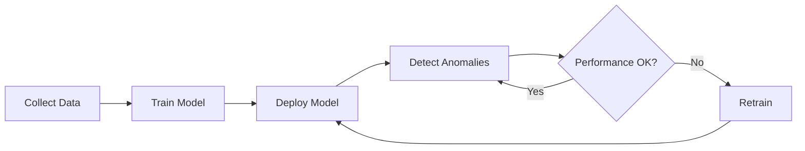

## Overview

The Detector API provides anomaly detection capabilities using Isolation Forest algorithm.

## Endpoints

### Detect Anomalies

```http
POST /api/detector/detect
```

Detect anomalies in provided metric data.

<ParamField body="metric_name" type="string" required>
  Name of the metric to analyze
</ParamField>

<ParamField body="values" type="array" required>
  Array of metric values with timestamps
</ParamField>

<ParamField body="threshold" type="number">
  Custom anomaly score threshold (default: 0.7)
</ParamField>

<ResponseExample>
```json
{
  "anomalies": [
    {
      "timestamp": "2026-04-06T10:30:00Z",
      "value": 94.5,
      "anomaly_score": 0.95,
      "is_anomaly": true,
      "expected_range": [40, 70],
      "deviation_std": 3.2
    }
  ],
  "total_points": 100,
  "anomaly_count": 3
}
```
</ResponseExample>

### Train Model

```http
POST /api/detector/train
```

Train or retrain anomaly detection model for a metric.

<ParamField body="metric_name" type="string" required>
  Metric to train model for
</ParamField>

<ParamField body="training_days" type="number">
  Days of historical data to use (default: 7)
</ParamField>

<ResponseExample>
```json
{
  "status": "success",
  "model_id": "model_cpu_usage_20260406",
  "training_samples": 10080,
  "training_duration_ms": 5420,
  "accuracy_score": 0.94
}
```
</ResponseExample>

### Get Model Info

```http
GET /api/detector/models/{metric_name}
```

Retrieve information about trained model.

<ResponseExample>
```json
{
  "metric_name": "cpu_usage_percent",
  "model_id": "model_cpu_usage_20260406",
  "algorithm": "isolation_forest",
  "trained_at": "2026-04-06T00:00:00Z",
  "training_samples": 10080,
  "parameters": {
    "n_estimators": 100,
    "contamination": 0.1,
    "max_samples": 256
  },
  "performance": {
    "accuracy": 0.94,
    "precision": 0.89,
    "recall": 0.92,
    "f1_score": 0.90
  }
}
```
</ResponseExample>

### Evaluate Model

```http
POST /api/detector/evaluate
```

Evaluate model performance on test data.

<ParamField body="metric_name" type="string" required>
  Metric name
</ParamField>

<ParamField body="test_data" type="array" required>
  Test dataset with labels
</ParamField>

<ResponseExample>
```json
{
  "accuracy": 0.94,
  "precision": 0.89,
  "recall": 0.92,
  "f1_score": 0.90,
  "confusion_matrix": {
    "true_positive": 92,
    "false_positive": 11,
    "true_negative": 887,
    "false_negative": 10
  }
}
```
</ResponseExample>

### Update Threshold

```http
PUT /api/detector/threshold
```

Update anomaly detection threshold.

<ParamField body="metric_name" type="string" required>
  Metric name
</ParamField>

<ParamField body="threshold" type="number" required>
  New threshold value (0.0 - 1.0)
</ParamField>

<ResponseExample>
```json
{
  "status": "success",
  "metric_name": "cpu_usage_percent",
  "old_threshold": 0.7,
  "new_threshold": 0.8
}
```
</ResponseExample>

## Python SDK

```python
from infraguard import Detector

detector = Detector(config)

# Detect anomalies
result = detector.detect(
    metric_name="cpu_usage",
    values=[
        {"timestamp": "2026-04-06T10:00:00Z", "value": 75.5},
        {"timestamp": "2026-04-06T10:01:00Z", "value": 94.5}
    ]
)

# Train model
model = detector.train(
    metric_name="cpu_usage",
    training_days=7
)

# Get model info
info = detector.get_model_info("cpu_usage")

# Evaluate model
metrics = detector.evaluate(
    metric_name="cpu_usage",
    test_data=test_dataset
)

# Update threshold
detector.update_threshold(
    metric_name="cpu_usage",
    threshold=0.8
)
```

## Anomaly Score Interpretation

| Score Range | Interpretation | Action |
|-------------|----------------|--------|
| 0.0 - 0.5 | Normal behavior | No action |
| 0.5 - 0.7 | Slightly unusual | Monitor |
| 0.7 - 0.9 | Anomalous | Alert (Warning) |
| 0.9 - 1.0 | Highly anomalous | Alert (Critical) |

## Model Lifecycle



## Best Practices

<AccordionGroup>
  <Accordion title="Training Data">
    - Use at least 7 days of historical data
    - Ensure data represents normal behavior
    - Exclude known incidents from training data
    - Retrain models regularly (daily or weekly)
  </Accordion>
  
  <Accordion title="Threshold Tuning">
    - Start with default threshold (0.7)
    - Adjust based on false positive rate
    - Lower threshold = more sensitive
    - Higher threshold = fewer false positives
  </Accordion>
  
  <Accordion title="Model Evaluation">
    - Evaluate models on labeled test data
    - Track precision and recall metrics
    - Monitor false positive rate
    - Compare against baseline models
  </Accordion>
</AccordionGroup>

## Next Steps

<CardGroup cols={2}>
  <Card title="Forecaster API" icon="chart-line" href="/api-reference/forecaster">
    Time series forecasting endpoints
  </Card>
  
  <Card title="Training Guide" icon="graduation-cap" href="/guides/training-models">
    Learn how to train and optimize models
  </Card>
</CardGroup>
