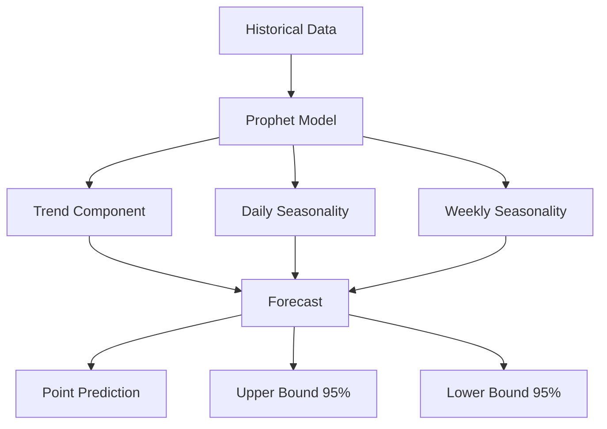

## Overview

The Forecaster API provides time series forecasting using Facebook's Prophet algorithm.

## Endpoints

### Generate Forecast

```http
POST /api/forecaster/predict
```

Generate forecast for a metric.

<ParamField body="metric_name" type="string" required>
  Name of the metric to forecast
</ParamField>

<ParamField body="horizon_hours" type="number">
  Forecast horizon in hours (default: 24)
</ParamField>

<ParamField body="interval_minutes" type="number">
  Prediction interval in minutes (default: 5)
</ParamField>

<ResponseExample>
```json
{
  "metric_name": "cpu_usage_percent",
  "forecast": [
    {
      "timestamp": "2026-04-06T11:00:00Z",
      "yhat": 65.2,
      "yhat_lower": 55.8,
      "yhat_upper": 74.6,
      "trend": 63.5,
      "seasonal": 1.7
    }
  ],
  "horizon_hours": 24,
  "confidence_level": 0.95,
  "model_id": "prophet_cpu_usage_20260406"
}
```
</ResponseExample>

### Train Forecast Model

```http
POST /api/forecaster/train
```

Train or retrain forecasting model.

<ParamField body="metric_name" type="string" required>
  Metric to train model for
</ParamField>

<ParamField body="history_days" type="number">
  Days of historical data (default: 30)
</ParamField>

<ParamField body="seasonality" type="object">
  Seasonality configuration
</ParamField>

<ResponseExample>
```json
{
  "status": "success",
  "model_id": "prophet_cpu_usage_20260406",
  "training_samples": 8640,
  "training_duration_ms": 12500,
  "seasonality_detected": {
    "daily": true,
    "weekly": true,
    "yearly": false
  }
}
```
</ResponseExample>

### Evaluate Forecast

```http
POST /api/forecaster/evaluate
```

Evaluate forecast accuracy against actual values.

<ParamField body="metric_name" type="string" required>
  Metric name
</ParamField>

<ParamField body="test_period_days" type="number">
  Days to evaluate (default: 7)
</ParamField>

<ResponseExample>
```json
{
  "metric_name": "cpu_usage_percent",
  "evaluation_period": "2026-03-30 to 2026-04-06",
  "metrics": {
    "mape": 8.5,
    "rmse": 5.2,
    "mae": 4.1,
    "coverage": 0.92
  },
  "quality_score": "good"
}
```
</ResponseExample>

### Get Forecast Components

```http
GET /api/forecaster/components/{metric_name}
```

Retrieve forecast components (trend, seasonality, holidays).

<ResponseExample>
```json
{
  "metric_name": "cpu_usage_percent",
  "components": {
    "trend": {
      "direction": "increasing",
      "slope": 0.05,
      "changepoints": [
        "2026-04-01T00:00:00Z",
        "2026-04-03T12:00:00Z"
      ]
    },
    "seasonality": {
      "daily": {
        "strength": 0.75,
        "peak_hour": 14,
        "trough_hour": 3
      },
      "weekly": {
        "strength": 0.45,
        "peak_day": "Tuesday",
        "trough_day": "Sunday"
      }
    }
  }
}
```
</ResponseExample>

## Python SDK

```python
from infraguard import Forecaster

forecaster = Forecaster(config)

# Generate forecast
forecast = forecaster.predict(
    metric_name="cpu_usage",
    horizon_hours=24,
    interval_minutes=5
)

# Access forecast values
for point in forecast.predictions:
    print(f"Time: {point.timestamp}")
    print(f"Predicted: {point.yhat}")
    print(f"Range: {point.yhat_lower} - {point.yhat_upper}")

# Train model
model = forecaster.train(
    metric_name="cpu_usage",
    history_days=30,
    seasonality={
        "daily": True,
        "weekly": True,
        "yearly": False
    }
)

# Evaluate accuracy
metrics = forecaster.evaluate(
    metric_name="cpu_usage",
    test_period_days=7
)

print(f"MAPE: {metrics.mape}%")
print(f"Coverage: {metrics.coverage * 100}%")

# Get components
components = forecaster.get_components("cpu_usage")
print(f"Trend: {components.trend.direction}")
print(f"Daily peak: {components.seasonality.daily.peak_hour}:00")
```

## Forecast Accuracy Metrics

| Metric | Description | Good Value |
|--------|-------------|------------|
| MAPE | Mean Absolute Percentage Error | < 10% |
| RMSE | Root Mean Squared Error | Lower is better |
| MAE | Mean Absolute Error | Lower is better |
| Coverage | % actuals within confidence interval | > 90% |

## Seasonality Configuration

```python
# Auto-detect seasonality
seasonality = {
    "daily": "auto",
    "weekly": "auto",
    "yearly": "auto"
}

# Manual configuration
seasonality = {
    "daily": True,
    "weekly": True,
    "yearly": False
}

# Custom seasonality
custom_seasonality = {
    "name": "monthly",
    "period": 30.5,
    "fourier_order": 8
}
```

## Forecast Visualization



## Use Cases

<CardGroup cols={2}>
  <Card title="Capacity Planning" icon="server">
    Predict when resources will reach capacity
  </Card>
  
  <Card title="Predictive Alerting" icon="bell">
    Alert before issues occur based on trends
  </Card>
  
  <Card title="Budget Forecasting" icon="dollar-sign">
    Estimate future infrastructure costs
  </Card>
  
  <Card title="Anomaly Detection" icon="magnifying-glass">
    Compare actuals vs forecast to detect anomalies
  </Card>
</CardGroup>

## Best Practices

<AccordionGroup>
  <Accordion title="Training Data">
    - Use at least 30 days of historical data
    - Ensure data has consistent intervals
    - Handle missing values appropriately
    - Include at least 2 seasonal cycles
  </Accordion>
  
  <Accordion title="Seasonality">
    - Start with auto-detection
    - Add custom seasonality only when needed
    - Adjust Fourier order for pattern complexity
    - Monitor seasonality strength
  </Accordion>
  
  <Accordion title="Model Maintenance">
    - Retrain models regularly (daily/weekly)
    - Monitor forecast accuracy metrics
    - Update when patterns change
    - Version models for rollback
  </Accordion>
</AccordionGroup>

## Next Steps

<CardGroup cols={2}>
  <Card title="Alerter API" icon="bell" href="/api-reference/alerter">
    Alert management endpoints
  </Card>
  
  <Card title="Training Guide" icon="graduation-cap" href="/guides/training-models">
    Optimize forecasting models
  </Card>
</CardGroup>
