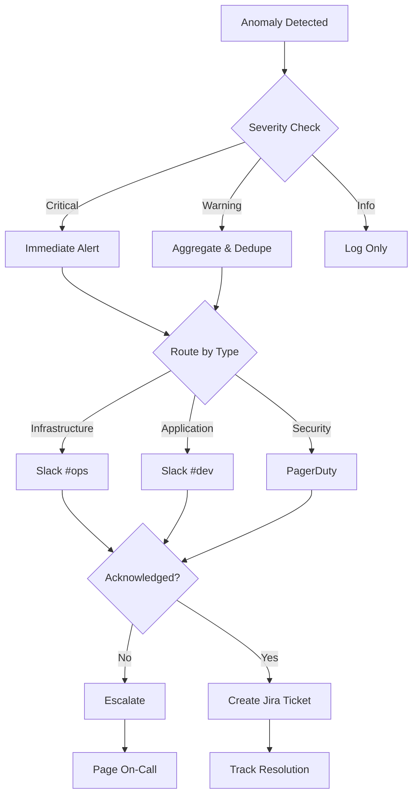
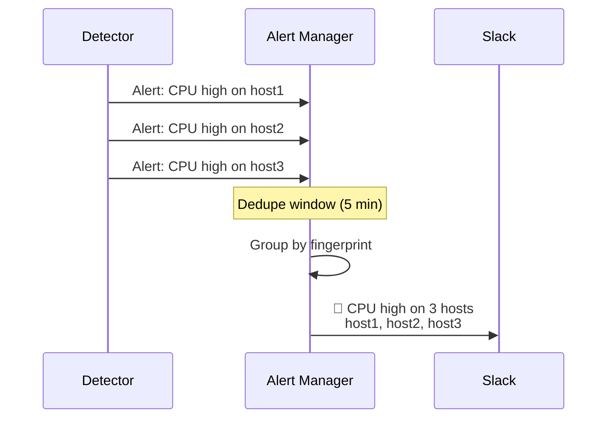
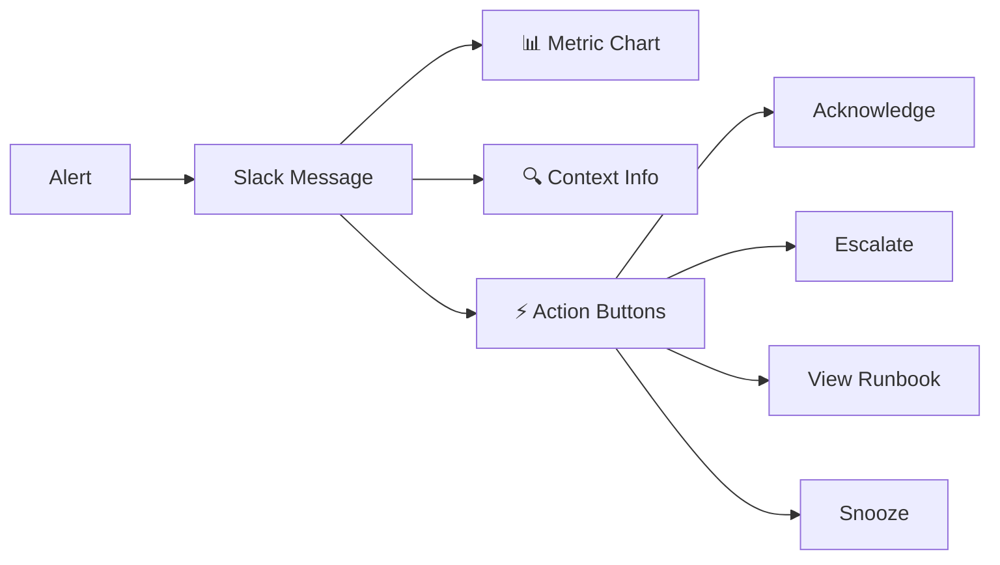
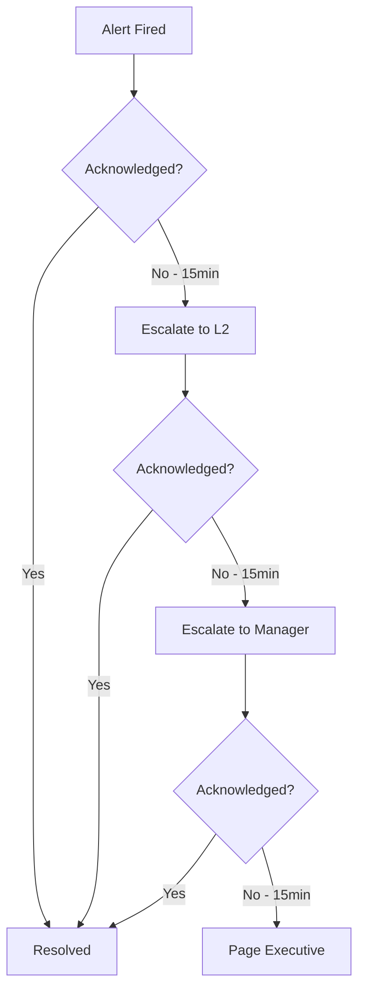
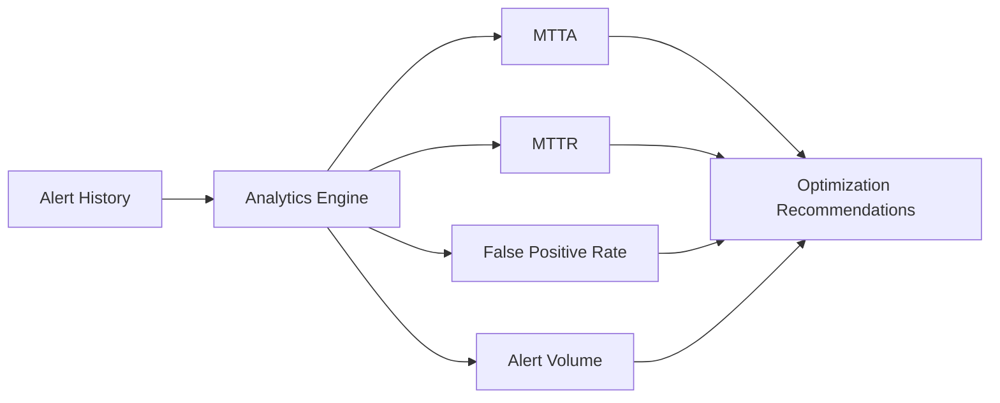

## Overview

InfraGuard's alerting system provides intelligent, context-aware notifications through multiple channels. It reduces alert fatigue through smart deduplication, severity-based routing, and automated escalation.

<Card title="Alert Philosophy" icon="brain">
  Send the right alert, to the right person, at the right time, through the right channel.
</Card>

## Alert Flow



## Severity Levels

<AccordionGroup>
  <Accordion title="Critical" icon="circle-exclamation">
    **Immediate action required** - Service is down or severely degraded
    
    - Instant notification to all channels
    - Page on-call engineer
    - Create P0 incident ticket
    - No deduplication delay
    
    Examples: Service outage, data loss, security breach
  </Accordion>
  
  <Accordion title="Warning" icon="triangle-exclamation">
    **Action needed soon** - Service degradation or approaching thresholds
    
    - Aggregate similar alerts (5 min window)
    - Notify primary channel
    - Create P1/P2 ticket
    - Escalate if unacknowledged (30 min)
    
    Examples: High CPU, elevated error rates, capacity warnings
  </Accordion>
  
  <Accordion title="Info" icon="circle-info">
    **Informational** - Notable events that don't require immediate action
    
    - Log to database
    - Daily digest email
    - No immediate notification
    - Available in dashboard
    
    Examples: Deployment events, configuration changes, metric trends
  </Accordion>
</AccordionGroup>

## Alert Channels

<CardGroup cols={2}>
  <Card title="Slack" icon="slack">
    Real-time notifications with interactive buttons for acknowledgment and escalation
  </Card>
  
  <Card title="Jira" icon="jira">
    Automatic ticket creation with context, metrics, and runbook links
  </Card>
  
  <Card title="PagerDuty" icon="pager">
    Critical alerts with on-call rotation and escalation policies
  </Card>
  
  <Card title="Email" icon="envelope">
    Digest reports and non-urgent notifications
  </Card>
</CardGroup>

## Configuration

```yaml
alerting:
  enabled: true
  
  # Deduplication settings
  deduplication:
    enabled: true
    window_minutes: 5
    max_alerts_per_window: 3
  
  # Routing rules
  routing:
    - name: critical_infrastructure
      severity: critical
      metric_pattern: "^(cpu|memory|disk)_.*"
      channels:
        - slack: "#ops-critical"
        - pagerduty: "infrastructure-team"
        - jira:
            project: OPS
            priority: P0
    
    - name: application_warnings
      severity: warning
      metric_pattern: "^app_.*"
      channels:
        - slack: "#dev-alerts"
        - jira:
            project: DEV
            priority: P2
  
  # Escalation policy
  escalation:
    enabled: true
    unacknowledged_timeout: 30m
    escalation_chain:
      - pagerduty: "on-call-primary"
      - delay: 15m
      - pagerduty: "on-call-secondary"
      - delay: 15m
      - pagerduty: "engineering-manager"
```

## Smart Deduplication

InfraGuard prevents alert storms by intelligently grouping similar alerts:

<Steps>
  <Step title="Alert Fingerprinting">
    Generate unique fingerprint based on metric, host, and alert type
  </Step>
  <Step title="Time Window Grouping">
    Group alerts with same fingerprint within configured window
  </Step>
  <Step title="Aggregation">
    Combine multiple alerts into single notification with count
  </Step>
  <Step title="Delivery">
    Send aggregated alert with all affected resources
  </Step>
</Steps>



## Alert Context

Every alert includes rich context for faster resolution:

<CodeGroup>
```json Alert Payload
{
  "alert_id": "alert_123",
  "severity": "critical",
  "title": "High CPU Usage Detected",
  "description": "CPU usage exceeded 90% threshold",
  
  "metric": {
    "name": "cpu_usage_percent",
    "current_value": 94.5,
    "threshold": 90.0,
    "host": "prod-web-01"
  },
  
  "anomaly": {
    "score": 0.95,
    "expected_range": [40, 70],
    "deviation": "3.2 std dev"
  },
  
  "context": {
    "recent_deployments": ["v2.3.1 deployed 15m ago"],
    "related_alerts": ["memory_high on prod-web-01"],
    "historical_pattern": "Normal range: 45-65%"
  },
  
  "actions": {
    "runbook": "https://wiki/runbooks/high-cpu",
    "dashboard": "https://grafana/d/cpu-analysis",
    "logs": "https://kibana/app/logs?host=prod-web-01"
  },
  
  "timestamp": "2026-04-06T10:30:00Z"
}
```

```python Python API
from infraguard.alerter import Alert, Severity

alert = Alert(
    severity=Severity.CRITICAL,
    title="High CPU Usage",
    metric_name="cpu_usage",
    current_value=94.5,
    threshold=90.0,
    host="prod-web-01",
    runbook_url="https://wiki/runbooks/high-cpu"
)

alerter.send(alert)
```
</CodeGroup>

## Slack Integration

InfraGuard sends rich, interactive Slack messages:



<Tip>
  Use Slack's interactive buttons to acknowledge alerts, escalate issues, or snooze notifications directly from the message.
</Tip>

## Jira Integration

Automatic ticket creation with full context:

<AccordionGroup>
  <Accordion title="Ticket Fields">
    - **Summary**: Alert title with severity
    - **Description**: Full alert context with metrics
    - **Priority**: Mapped from alert severity
    - **Labels**: Auto-tagged with metric type, host, environment
    - **Attachments**: Metric charts and graphs
    - **Links**: Runbook, dashboard, and log URLs
  </Accordion>
  
  <Accordion title="Lifecycle Management">
    - Created when alert fires
    - Updated with resolution notes when acknowledged
    - Closed automatically when metric returns to normal
    - Reopened if issue recurs within 24 hours
  </Accordion>
</AccordionGroup>

## Alert Suppression

Temporarily suppress alerts during maintenance:

```yaml
suppression:
  - name: planned_maintenance
    start: "2026-04-06T22:00:00Z"
    end: "2026-04-07T02:00:00Z"
    hosts: ["prod-web-*"]
    reason: "Database migration"
  
  - name: known_issue
    metric_pattern: "disk_io_.*"
    hosts: ["prod-db-01"]
    until_resolved: true
    jira_ticket: "OPS-1234"
```

## Escalation Policies

Define escalation chains for unacknowledged alerts:



## Alert Analytics

Track alert metrics to improve signal-to-noise ratio:

| Metric | Description | Target |
|--------|-------------|--------|
| MTTA | Mean Time To Acknowledge | < 5 min |
| MTTR | Mean Time To Resolve | < 30 min |
| False Positive Rate | % of alerts that were not issues | < 5% |
| Alert Volume | Alerts per day | Minimize |



## Best Practices

<AccordionGroup>
  <Accordion title="Threshold Tuning">
    - Start with conservative thresholds
    - Adjust based on false positive rate
    - Use dynamic thresholds from forecasting
    - Review and update quarterly
  </Accordion>
  
  <Accordion title="Alert Fatigue Prevention">
    - Enable deduplication for all non-critical alerts
    - Use aggregation for related alerts
    - Suppress known issues with Jira tickets
    - Regular alert hygiene reviews
  </Accordion>
  
  <Accordion title="Runbook Integration">
    - Every alert should link to a runbook
    - Keep runbooks up-to-date
    - Include common resolution steps
    - Document escalation procedures
  </Accordion>
</AccordionGroup>

## Troubleshooting

<Warning>
  If you're not receiving alerts:
  - Check channel configuration in `config.yaml`
  - Verify API credentials for Slack/Jira/PagerDuty
  - Review alert routing rules
  - Check suppression rules aren't blocking alerts
</Warning>

<Tip>
  Use the `/api/alerter/test` endpoint to send test alerts and verify channel configuration.
</Tip>

## Next Steps

<CardGroup cols={2}>
  <Card title="Slack Setup" icon="slack" href="/integrations/slack">
    Configure Slack integration and webhooks
  </Card>
  
  <Card title="Jira Setup" icon="jira" href="/integrations/jira">
    Set up automatic ticket creation
  </Card>
  
  <Card title="Runbooks Guide" icon="book" href="/guides/runbooks">
    Create effective runbooks for your alerts
  </Card>
  
  <Card title="API Reference" icon="code" href="/api-reference/alerter">
    Explore the Alerter API documentation
  </Card>
</CardGroup>
