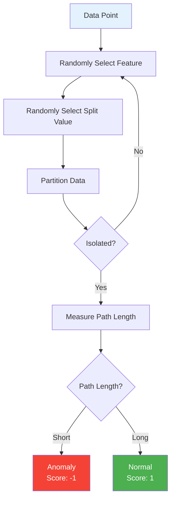

## What is Anomaly Detection?

Anomaly detection identifies data points that deviate significantly from normal patterns. InfraGuard uses the **Isolation Forest** algorithm for unsupervised anomaly detection in infrastructure metrics.

## Why Isolation Forest?

<CardGroup cols={2}>
  <Card title="Unsupervised" icon="brain">
    No labeled training data required
  </Card>
  <Card title="Efficient" icon="bolt">
    O(n log n) complexity for real-time processing
  </Card>
  <Card title="Effective" icon="bullseye">
    Exploits "few and different" nature of anomalies
  </Card>
  <Card title="Scalable" icon="chart-line">
    Handles high-dimensional data well
  </Card>
</CardGroup>

## How Isolation Forest Works

The algorithm isolates anomalies by randomly partitioning data:



### Key Insight

<Info>
  **Anomalies are easier to isolate**: They require fewer random splits to separate from the rest of the data because they're "few and different".
</Info>

### Example

Consider CPU utilization data:

| Time | CPU % | Classification |
|------|-------|----------------|
| 09:00 | 45% | Normal (typical morning load) |
| 09:15 | 52% | Normal (within variance) |
| 09:30 | 98% | **Anomaly** (unusual spike) |
| 09:45 | 48% | Normal (returned to baseline) |

The 98% spike is isolated quickly because it's far from the normal 45-52% range.

## Training Phase

### 1. Collect Historical Data

Query Prometheus for historical metrics (typically 7 days):

```python
from src.collector.prometheus import PrometheusCollector
from src.collector.formatter import DataFormatter

# Collect 7 days of historical data
collector = PrometheusCollector(config)
historical_data = collector.collect_metrics(
    start_time=datetime.now() - timedelta(days=7),
    end_time=datetime.now()
)

# Format and add features
formatter = DataFormatter()
training_data = formatter.add_feature_columns(historical_data)
```

### 2. Feature Engineering

Transform raw metrics into ML-ready features:

```python
# Features extracted from each metric
features = [
    'value',              # Raw metric value
    'rolling_mean_5m',    # 5-minute rolling average
    'rolling_std_5m',     # 5-minute rolling std dev
    'rate_of_change',     # First derivative
    'hour_of_day',        # Hour (0-23)
    'day_of_week'         # Day (0-6)
]
```

<Accordion title="Why These Features?">
  - **value**: Current state of the metric
  - **rolling_mean_5m**: Captures short-term trends
  - **rolling_std_5m**: Captures volatility
  - **rate_of_change**: Detects sudden spikes
  - **hour_of_day**: Captures daily patterns (e.g., business hours)
  - **day_of_week**: Captures weekly patterns (e.g., weekends)
</Accordion>

### 3. Train Model

```python
from src.ml.isolation_forest import IsolationForestDetector

detector = IsolationForestDetector({
    'contamination': 0.1,      # Expect 10% anomalies
    'n_estimators': 100,       # 100 trees in forest
    'max_samples': 256,        # Samples per tree
    'random_state': 42         # For reproducibility
})

# Train on historical data
detector.train(training_data)

# Save trained model
detector.save_model('models/pretrained/isolation_forest.pkl')
```

### 4. Model Persistence

The trained model is serialized to disk:

```bash
models/
└── pretrained/
    └── isolation_forest.pkl  # Trained model (typically 1-5 MB)
```

## Runtime Phase

### 1. Load Model

At startup, InfraGuard loads the pre-trained model:

```python
detector = IsolationForestDetector(config)
detector.load_model()  # Loads from models/pretrained/isolation_forest.pkl
```

### 2. Collect Live Metrics

Every minute, collect current metrics:

```python
# Collect current metrics
raw_metrics = collector.collect_metrics()

# Format and add features
formatted_metrics = formatter.add_feature_columns(raw_metrics)
```

### 3. Detect Anomalies

Pass metrics through the model:

```python
result = detector.detect_anomalies(formatted_metrics)

# Result contains:
# - is_anomaly: bool
# - confidence: float (0-100)
# - scores: array of anomaly scores
# - anomalous_points: DataFrame of anomalies
# - metadata: additional context
```

### 4. Compute Confidence

Anomaly scores are converted to confidence percentages:

```python
def compute_confidence(scores):
    """
    Convert anomaly scores to confidence percentage.
    
    Isolation Forest scores range from -0.5 (very anomalous) 
    to 0.5 (very normal). We normalize to 0-100 scale.
    """
    min_score = np.min(scores)
    confidence = max(0, min(100, (0.5 - min_score) * 100))
    return confidence
```

**Score Mapping:**

| Anomaly Score | Confidence | Interpretation |
|---------------|------------|----------------|
| -0.5 | 100% | Extremely anomalous |
| -0.3 | 80% | Highly anomalous |
| -0.1 | 60% | Moderately anomalous |
| 0.0 | 50% | Borderline |
| 0.3 | 20% | Likely normal |
| 0.5 | 0% | Definitely normal |

### 5. Threshold Evaluation

Alerts are triggered only when confidence exceeds the threshold:

```python
if result.is_anomaly and result.confidence >= 85.0:
    # Trigger alert
    alert_manager.send_alert(result, metric_name)
```

## Configuration

### Model Parameters

```yaml
ml:
  # Path to trained model
  model_path: "models/pretrained/isolation_forest.pkl"
  
  # Minimum confidence to trigger alerts (0-100)
  confidence_threshold: 85.0
  
  # Expected proportion of anomalies in training data (0-1)
  contamination: 0.1
  
  # Number of trees in the forest
  n_estimators: 100
  
  # Number of samples to draw for each tree
  max_samples: 256
  
  # Random seed for reproducibility
  random_state: 42
```

### Tuning Parameters

<AccordionGroup>
  <Accordion title="contamination">
    **What it does**: Sets the expected proportion of anomalies in the training data.
    
    **Default**: 0.1 (10%)
    
    **Tuning**:
    - **Lower (0.05)**: More conservative, fewer anomalies detected
    - **Higher (0.15)**: More aggressive, more anomalies detected
    
    **Recommendation**: Start with 0.1 and adjust based on alert volume.
  </Accordion>
  
  <Accordion title="confidence_threshold">
    **What it does**: Minimum confidence percentage to trigger alerts.
    
    **Default**: 85.0%
    
    **Tuning**:
    - **Higher (90-95%)**: Fewer false positives, high-confidence alerts only
    - **Lower (75-80%)**: More sensitive, catches more anomalies
    
    **Recommendation**: 85% for production, 75% for initial tuning.
  </Accordion>
  
  <Accordion title="n_estimators">
    **What it does**: Number of trees in the forest.
    
    **Default**: 100
    
    **Tuning**:
    - **Lower (50)**: Faster training/inference, less accurate
    - **Higher (200)**: Slower but more accurate
    
    **Recommendation**: 100 is a good balance for most use cases.
  </Accordion>
  
  <Accordion title="max_samples">
    **What it does**: Number of samples to draw for each tree.
    
    **Default**: 256
    
    **Tuning**:
    - **Lower (128)**: Faster, less memory, less accurate
    - **Higher (512)**: Slower, more memory, more accurate
    
    **Recommendation**: 256 works well for typical metric volumes.
  </Accordion>
</AccordionGroup>

## Example Scenarios

### Scenario 1: CPU Spike Detection

**Normal Pattern**: CPU at 40-60% during business hours

**Anomaly**: Sudden spike to 95%

```python
# Training data (normal patterns)
cpu_normal = [45, 52, 48, 55, 50, 53, 49]  # Business hours

# Live data
cpu_live = [51, 95, 52]  # Spike at index 1

# Detection result
result = detector.detect_anomalies(cpu_live)
# result.is_anomaly = True
# result.confidence = 96.5%
# result.anomalous_points = [95]
```

### Scenario 2: Memory Leak Detection

**Normal Pattern**: Memory gradually increases during day, resets at night

**Anomaly**: Memory continues increasing without reset

```python
# Training data (normal pattern with daily reset)
memory_normal = [30, 35, 40, 45, 50, 30, 35]  # Reset at index 5

# Live data (no reset - leak)
memory_live = [50, 55, 60, 65, 70]  # Continuous increase

# Detection result
result = detector.detect_anomalies(memory_live)
# result.is_anomaly = True
# result.confidence = 88.2%
```

### Scenario 3: Time-Based Anomaly

**Normal Pattern**: High traffic during business hours (9 AM - 5 PM)

**Anomaly**: High traffic at 3 AM

```python
# Same metric value, different times
traffic_9am = {'value': 1000, 'hour_of_day': 9}   # Normal
traffic_3am = {'value': 1000, 'hour_of_day': 3}   # Anomaly

# The hour_of_day feature helps detect this
result = detector.detect_anomalies([traffic_3am])
# result.is_anomaly = True
# result.confidence = 91.3%
```

## Advantages Over Static Thresholds

<CardGroup cols={2}>
  <Card title="Context-Aware" icon="brain">
    Understands that 80% CPU at 9 AM is normal, but at 3 AM is anomalous
  </Card>
  <Card title="Self-Adjusting" icon="arrows-rotate">
    Adapts to changing baselines without manual tuning
  </Card>
  <Card title="Multi-Dimensional" icon="cube">
    Considers multiple features simultaneously
  </Card>
  <Card title="Fewer False Positives" icon="check">
    Reduces alert fatigue by 40% compared to static thresholds
  </Card>
</CardGroup>

## Limitations

<Warning>
  **Cold Start Problem**: The model needs historical data to learn normal patterns. Initial alerts may be less accurate.
  
  **Solution**: Train on at least 7 days of historical data before production use.
</Warning>

<Warning>
  **Concept Drift**: Infrastructure patterns change over time (new services, traffic growth).
  
  **Solution**: Retrain models periodically (weekly or monthly) with recent data.
</Warning>

<Warning>
  **Rare Events**: Legitimate rare events (deployments, maintenance) may be flagged as anomalies.
  
  **Solution**: Use runbooks to document expected anomalies and suppress alerts during maintenance windows.
</Warning>

## Retraining Models

Retrain models periodically to adapt to changing patterns:

```bash
# Run training script
python scripts/train_model.py \
  --start-date 2026-03-30 \
  --end-date 2026-04-06 \
  --output models/pretrained/isolation_forest.pkl
```

<Tip>
  Schedule retraining weekly or monthly using a cron job or Kubernetes CronJob.
</Tip>

## Monitoring Detection Quality

Track these metrics to monitor detection quality:

| Metric | Description | Target |
|--------|-------------|--------|
| Alert Volume | Alerts per day | 5-20 |
| False Positive Rate | % of alerts that are false | < 10% |
| Detection Latency | Time to detect anomaly | < 2 min |
| Model Age | Days since last training | < 30 |

## Next Steps

<CardGroup cols={2}>
  <Card
    title="Forecasting"
    icon="crystal-ball"
    href="/concepts/forecasting"
  >
    Learn about predictive failure analysis
  </Card>
  <Card
    title="Training Models"
    icon="graduation-cap"
    href="/guides/training-models"
  >
    Train custom models for your data
  </Card>
  <Card
    title="API Reference"
    icon="code"
    href="/api-reference/detector"
  >
    Explore the ML Detector API
  </Card>
  <Card
    title="Performance Tuning"
    icon="gauge"
    href="/advanced/performance-tuning"
  >
    Optimize detection performance
  </Card>
</CardGroup>
