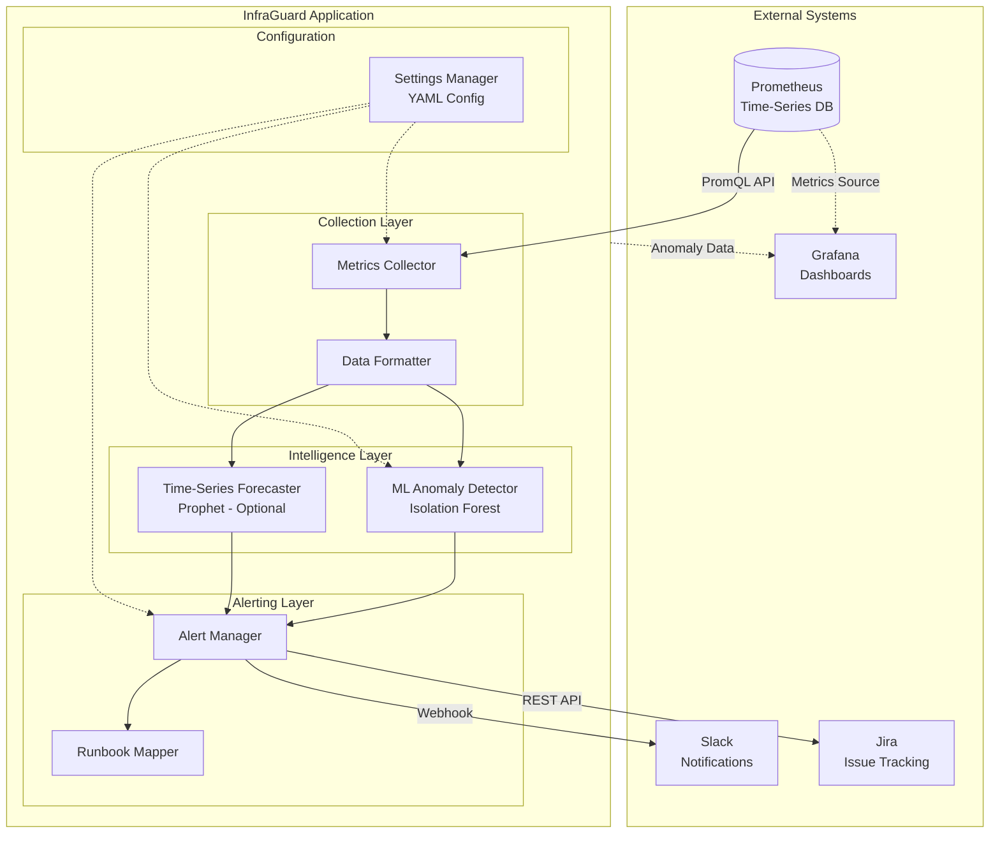
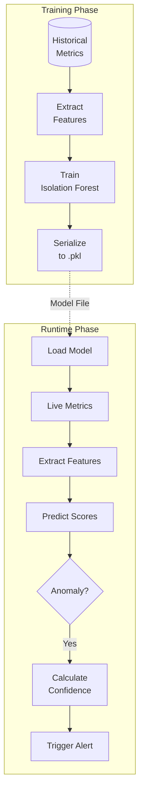
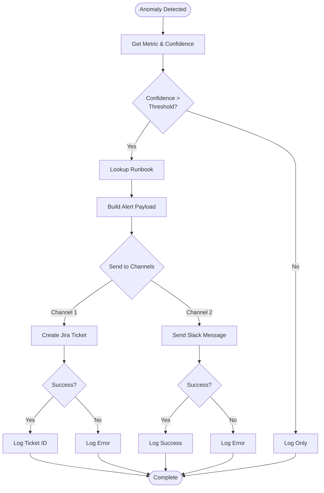
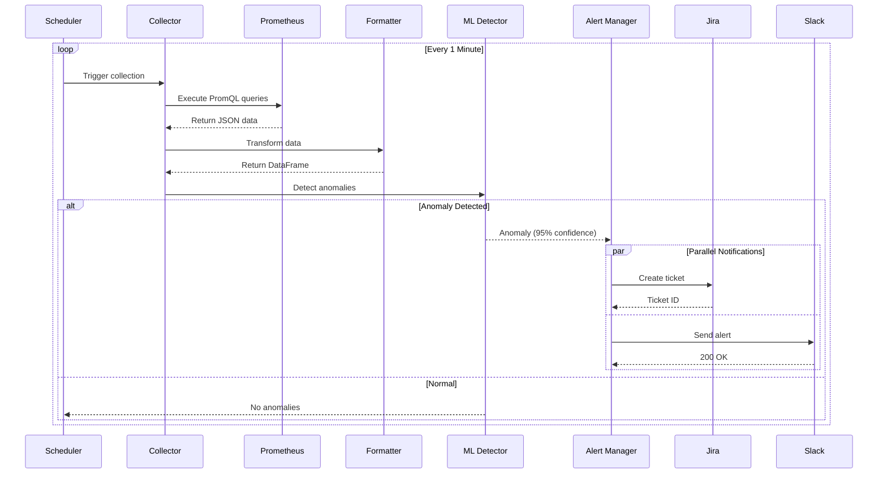
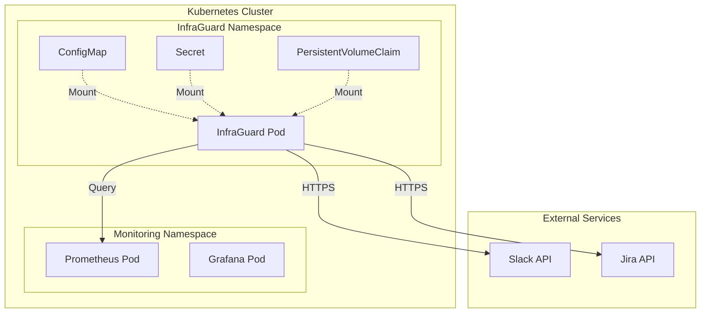

## System Architecture

InfraGuard follows a layered architecture pattern with clear separation of concerns:



## Design Principles

<CardGroup cols={2}>
  <Card title="Modularity" icon="cubes">
    Each component has a single responsibility and clear interfaces
  </Card>
  <Card title="Reliability" icon="shield">
    Graceful degradation and comprehensive error handling
  </Card>
  <Card title="Testability" icon="flask">
    Property-based testing for correctness guarantees
  </Card>
  <Card title="Operability" icon="gauge">
    Container-native with built-in observability
  </Card>
</CardGroup>

## Collection Layer

### Metrics Collector

Queries Prometheus API using PromQL:

```python
class PrometheusCollector:
    def __init__(self, config: dict):
        self.prometheus_url = config['url']
        self.queries = config['queries']
        self.timeout_seconds = config.get('timeout', 30)
    
    def collect_metrics(self) -> pd.DataFrame:
        """Execute all configured queries and return formatted data."""
        results = []
        for metric_name, query in self.queries.items():
            response = self.execute_query(query)
            results.append(self._format_response(response, metric_name))
        return pd.concat(results)
```

**Key Features:**
- HTTP-based API client with configurable timeout
- Parallel query execution for multiple metrics
- Automatic retry on connection failures
- Error handling with graceful degradation

### Data Formatter

Transforms Prometheus JSON to ML-ready DataFrames:

```python
class DataFormatter:
    @staticmethod
    def add_feature_columns(df: pd.DataFrame) -> pd.DataFrame:
        """Add derived features for ML model."""
        df['rolling_mean_5m'] = df['value'].rolling(window=5).mean()
        df['rolling_std_5m'] = df['value'].rolling(window=5).std()
        df['rate_of_change'] = df['value'].diff()
        df['hour_of_day'] = df['timestamp'].dt.hour
        df['day_of_week'] = df['timestamp'].dt.dayofweek
        return df
```

**Features Added:**
- Rolling statistics (mean, std dev)
- Rate of change (first derivative)
- Temporal features (hour, day of week)
- Timestamp normalization

## Intelligence Layer

### ML Anomaly Detector

Uses Isolation Forest for unsupervised anomaly detection:



**Algorithm Details:**

<Accordion title="How Isolation Forest Works">
  The Isolation Forest algorithm isolates anomalies by:
  
  1. **Random Feature Selection**: Randomly selects a feature
  2. **Random Split**: Randomly selects a split value between min and max
  3. **Recursive Partitioning**: Recursively partitions the data
  4. **Path Length**: Anomalies require fewer splits (shorter path)
  
  **Why it works**: Anomalies are "few and different", so they're easier to isolate than normal points.
</Accordion>

**Configuration:**

```yaml
ml:
  contamination: 0.1        # Expected proportion of anomalies
  n_estimators: 100         # Number of trees in forest
  max_samples: 256          # Samples per tree
  random_state: 42          # For reproducibility
  confidence_threshold: 85.0 # Minimum confidence to alert
```

### Time-Series Forecaster

Optional Prophet-based forecasting:

```python
class TimeSeriesForecaster:
    def forecast(self, data: pd.DataFrame, metric_name: str) -> ForecastResult:
        """Generate forecast for prediction window."""
        # Prepare data in Prophet format
        prophet_data = pd.DataFrame({
            'ds': data['timestamp'],
            'y': data['value']
        })
        
        # Fit model and predict
        self.model.fit(prophet_data)
        future = self.model.make_future_dataframe(
            periods=self.prediction_window_minutes,
            freq='T'
        )
        forecast = self.model.predict(future)
        
        # Check for threshold breaches
        return self._check_breach(forecast, metric_name)
```

**Features:**
- Seasonal decomposition (daily, weekly)
- Trend detection with changepoints
- Confidence intervals
- Threshold breach prediction

## Alerting Layer

### Alert Manager

Orchestrates alert delivery to multiple channels:



**Key Features:**
- Parallel notification delivery
- Automatic retry with backoff
- Graceful degradation (one channel failure doesn't stop others)
- Comprehensive logging

### Slack Notifier

Sends formatted Block Kit messages:

```json
{
  "blocks": [
    {
      "type": "header",
      "text": {
        "type": "plain_text",
        "text": "🔴 InfraGuard Anomaly Detected"
      }
    },
    {
      "type": "section",
      "fields": [
        {"type": "mrkdwn", "text": "*Severity:*\nCRITICAL"},
        {"type": "mrkdwn", "text": "*Confidence:*\n95.0%"},
        {"type": "mrkdwn", "text": "*Metric:*\n`cpu_utilization`"}
      ]
    }
  ]
}
```

### Jira Notifier

Creates structured incident tickets:

```python
{
  "fields": {
    "project": {"key": "INC"},
    "summary": "InfraGuard Anomaly: cpu_utilization (95.0% confidence)",
    "issuetype": {"name": "Incident"},
    "priority": {"name": "High"},
    "labels": ["infraguard", "anomaly", "automated"]
  }
}
```

## Configuration Layer

### Settings Manager

Loads and validates YAML configuration:

```python
class ConfigurationManager:
    def __init__(self, config_path: str):
        self.config = self._load_config(config_path)
        self._validate_config()
    
    def _validate_config(self):
        """Validate required fields."""
        required_sections = ['prometheus', 'ml', 'alerting']
        for section in required_sections:
            if section not in self.config:
                raise ConfigurationError(f"Missing section: {section}")
```

**Validation Rules:**
- Required sections must be present
- URLs must be valid HTTP/HTTPS
- Thresholds must be in valid ranges
- Credentials must be provided for enabled integrations

## Data Flow

Complete request flow through the system:



## Deployment Architecture

### Kubernetes Deployment



**Resources:**
- **CPU**: 250m-500m (0.25-0.5 cores)
- **Memory**: 512Mi-1Gi
- **Storage**: 1-5Gi for models and logs

## Error Handling

### Error Categories

<AccordionGroup>
  <Accordion title="Network Errors">
    **Prometheus Connection Errors**
    - Retry with exponential backoff
    - Log error and continue with next cycle
    
    **Slack/Jira API Errors**
    - Retry once after 10 seconds
    - Log error but don't fail entire alert cycle
  </Accordion>
  
  <Accordion title="Data Validation Errors">
    **Invalid Prometheus Response**
    - Log error with response details
    - Skip invalid data points
    - Continue with valid data
    
    **Missing Feature Columns**
    - Fill with appropriate defaults
    - Log warning
    - Continue processing
  </Accordion>
  
  <Accordion title="ML Processing Errors">
    **Model Loading Errors**
    - Log error and exit (fatal)
    - Or operate in training mode
    
    **Prediction Errors**
    - Log error with input data
    - Return empty result
    - Continue monitoring
  </Accordion>
  
  <Accordion title="Configuration Errors">
    **Missing Configuration**
    - Log error and exit (fatal)
    
    **Invalid Configuration**
    - Log descriptive error
    - Exit with non-zero status
  </Accordion>
</AccordionGroup>

### Graceful Degradation

InfraGuard continues operating even when components fail:

- **Slack fails**: Jira still works
- **Jira fails**: Slack still works
- **Forecasting fails**: Anomaly detection continues
- **Single metric fails**: Other metrics continue

## Performance Characteristics

### Scalability

<CardGroup cols={2}>
  <Card title="Single Instance" icon="server">
    Handles up to 100 metrics at 1-minute intervals
  </Card>
  <Card title="Latency" icon="clock">
    < 5 seconds per collection cycle
  </Card>
  <Card title="ML Inference" icon="brain">
    < 1 second per metric
  </Card>
  <Card title="Alert Delivery" icon="bell">
    < 3 seconds (parallel)
  </Card>
</CardGroup>

### Resource Usage

| Component | CPU | Memory | Storage |
|-----------|-----|--------|---------|
| Collector | 50m | 128Mi | - |
| ML Detector | 100m | 256Mi | 100Mi |
| Alerter | 50m | 128Mi | - |
| **Total** | **250m** | **512Mi** | **1Gi** |

## Security

### Authentication

- **Prometheus**: No authentication (HTTP)
- **Slack**: Webhook URL (secret)
- **Jira**: API token (secret)

### Network Security

- TLS for all external API calls
- Network policies for pod isolation
- Service mesh (optional) for mTLS

### Data Protection

- No PII in logs or metrics
- Encrypted secrets at rest
- Audit logging for alert delivery

## Monitoring

InfraGuard exposes metrics about its own operation:

```python
# Prometheus metrics
metrics_collected = Counter('infraguard_metrics_collected_total')
anomalies_detected = Counter('infraguard_anomalies_detected_total')
alerts_sent = Counter('infraguard_alerts_sent_total', ['channel', 'status'])
collection_duration = Histogram('infraguard_collection_duration_seconds')
```

## Next Steps

<CardGroup cols={2}>
  <Card
    title="Anomaly Detection"
    icon="magnifying-glass"
    href="/concepts/anomaly-detection"
  >
    Learn how anomaly detection works
  </Card>
  <Card
    title="Forecasting"
    icon="crystal-ball"
    href="/concepts/forecasting"
  >
    Understand predictive analysis
  </Card>
  <Card
    title="Deployment"
    icon="rocket"
    href="/deployment/kubernetes"
  >
    Deploy to production
  </Card>
  <Card
    title="API Reference"
    icon="code"
    href="/api-reference/introduction"
  >
    Explore the API
  </Card>
</CardGroup>
