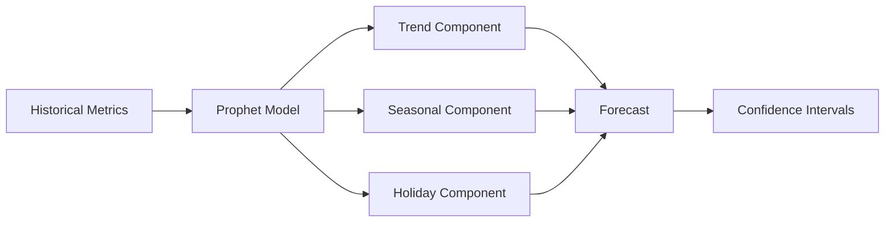
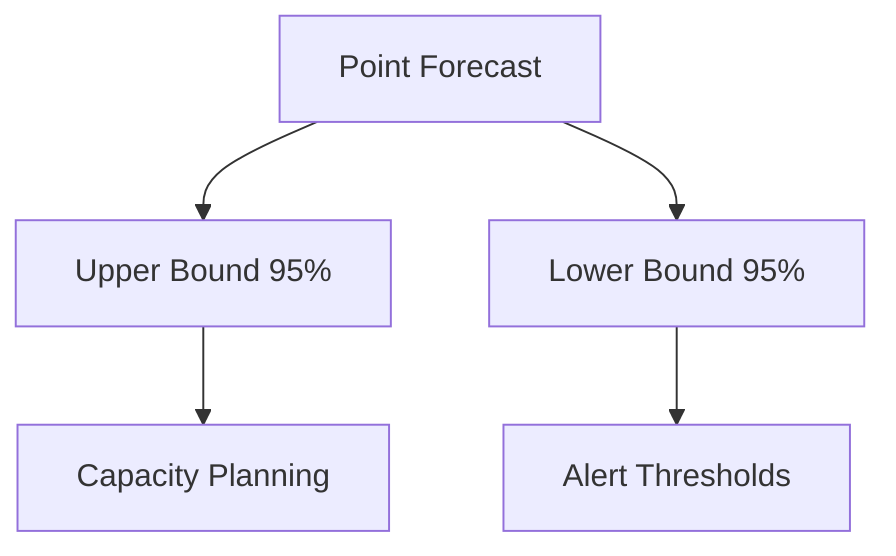
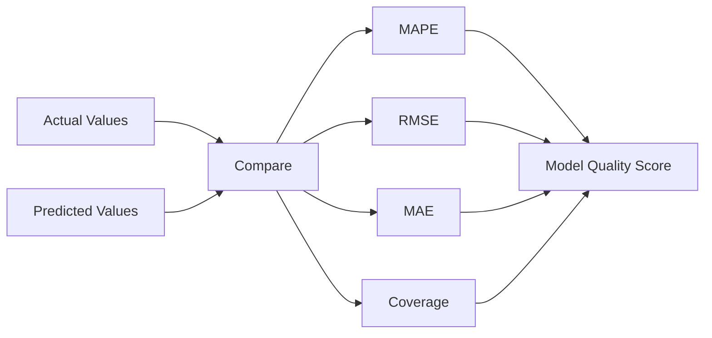

## Overview

InfraGuard uses Facebook's Prophet algorithm to forecast future metric values, enabling proactive capacity planning and predictive alerting. The forecasting engine analyzes historical patterns to predict future trends with confidence intervals.

<Card title="Why Forecasting?" icon="lightbulb">
  Forecasting helps you anticipate issues before they occur, plan capacity needs, and set intelligent alert thresholds based on predicted values.
</Card>

## Prophet Algorithm

Prophet is designed for business time series data with the following characteristics:

- **Seasonal patterns**: Daily, weekly, and yearly seasonality
- **Trend changes**: Automatic detection of trend shifts
- **Holiday effects**: Custom holiday calendars
- **Missing data**: Robust to missing values and outliers



## Forecasting Pipeline

<Steps>
  <Step title="Data Collection">
    Gather historical metric data with timestamps
  </Step>
  <Step title="Preprocessing">
    Clean data, handle missing values, and normalize
  </Step>
  <Step title="Model Training">
    Fit Prophet model with seasonality parameters
  </Step>
  <Step title="Prediction">
    Generate forecasts with confidence intervals
  </Step>
  <Step title="Validation">
    Compare predictions against actual values
  </Step>
</Steps>

## Configuration

```yaml
forecasting:
  enabled: true
  algorithm: prophet
  
  # Training parameters
  training:
    history_days: 30
    retrain_interval: 24h
    min_data_points: 100
  
  # Seasonality detection
  seasonality:
    daily: auto
    weekly: auto
    yearly: false
  
  # Forecast horizon
  forecast:
    horizon_hours: 24
    interval_minutes: 5
    confidence_level: 0.95
  
  # Performance tuning
  performance:
    parallel_models: 4
    cache_predictions: true
    cache_ttl: 1h
```

## Forecast Components

### Trend Component

Captures long-term growth or decline patterns:

```python
# Linear trend (default)
trend = 'linear'

# Logistic growth with capacity
trend = 'logistic'
growth_cap = 100.0
```

### Seasonal Components

<AccordionGroup>
  <Accordion title="Daily Seasonality">
    Captures patterns that repeat every 24 hours (e.g., traffic peaks during business hours)
    
    ```python
    model.add_seasonality(
        name='daily',
        period=1,
        fourier_order=10
    )
    ```
  </Accordion>
  
  <Accordion title="Weekly Seasonality">
    Captures patterns that repeat every 7 days (e.g., lower weekend traffic)
    
    ```python
    model.add_seasonality(
        name='weekly',
        period=7,
        fourier_order=5
    )
    ```
  </Accordion>
  
  <Accordion title="Custom Seasonality">
    Define custom seasonal patterns for your specific use case
    
    ```python
    model.add_seasonality(
        name='monthly',
        period=30.5,
        fourier_order=8
    )
    ```
  </Accordion>
</AccordionGroup>

## Confidence Intervals

Prophet provides uncertainty intervals for predictions:



<CodeGroup>
```python Python API
from infraguard.forecaster import Forecaster

forecaster = Forecaster(config)
forecast = forecaster.predict(
    metric_name='cpu_usage',
    horizon_hours=24
)

# Access forecast components
print(f"Predicted value: {forecast.yhat}")
print(f"Upper bound: {forecast.yhat_upper}")
print(f"Lower bound: {forecast.yhat_lower}")
```

```yaml Configuration
metrics:
  - name: cpu_usage
    forecast:
      enabled: true
      horizon: 24h
      alert_on_upper: 80
      alert_on_lower: 10
```
</CodeGroup>

## Use Cases

<CardGroup cols={2}>
  <Card title="Capacity Planning" icon="server">
    Predict when resources will reach capacity and plan scaling accordingly
  </Card>
  
  <Card title="Predictive Alerting" icon="bell">
    Alert before issues occur based on forecast trends
  </Card>
  
  <Card title="Budget Forecasting" icon="dollar-sign">
    Estimate future infrastructure costs based on usage trends
  </Card>
  
  <Card title="SLA Management" icon="handshake">
    Ensure SLA compliance by predicting potential violations
  </Card>
</CardGroup>

## Model Evaluation

InfraGuard tracks forecast accuracy using multiple metrics:

| Metric | Description | Target |
|--------|-------------|--------|
| MAPE | Mean Absolute Percentage Error | < 10% |
| RMSE | Root Mean Squared Error | Minimize |
| MAE | Mean Absolute Error | Minimize |
| Coverage | % of actuals within confidence interval | > 90% |



## Best Practices

<AccordionGroup>
  <Accordion title="Data Quality">
    - Ensure consistent time intervals
    - Handle missing data appropriately
    - Remove outliers that don't represent normal patterns
    - Maintain at least 2 seasonal cycles of history
  </Accordion>
  
  <Accordion title="Model Tuning">
    - Start with default seasonality settings
    - Add custom seasonality only when needed
    - Adjust Fourier order based on pattern complexity
    - Retrain models regularly to capture new patterns
  </Accordion>
  
  <Accordion title="Performance">
    - Cache predictions for frequently accessed metrics
    - Use parallel training for multiple metrics
    - Limit forecast horizon to practical needs
    - Monitor model training time and optimize
  </Accordion>
</AccordionGroup>

## Troubleshooting

<Warning>
  If forecasts are inaccurate, check:
  - Sufficient historical data (minimum 30 days recommended)
  - Appropriate seasonality settings for your data
  - Recent trend changes that may require retraining
  - Data quality issues (missing values, outliers)
</Warning>

<Tip>
  Use the `/api/forecaster/evaluate` endpoint to assess model performance and identify issues.
</Tip>

## Next Steps

<CardGroup cols={2}>
  <Card title="Training Models" icon="graduation-cap" href="/guides/training-models">
    Learn how to train and optimize forecasting models
  </Card>
  
  <Card title="API Reference" icon="code" href="/api-reference/forecaster">
    Explore the Forecaster API documentation
  </Card>
</CardGroup>
