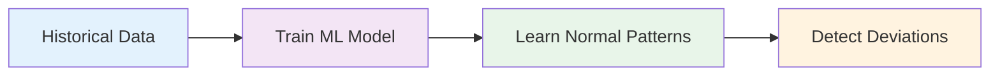
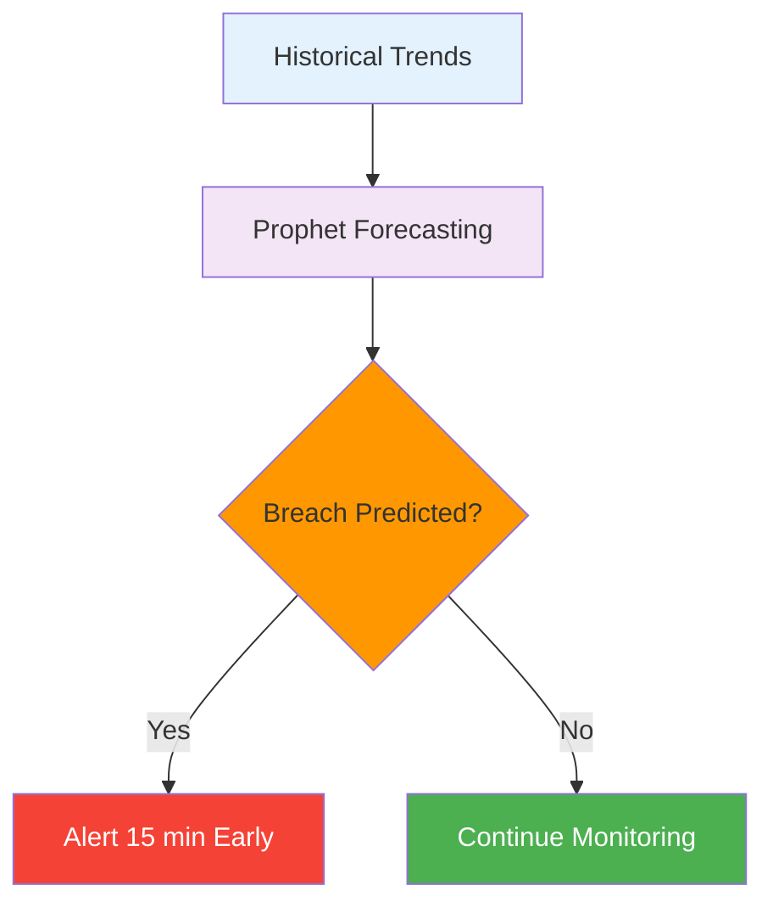
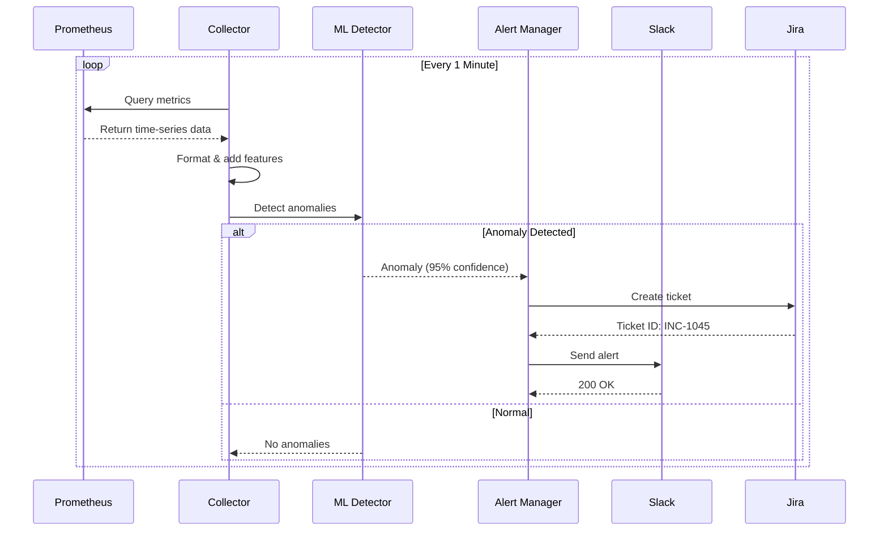

## What is AIOps?

AIOps (Artificial Intelligence for IT Operations) combines big data and machine learning to automate and enhance IT operations processes. InfraGuard brings AIOps capabilities to infrastructure monitoring by:

<CardGroup cols={2}>
  <Card title="Learning Normal Behavior" icon="brain">
    Dynamically learns what "normal" looks like for your infrastructure
  </Card>
  <Card title="Detecting Anomalies" icon="magnifying-glass">
    Identifies statistical deviations from learned patterns
  </Card>
  <Card title="Predicting Failures" icon="crystal-ball">
    Forecasts issues before they impact users
  </Card>
  <Card title="Automating Response" icon="robot">
    Creates tickets and alerts automatically
  </Card>
</CardGroup>

## The Problem with Static Thresholds

Traditional monitoring relies on static thresholds like "alert if CPU > 80%". This approach has several problems:

<AccordionGroup>
  <Accordion title="High False Positive Rate" icon="triangle-exclamation">
    Static thresholds don't account for normal operational variance. A CPU spike during business hours might be normal, but the same spike at 3 AM could indicate a problem.
    
    **Result**: Alert fatigue and ignored notifications
  </Accordion>
  
  <Accordion title="Missed Anomalies" icon="eye-slash">
    Problems that fall within static thresholds but deviate from normal patterns go undetected. For example, a gradual memory leak might never trigger a threshold but still cause issues.
    
    **Result**: Incidents discovered too late
  </Accordion>
  
  <Accordion title="Reactive Response" icon="clock">
    Static thresholds only alert after a problem has occurred, giving no time for proactive remediation.
    
    **Result**: User-impacting incidents
  </Accordion>
  
  <Accordion title="Manual Maintenance" icon="wrench">
    Thresholds must be manually tuned for each metric and environment, requiring constant adjustment.
    
    **Result**: High operational overhead
  </Accordion>
</AccordionGroup>

## The InfraGuard Approach

InfraGuard solves these problems with intelligent, ML-driven monitoring:

### 1. Dynamic Baseline Learning

Instead of static thresholds, InfraGuard learns your infrastructure's normal behavior patterns:



<Info>
  InfraGuard knows that CPU at 90% during business hours might be normal, but 50% at 3 AM could be anomalous.
</Info>

### 2. Statistical Anomaly Detection

Using the Isolation Forest algorithm, InfraGuard identifies data points that are statistically different from the learned baseline:

<Steps>
  <Step title="Feature Extraction">
    Extracts features from metrics: value, rolling averages, rate of change, time of day, day of week
  </Step>
  <Step title="Anomaly Scoring">
    Computes anomaly scores for each data point (-1 for anomaly, 1 for normal)
  </Step>
  <Step title="Confidence Calculation">
    Converts scores to confidence percentages (0-100%)
  </Step>
  <Step title="Threshold Evaluation">
    Triggers alerts only when confidence exceeds configured threshold
  </Step>
</Steps>

### 3. Predictive Analysis

Optional time-series forecasting predicts future metric values:



<Check>
  Get 15 minutes of advance warning before failures impact users
</Check>

### 4. Automated Incident Response

When anomalies are detected, InfraGuard automatically:

<CardGroup cols={2}>
  <Card title="Creates Jira Tickets" icon="ticket">
    High-priority incidents with full context
  </Card>
  <Card title="Sends Slack Alerts" icon="slack">
    Formatted notifications to your team channel
  </Card>
  <Card title="Includes Runbooks" icon="book">
    Links to remediation documentation
  </Card>
  <Card title="Provides Context" icon="info-circle">
    Confidence scores, affected metrics, timestamps
  </Card>
</CardGroup>

## Key Concepts

### Metrics Collection

InfraGuard continuously queries Prometheus for infrastructure metrics:

- **CPU Utilization**: `rate(node_cpu_seconds_total{mode!="idle"}[5m])`
- **Memory Utilization**: `node_memory_Active_bytes / node_memory_MemTotal_bytes`
- **HTTP Error Rate**: `rate(http_requests_total{status=~"5.."}[5m])`

<Tip>
  You can configure custom PromQL queries for any metric Prometheus collects
</Tip>

### Feature Engineering

Raw metrics are transformed into ML-ready features:

| Feature | Description | Purpose |
|---------|-------------|---------|
| `value` | Raw metric value | Current state |
| `rolling_mean_5m` | 5-minute rolling average | Trend detection |
| `rolling_std_5m` | 5-minute rolling std dev | Volatility detection |
| `rate_of_change` | First derivative | Spike detection |
| `hour_of_day` | Hour (0-23) | Time-based patterns |
| `day_of_week` | Day (0-6) | Weekly patterns |

### Anomaly Scores

The Isolation Forest algorithm assigns scores to each data point:

- **Score = 1**: Normal behavior (deep in decision tree)
- **Score = -1**: Anomalous behavior (shallow in decision tree)
- **Confidence**: Normalized to 0-100% scale

<Note>
  More negative scores indicate stronger anomalies. A score of -0.5 maps to ~100% confidence.
</Note>

### Confidence Threshold

The confidence threshold determines when alerts are triggered:

```yaml
ml:
  confidence_threshold: 85.0  # Alert if confidence >= 85%
```

<AccordionGroup>
  <Accordion title="High Threshold (90-95%)">
    **Pros**: Fewer false positives, high-confidence alerts only
    
    **Cons**: May miss some real anomalies
    
    **Use Case**: Production environments with low tolerance for alert noise
  </Accordion>
  
  <Accordion title="Medium Threshold (80-90%)">
    **Pros**: Balanced approach, catches most anomalies
    
    **Cons**: Some false positives possible
    
    **Use Case**: Most production environments (recommended)
  </Accordion>
  
  <Accordion title="Low Threshold (70-80%)">
    **Pros**: Catches all potential anomalies
    
    **Cons**: Higher false positive rate
    
    **Use Case**: Development/staging environments, initial tuning
  </Accordion>
</AccordionGroup>

### Prediction Window

For time-series forecasting, the prediction window defines how far ahead to predict:

```yaml
forecasting:
  prediction_window_minutes: 15  # Predict 15 minutes ahead
```

<Info>
  15 minutes provides enough time for proactive remediation without too many false predictions
</Info>

## Architecture Layers

InfraGuard is organized into four logical layers:

### Collection Layer

Responsible for querying Prometheus and formatting data:

- **PrometheusCollector**: Executes PromQL queries via HTTP
- **DataFormatter**: Transforms JSON to Pandas DataFrames
- **Feature Engineering**: Adds derived features for ML

### Intelligence Layer

Applies machine learning for detection and prediction:

- **IsolationForestDetector**: Detects statistical anomalies
- **TimeSeriesForecaster**: Predicts future metric values (optional)
- **Model Management**: Loads, trains, and persists ML models

### Alerting Layer

Routes notifications to external systems:

- **AlertManager**: Orchestrates alert delivery
- **SlackNotifier**: Sends formatted Slack messages
- **JiraNotifier**: Creates Jira incident tickets
- **RunbookMapper**: Associates anomalies with runbooks

### Configuration Layer

Manages application configuration:

- **ConfigurationManager**: Loads and validates YAML config
- **Environment Variables**: Supports runtime configuration
- **Validation**: Ensures required fields are present

## Data Flow

The complete data flow through InfraGuard:



## Benefits

<CardGroup cols={2}>
  <Card title="40% Fewer False Positives" icon="arrow-down">
    Dynamic baselines eliminate threshold-based false alarms
  </Card>
  <Card title="15 Min Early Warning" icon="clock">
    Predictive analysis provides time for proactive action
  </Card>
  <Card title="25% Faster MTTR" icon="gauge">
    Automated tickets and runbooks speed up resolution
  </Card>
  <Card title="Zero Manual Tuning" icon="robot">
    ML models adapt automatically to changing patterns
  </Card>
</CardGroup>

## Next Steps

<CardGroup cols={2}>
  <Card
    title="Architecture Deep Dive"
    icon="sitemap"
    href="/concepts/architecture"
  >
    Explore the detailed architecture
  </Card>
  <Card
    title="Anomaly Detection"
    icon="magnifying-glass"
    href="/concepts/anomaly-detection"
  >
    Learn how anomaly detection works
  </Card>
  <Card
    title="Forecasting"
    icon="crystal-ball"
    href="/concepts/forecasting"
  >
    Understand predictive analysis
  </Card>
  <Card
    title="Alerting"
    icon="bell"
    href="/concepts/alerting"
  >
    Configure alert routing
  </Card>
</CardGroup>
