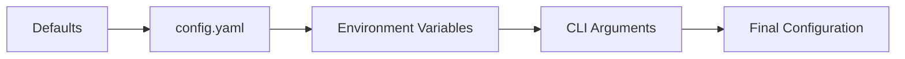

## Overview

InfraGuard uses a YAML configuration file to control all aspects of the system. This guide covers all available configuration options.

<Card title="Configuration File" icon="file">
  Default location: `/app/config/config.yaml` or set via `INFRAGUARD_CONFIG` environment variable
</Card>

## Complete Configuration Example

<CodeGroup>
```yaml config.yaml
# InfraGuard Configuration File
version: "1.0"

# Collector Configuration
collector:
  enabled: true
  prometheus:
    url: "http://prometheus:9090"
    scrape_interval: 60s
    timeout: 30s
    max_retries: 3
  
  metrics:
    - name: "cpu_usage_percent"
      query: "100 - (avg by (instance) (rate(node_cpu_seconds_total{mode='idle'}[5m])) * 100)"
      labels: ["instance", "job"]
    
    - name: "memory_usage_percent"
      query: "(1 - (node_memory_MemAvailable_bytes / node_memory_MemTotal_bytes)) * 100"
      labels: ["instance"]
    
    - name: "disk_usage_percent"
      query: "(1 - (node_filesystem_avail_bytes / node_filesystem_size_bytes)) * 100"
      labels: ["instance", "mountpoint"]
    
    - name: "network_errors_total"
      query: "rate(node_network_receive_errs_total[5m]) + rate(node_network_transmit_errs_total[5m])"
      labels: ["instance", "device"]

# Anomaly Detection Configuration
detector:
  enabled: true
  algorithm: "isolation_forest"
  
  isolation_forest:
    n_estimators: 100
    contamination: 0.1
    max_samples: 256
    random_state: 42
  
  training:
    initial_training_days: 7
    retrain_interval: 24h
    min_data_points: 100
    auto_retrain: true
  
  thresholds:
    anomaly_score: 0.7
    confidence_level: 0.95
  
  preprocessing:
    normalize: true
    handle_missing: "interpolate"
    outlier_removal: true

# Forecasting Configuration
forecaster:
  enabled: true
  algorithm: "prophet"
  
  prophet:
    growth: "linear"
    changepoint_prior_scale: 0.05
    seasonality_prior_scale: 10.0
    holidays_prior_scale: 10.0
  
  seasonality:
    daily: auto
    weekly: auto
    yearly: false
  
  training:
    history_days: 30
    retrain_interval: 24h
    min_data_points: 100
  
  forecast:
    horizon_hours: 24
    interval_minutes: 5
    confidence_level: 0.95
  
  performance:
    parallel_models: 4
    cache_predictions: true
    cache_ttl: 1h

# Alerting Configuration
alerting:
  enabled: true
  
  deduplication:
    enabled: true
    window_minutes: 5
    max_alerts_per_window: 3
  
  routing:
    - name: "critical_infrastructure"
      severity: "critical"
      metric_pattern: "^(cpu|memory|disk)_.*"
      channels:
        - type: "slack"
          webhook_url: "${SLACK_WEBHOOK_URL}"
          channel: "#ops-critical"
        - type: "pagerduty"
          integration_key: "${PAGERDUTY_INTEGRATION_KEY}"
        - type: "jira"
          project: "OPS"
          issue_type: "Incident"
          priority: "Highest"
    
    - name: "application_warnings"
      severity: "warning"
      metric_pattern: "^app_.*"
      channels:
        - type: "slack"
          webhook_url: "${SLACK_WEBHOOK_URL}"
          channel: "#dev-alerts"
        - type: "jira"
          project: "DEV"
          issue_type: "Bug"
          priority: "High"
    
    - name: "info_events"
      severity: "info"
      channels:
        - type: "log"
  
  escalation:
    enabled: true
    unacknowledged_timeout: 30m
    escalation_chain:
      - type: "pagerduty"
        integration_key: "${PAGERDUTY_PRIMARY}"
      - delay: 15m
      - type: "pagerduty"
        integration_key: "${PAGERDUTY_SECONDARY}"
      - delay: 15m
      - type: "pagerduty"
        integration_key: "${PAGERDUTY_MANAGER}"

# Integration Configuration
integrations:
  slack:
    enabled: true
    webhook_url: "${SLACK_WEBHOOK_URL}"
    default_channel: "#ops-alerts"
    username: "InfraGuard"
    icon_emoji: ":robot_face:"
    mention_on_critical: "@channel"
  
  jira:
    enabled: true
    url: "${JIRA_URL}"
    user_email: "${JIRA_USER_EMAIL}"
    api_token: "${JIRA_API_TOKEN}"
    default_project: "OPS"
    auto_close: true
    close_on_resolution: true
  
  pagerduty:
    enabled: false
    api_key: "${PAGERDUTY_API_KEY}"
    default_service_key: "${PAGERDUTY_SERVICE_KEY}"
  
  grafana:
    enabled: false
    url: "${GRAFANA_URL}"
    api_key: "${GRAFANA_API_KEY}"
    dashboard_uid: "infraguard-overview"

# Database Configuration
database:
  type: "sqlite"  # Options: sqlite, postgresql
  
  sqlite:
    path: "/app/data/infraguard.db"
    timeout: 30s
  
  postgresql:
    host: "${DB_HOST}"
    port: 5432
    database: "${DB_NAME}"
    user: "${DB_USER}"
    password: "${DB_PASSWORD}"
    pool_size: 10
    max_overflow: 20

# Storage Configuration
storage:
  models_path: "/app/models"
  cache_path: "/app/cache"
  logs_path: "/app/logs"
  
  retention:
    metrics_days: 30
    alerts_days: 90
    models_versions: 5

# Logging Configuration
logging:
  level: "INFO"  # DEBUG, INFO, WARNING, ERROR, CRITICAL
  format: "json"  # json, text
  
  outputs:
    - type: "console"
      level: "INFO"
    - type: "file"
      level: "DEBUG"
      path: "/app/logs/infraguard.log"
      max_size_mb: 100
      max_files: 10
      rotation: "daily"
  
  loggers:
    infraguard.collector: "INFO"
    infraguard.detector: "INFO"
    infraguard.forecaster: "INFO"
    infraguard.alerter: "INFO"

# API Server Configuration
api:
  host: "0.0.0.0"
  port: 8000
  workers: 4
  timeout: 60s
  
  cors:
    enabled: true
    origins: ["*"]
    methods: ["GET", "POST", "PUT", "DELETE"]
  
  auth:
    enabled: false
    type: "api_key"  # api_key, oauth2, jwt
    api_keys:
      - key: "${API_KEY_1}"
        name: "admin"
        permissions: ["read", "write"]
  
  rate_limiting:
    enabled: true
    requests_per_minute: 100
    burst: 20

# Performance Configuration
performance:
  max_workers: 8
  queue_size: 1000
  batch_size: 100
  
  caching:
    enabled: true
    backend: "memory"  # memory, redis
    ttl: 300s
    max_size_mb: 512
  
  redis:
    host: "${REDIS_HOST}"
    port: 6379
    db: 0
    password: "${REDIS_PASSWORD}"

# Monitoring Configuration
monitoring:
  enabled: true
  metrics_port: 9100
  health_check_interval: 30s
  
  self_monitoring:
    enabled: true
    alert_on_errors: true
    alert_threshold: 10

# Feature Flags
features:
  forecasting: true
  auto_remediation: false
  ml_model_versioning: true
  distributed_training: false
```

```env .env
# Prometheus
PROMETHEUS_URL=http://prometheus:9090

# Slack
SLACK_WEBHOOK_URL=https://hooks.slack.com/services/YOUR/WEBHOOK/URL

# Jira
JIRA_URL=https://your-domain.atlassian.net
JIRA_USER_EMAIL=your-email@example.com
JIRA_API_TOKEN=your_jira_api_token

# PagerDuty
PAGERDUTY_API_KEY=your_pagerduty_api_key
PAGERDUTY_INTEGRATION_KEY=your_integration_key
PAGERDUTY_SERVICE_KEY=your_service_key
PAGERDUTY_PRIMARY=primary_key
PAGERDUTY_SECONDARY=secondary_key
PAGERDUTY_MANAGER=manager_key

# Database (PostgreSQL)
DB_HOST=postgres
DB_NAME=infraguard
DB_USER=infraguard
DB_PASSWORD=secure_password

# Redis
REDIS_HOST=redis
REDIS_PASSWORD=redis_password

# Grafana
GRAFANA_URL=http://grafana:3000
GRAFANA_API_KEY=your_grafana_api_key

# API Authentication
API_KEY_1=your_secure_api_key
```
</CodeGroup>

## Configuration Sections

### Collector

<AccordionGroup>
  <Accordion title="Prometheus Connection">
    ```yaml
    collector:
      prometheus:
        url: "http://prometheus:9090"
        scrape_interval: 60s  # How often to collect metrics
        timeout: 30s          # Request timeout
        max_retries: 3        # Retry failed requests
    ```
  </Accordion>
  
  <Accordion title="Metric Definitions">
    ```yaml
    collector:
      metrics:
        - name: "cpu_usage_percent"
          query: "100 - (avg by (instance) (rate(node_cpu_seconds_total{mode='idle'}[5m])) * 100)"
          labels: ["instance", "job"]
          enabled: true
          alert_threshold: 80
    ```
  </Accordion>
</AccordionGroup>

### Detector

<AccordionGroup>
  <Accordion title="Algorithm Settings">
    ```yaml
    detector:
      algorithm: "isolation_forest"
      isolation_forest:
        n_estimators: 100      # Number of trees
        contamination: 0.1     # Expected anomaly ratio
        max_samples: 256       # Samples per tree
        random_state: 42       # Reproducibility
    ```
  </Accordion>
  
  <Accordion title="Training Configuration">
    ```yaml
    detector:
      training:
        initial_training_days: 7    # Initial training period
        retrain_interval: 24h       # Retrain frequency
        min_data_points: 100        # Minimum data required
        auto_retrain: true          # Automatic retraining
    ```
  </Accordion>
  
  <Accordion title="Thresholds">
    ```yaml
    detector:
      thresholds:
        anomaly_score: 0.7         # Alert threshold
        confidence_level: 0.95     # Confidence interval
    ```
  </Accordion>
</AccordionGroup>

### Forecaster

<AccordionGroup>
  <Accordion title="Prophet Settings">
    ```yaml
    forecaster:
      prophet:
        growth: "linear"                    # linear or logistic
        changepoint_prior_scale: 0.05       # Trend flexibility
        seasonality_prior_scale: 10.0       # Seasonality strength
        holidays_prior_scale: 10.0          # Holiday effects
    ```
  </Accordion>
  
  <Accordion title="Seasonality">
    ```yaml
    forecaster:
      seasonality:
        daily: auto      # auto, true, false
        weekly: auto
        yearly: false
    ```
  </Accordion>
  
  <Accordion title="Forecast Parameters">
    ```yaml
    forecaster:
      forecast:
        horizon_hours: 24          # Forecast window
        interval_minutes: 5        # Prediction interval
        confidence_level: 0.95     # Confidence bands
    ```
  </Accordion>
</AccordionGroup>

### Alerting

<AccordionGroup>
  <Accordion title="Routing Rules">
    ```yaml
    alerting:
      routing:
        - name: "critical_infrastructure"
          severity: "critical"
          metric_pattern: "^(cpu|memory|disk)_.*"
          channels:
            - type: "slack"
              channel: "#ops-critical"
            - type: "pagerduty"
              integration_key: "${KEY}"
    ```
  </Accordion>
  
  <Accordion title="Deduplication">
    ```yaml
    alerting:
      deduplication:
        enabled: true
        window_minutes: 5              # Grouping window
        max_alerts_per_window: 3       # Max before aggregation
    ```
  </Accordion>
  
  <Accordion title="Escalation">
    ```yaml
    alerting:
      escalation:
        enabled: true
        unacknowledged_timeout: 30m
        escalation_chain:
          - type: "pagerduty"
            integration_key: "${PRIMARY}"
          - delay: 15m
          - type: "pagerduty"
            integration_key: "${SECONDARY}"
    ```
  </Accordion>
</AccordionGroup>

## Environment Variables

InfraGuard supports environment variable substitution using `${VAR_NAME}` syntax:

```yaml
# In config.yaml
slack:
  webhook_url: "${SLACK_WEBHOOK_URL}"

# In environment
export SLACK_WEBHOOK_URL="https://hooks.slack.com/..."
```

<Tip>
  Use environment variables for sensitive data like API keys and passwords. Never commit secrets to version control.
</Tip>

## Configuration Validation

Validate your configuration before deployment:

```bash
# Validate configuration file
infraguard config validate --config config.yaml

# Show effective configuration (with env vars resolved)
infraguard config show --config config.yaml

# Test specific integration
infraguard config test-integration slack --config config.yaml
```

## Configuration Precedence

InfraGuard loads configuration in this order (later overrides earlier):

1. Default values (built-in)
2. Configuration file (`config.yaml`)
3. Environment variables
4. Command-line arguments



## Dynamic Configuration

Some settings can be updated without restart:

```bash
# Update alert threshold
curl -X PUT http://localhost:8000/api/config/detector/thresholds \
  -H "Content-Type: application/json" \
  -d '{"anomaly_score": 0.8}'

# Update log level
curl -X PUT http://localhost:8000/api/config/logging/level \
  -H "Content-Type: application/json" \
  -d '{"level": "DEBUG"}'
```

<Warning>
  Not all settings support dynamic updates. Changes to collector, database, or API settings require a restart.
</Warning>

## Configuration Templates

<CardGroup cols={2}>
  <Card title="Development" icon="laptop-code">
    ```yaml
    # Minimal config for local development
    collector:
      prometheus:
        url: "http://localhost:9090"
    
    detector:
      training:
        initial_training_days: 1
    
    logging:
      level: "DEBUG"
    
    api:
      auth:
        enabled: false
    ```
  </Card>
  
  <Card title="Production" icon="server">
    ```yaml
    # Production-ready configuration
    collector:
      prometheus:
        url: "http://prometheus:9090"
        max_retries: 5
    
    detector:
      training:
        initial_training_days: 7
        auto_retrain: true
    
    database:
      type: "postgresql"
    
    api:
      auth:
        enabled: true
        type: "api_key"
    
    logging:
      level: "INFO"
      format: "json"
    ```
  </Card>
</CardGroup>

## Best Practices

<AccordionGroup>
  <Accordion title="Security">
    - Use environment variables for secrets
    - Enable API authentication in production
    - Restrict CORS origins
    - Use TLS for external connections
    - Rotate API keys regularly
  </Accordion>
  
  <Accordion title="Performance">
    - Tune `max_workers` based on CPU cores
    - Enable caching for frequently accessed data
    - Adjust `batch_size` for your workload
    - Use PostgreSQL for production (not SQLite)
    - Configure appropriate retention periods
  </Accordion>
  
  <Accordion title="Reliability">
    - Set appropriate timeouts and retries
    - Enable auto-retraining for ML models
    - Configure escalation policies
    - Set up health checks
    - Monitor InfraGuard itself
  </Accordion>
</AccordionGroup>

## Troubleshooting

<AccordionGroup>
  <Accordion title="Configuration Not Loading">
    ```bash
    # Check file path
    echo $INFRAGUARD_CONFIG
    
    # Validate YAML syntax
    yamllint config.yaml
    
    # Check file permissions
    ls -la config.yaml
    ```
  </Accordion>
  
  <Accordion title="Environment Variables Not Resolved">
    ```bash
    # Verify environment variables are set
    env | grep SLACK_WEBHOOK_URL
    
    # Show effective configuration
    infraguard config show
    ```
  </Accordion>
  
  <Accordion title="Integration Failures">
    ```bash
    # Test Slack integration
    infraguard config test-integration slack
    
    # Test Jira integration
    infraguard config test-integration jira
    
    # Check logs for errors
    tail -f /app/logs/infraguard.log
    ```
  </Accordion>
</AccordionGroup>

## Next Steps

<CardGroup cols={2}>
  <Card title="Docker Deployment" icon="docker" href="/deployment/docker">
    Deploy with Docker using this configuration
  </Card>
  
  <Card title="Kubernetes Deployment" icon="dharmachakra" href="/deployment/kubernetes">
    Deploy on Kubernetes with ConfigMaps
  </Card>
  
  <Card title="Slack Integration" icon="slack" href="/integrations/slack">
    Configure Slack webhooks and channels
  </Card>
  
  <Card title="Troubleshooting" icon="wrench" href="/guides/troubleshooting">
    Common configuration issues and solutions
  </Card>
</CardGroup>
