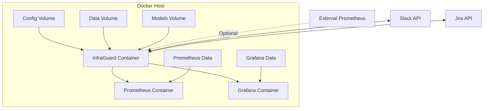
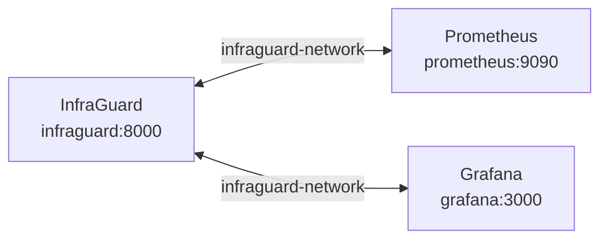

## Overview

Deploy InfraGuard quickly using Docker containers. This guide covers single-container deployment and multi-container orchestration with Docker Compose.

<Card title="Quick Start" icon="rocket">
  Get InfraGuard running in under 5 minutes with Docker Compose
</Card>

## Prerequisites

<AccordionGroup>
  <Accordion title="System Requirements">
    - Docker Engine 20.10+
    - Docker Compose 2.0+
    - 2GB RAM minimum (4GB recommended)
    - 10GB disk space
  </Accordion>
  
  <Accordion title="Network Requirements">
    - Port 8000 for API server
    - Port 9090 for Prometheus (if using bundled)
    - Outbound access to Slack/Jira APIs
  </Accordion>
</AccordionGroup>

## Docker Compose Deployment

### Quick Start

<Steps>
  <Step title="Download Docker Compose File">
    ```bash
    curl -O https://raw.githubusercontent.com/your-org/infraguard/main/docker-compose.yml
    ```
  </Step>
  
  <Step title="Create Configuration">
    ```bash
    mkdir -p config
    curl -O https://raw.githubusercontent.com/your-org/infraguard/main/config/config.example.yaml
    mv config.example.yaml config/config.yaml
    ```
  </Step>
  
  <Step title="Configure Environment">
    ```bash
    cp .env.example .env
    # Edit .env with your settings
    ```
  </Step>
  
  <Step title="Start Services">
    ```bash
    docker-compose up -d
    ```
  </Step>
  
  <Step title="Verify Deployment">
    ```bash
    curl http://localhost:8000/health
    ```
  </Step>
</Steps>

### Docker Compose File

<CodeGroup>
```yaml docker-compose.yml
version: '3.8'

services:
  infraguard:
    image: infraguard/infraguard:latest
    container_name: infraguard
    ports:
      - "8000:8000"
    volumes:
      - ./config:/app/config
      - ./data:/app/data
      - ./models:/app/models
    environment:
      - INFRAGUARD_CONFIG=/app/config/config.yaml
      - LOG_LEVEL=INFO
      - PROMETHEUS_URL=${PROMETHEUS_URL}
      - SLACK_WEBHOOK_URL=${SLACK_WEBHOOK_URL}
      - JIRA_URL=${JIRA_URL}
      - JIRA_API_TOKEN=${JIRA_API_TOKEN}
    restart: unless-stopped
    healthcheck:
      test: ["CMD", "curl", "-f", "http://localhost:8000/health"]
      interval: 30s
      timeout: 10s
      retries: 3
      start_period: 40s
    networks:
      - infraguard-network

  prometheus:
    image: prom/prometheus:latest
    container_name: prometheus
    ports:
      - "9090:9090"
    volumes:
      - ./prometheus/prometheus.yml:/etc/prometheus/prometheus.yml
      - prometheus-data:/prometheus
    command:
      - '--config.file=/etc/prometheus/prometheus.yml'
      - '--storage.tsdb.path=/prometheus'
      - '--storage.tsdb.retention.time=30d'
    restart: unless-stopped
    networks:
      - infraguard-network

  grafana:
    image: grafana/grafana:latest
    container_name: grafana
    ports:
      - "3000:3000"
    volumes:
      - grafana-data:/var/lib/grafana
      - ./grafana/dashboards:/etc/grafana/provisioning/dashboards
      - ./grafana/datasources:/etc/grafana/provisioning/datasources
    environment:
      - GF_SECURITY_ADMIN_PASSWORD=${GRAFANA_ADMIN_PASSWORD}
      - GF_INSTALL_PLUGINS=grafana-piechart-panel
    restart: unless-stopped
    networks:
      - infraguard-network

volumes:
  prometheus-data:
  grafana-data:

networks:
  infraguard-network:
    driver: bridge
```

```env .env
# Prometheus Configuration
PROMETHEUS_URL=http://prometheus:9090

# Slack Integration
SLACK_WEBHOOK_URL=https://hooks.slack.com/services/YOUR/WEBHOOK/URL

# Jira Integration
JIRA_URL=https://your-domain.atlassian.net
JIRA_API_TOKEN=your_jira_api_token
JIRA_USER_EMAIL=your-email@example.com

# Grafana
GRAFANA_ADMIN_PASSWORD=admin123

# Optional: PagerDuty
PAGERDUTY_API_KEY=your_pagerduty_key
```
</CodeGroup>

## Single Container Deployment

For minimal deployments without Prometheus/Grafana:

```bash
docker run -d \
  --name infraguard \
  -p 8000:8000 \
  -v $(pwd)/config:/app/config \
  -v $(pwd)/data:/app/data \
  -e PROMETHEUS_URL=http://your-prometheus:9090 \
  -e SLACK_WEBHOOK_URL=https://hooks.slack.com/... \
  infraguard/infraguard:latest
```

## Architecture



## Volume Management

<AccordionGroup>
  <Accordion title="Configuration Volume">
    **Path**: `./config:/app/config`
    
    Contains:
    - `config.yaml` - Main configuration file
    - `alert_rules.yaml` - Alert routing rules
    - `suppression.yaml` - Alert suppression rules
    
    ```bash
    # Backup configuration
    docker cp infraguard:/app/config ./config-backup
    ```
  </Accordion>
  
  <Accordion title="Data Volume">
    **Path**: `./data:/app/data`
    
    Contains:
    - SQLite database (if using local DB)
    - Alert history
    - Metric cache
    
    ```bash
    # Backup data
    docker cp infraguard:/app/data ./data-backup
    ```
  </Accordion>
  
  <Accordion title="Models Volume">
    **Path**: `./models:/app/models`
    
    Contains:
    - Trained ML models
    - Model metadata
    - Training history
    
    ```bash
    # Backup models
    docker cp infraguard:/app/models ./models-backup
    ```
  </Accordion>
</AccordionGroup>

## Container Management

### Start/Stop Services

```bash
# Start all services
docker-compose up -d

# Stop all services
docker-compose down

# Restart specific service
docker-compose restart infraguard

# View logs
docker-compose logs -f infraguard

# View logs for all services
docker-compose logs -f
```

### Health Checks

```bash
# Check container health
docker ps

# Check InfraGuard health endpoint
curl http://localhost:8000/health

# Check Prometheus
curl http://localhost:9090/-/healthy

# Check Grafana
curl http://localhost:3000/api/health
```

### Resource Limits

Add resource constraints to prevent container resource exhaustion:

```yaml
services:
  infraguard:
    # ... other config ...
    deploy:
      resources:
        limits:
          cpus: '2'
          memory: 4G
        reservations:
          cpus: '1'
          memory: 2G
```

## Networking

### Internal Network

Containers communicate via Docker network:



### External Access

```bash
# Access from host
curl http://localhost:8000/api/metrics

# Access from other containers
curl http://infraguard:8000/api/metrics
```

### Custom Network

```yaml
networks:
  infraguard-network:
    driver: bridge
    ipam:
      config:
        - subnet: 172.28.0.0/16
```

## Monitoring

### Container Metrics

```bash
# View resource usage
docker stats infraguard

# Detailed container info
docker inspect infraguard
```

### Application Logs

```bash
# Follow logs
docker-compose logs -f infraguard

# Last 100 lines
docker-compose logs --tail=100 infraguard

# Logs since timestamp
docker-compose logs --since 2026-04-06T10:00:00 infraguard
```

## Upgrades

<Steps>
  <Step title="Backup Data">
    ```bash
    docker-compose exec infraguard /app/scripts/backup.sh
    ```
  </Step>
  
  <Step title="Pull New Image">
    ```bash
    docker-compose pull infraguard
    ```
  </Step>
  
  <Step title="Restart Container">
    ```bash
    docker-compose up -d infraguard
    ```
  </Step>
  
  <Step title="Verify Upgrade">
    ```bash
    docker-compose logs infraguard | grep "version"
    curl http://localhost:8000/health
    ```
  </Step>
</Steps>

## Troubleshooting

<AccordionGroup>
  <Accordion title="Container Won't Start">
    ```bash
    # Check logs for errors
    docker-compose logs infraguard
    
    # Verify configuration
    docker-compose config
    
    # Check port conflicts
    netstat -tulpn | grep 8000
    ```
  </Accordion>
  
  <Accordion title="Can't Connect to Prometheus">
    ```bash
    # Test network connectivity
    docker-compose exec infraguard ping prometheus
    
    # Verify Prometheus is running
    docker-compose ps prometheus
    
    # Check Prometheus logs
    docker-compose logs prometheus
    ```
  </Accordion>
  
  <Accordion title="High Memory Usage">
    ```bash
    # Check current usage
    docker stats infraguard
    
    # Adjust memory limits
    # Edit docker-compose.yml and add:
    deploy:
      resources:
        limits:
          memory: 2G
    
    # Restart with new limits
    docker-compose up -d
    ```
  </Accordion>
</AccordionGroup>

## Production Considerations

<Warning>
  For production deployments:
  - Use specific image tags instead of `latest`
  - Set up log rotation
  - Configure resource limits
  - Use external database (PostgreSQL)
  - Enable TLS/SSL
  - Set up backup automation
</Warning>

<Tip>
  Consider using Docker Swarm or Kubernetes for high-availability production deployments.
</Tip>

## Next Steps

<CardGroup cols={2}>
  <Card title="Kubernetes Deployment" icon="dharmachakra" href="/deployment/kubernetes">
    Deploy InfraGuard on Kubernetes for production
  </Card>
  
  <Card title="Configuration Guide" icon="gear" href="/deployment/configuration">
    Learn about all configuration options
  </Card>
  
  <Card title="Monitoring Setup" icon="chart-line" href="/advanced/monitoring">
    Set up monitoring for InfraGuard itself
  </Card>
  
  <Card title="Backup Strategy" icon="database" href="/guides/troubleshooting">
    Implement backup and disaster recovery
  </Card>
</CardGroup>
