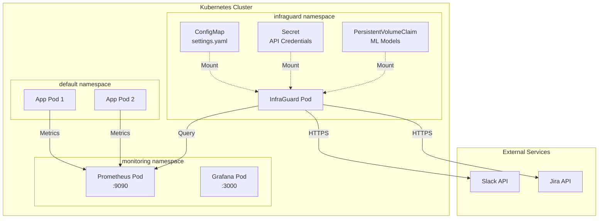

## Overview

This guide walks you through deploying InfraGuard to a Kubernetes cluster for production use.

## Prerequisites

<CardGroup cols={2}>
  <Card title="Kubernetes Cluster" icon="dharmachakra">
    Version 1.21 or higher
  </Card>
  <Card title="kubectl CLI" icon="terminal">
    Configured to access your cluster
  </Card>
  <Card title="Prometheus" icon="chart-line">
    Running in your cluster
  </Card>
  <Card title="Credentials" icon="key">
    Jira API token and Slack webhook URL
  </Card>
</CardGroup>

## Deployment Architecture



## Step 1: Create Namespace

Create a dedicated namespace for InfraGuard:

```bash
kubectl create namespace infraguard
```

<Check>
  Verify namespace creation:
  ```bash
  kubectl get namespace infraguard
  ```
</Check>

## Step 2: Create Secrets

Store sensitive credentials in Kubernetes Secrets:

```bash
kubectl create secret generic infraguard-secrets \
  --from-literal=jira-api-token='your-jira-api-token' \
  --from-literal=slack-webhook-url='https://hooks.slack.com/services/YOUR/WEBHOOK/URL' \
  --namespace=infraguard
```

<Warning>
  Never commit secrets to version control. Use a secrets management solution like:
  - Sealed Secrets
  - External Secrets Operator
  - HashiCorp Vault
  - AWS Secrets Manager
</Warning>

### Verify Secret

```bash
kubectl get secret infraguard-secrets -n infraguard
kubectl describe secret infraguard-secrets -n infraguard
```

## Step 3: Create ConfigMap

Create a ConfigMap for application settings:

```yaml k8s/configmap.yaml
apiVersion: v1
kind: ConfigMap
metadata:
  name: infraguard-config
  namespace: infraguard
data:
  settings.yaml: |
    # Prometheus connection settings
    prometheus:
      url: "http://prometheus-server.monitoring.svc.cluster.local:9090"
      timeout_seconds: 30
      queries:
        cpu_utilization: 'rate(node_cpu_seconds_total{mode!="idle"}[5m])'
        memory_utilization: 'node_memory_Active_bytes / node_memory_MemTotal_bytes'
        http_error_rate: 'rate(http_requests_total{status=~"5.."}[5m])'
    
    # Machine Learning settings
    ml:
      model_path: "models/pretrained/isolation_forest.pkl"
      confidence_threshold: 85.0
      contamination: 0.1
      n_estimators: 100
      max_samples: 256
      random_state: 42
    
    # Time-series forecasting (optional)
    forecasting:
      enabled: false
      prediction_window_minutes: 15
      thresholds:
        cpu_utilization: 0.9
        memory_utilization: 0.85
    
    # Alerting configuration
    alerting:
      slack:
        webhook_url: "${SLACK_WEBHOOK_URL}"
        channel: "#ops-alerts"
        retry_count: 1
      
      jira:
        api_url: "https://your-company.atlassian.net"
        project_key: "INC"
        username: "infraguard@company.com"
        api_token: "${JIRA_API_TOKEN}"
      
      runbooks:
        cpu_utilization:
          anomaly: "https://wiki.internal/runbooks/cpu-spike"
          prediction: "https://wiki.internal/runbooks/cpu-scale"
        memory_utilization:
          anomaly: "https://wiki.internal/runbooks/memory-leak"
          prediction: "https://wiki.internal/runbooks/memory-scale"
        http_error_rate:
          anomaly: "https://wiki.internal/runbooks/http-errors"
        default: "https://wiki.internal/runbooks/general-troubleshooting"
    
    # Collection interval
    collection_interval_seconds: 60
    
    # Logging configuration
    logging:
      level: "INFO"
      format: "%(asctime)s - %(name)s - %(levelname)s - %(message)s"
```

Apply the ConfigMap:

```bash
kubectl apply -f k8s/configmap.yaml
```

<Tip>
  Update the Prometheus URL to match your cluster's Prometheus service name and namespace.
</Tip>

## Step 4: Create PersistentVolumeClaim

Create storage for ML models:

```yaml k8s/pvc.yaml
apiVersion: v1
kind: PersistentVolumeClaim
metadata:
  name: infraguard-models
  namespace: infraguard
spec:
  accessModes:
    - ReadWriteOnce
  resources:
    requests:
      storage: 1Gi
  storageClassName: standard  # Adjust for your cluster
```

Apply the PVC:

```bash
kubectl apply -f k8s/pvc.yaml
```

<Check>
  Verify PVC is bound:
  ```bash
  kubectl get pvc -n infraguard
  ```
</Check>

## Step 5: Deploy InfraGuard

Create the Deployment:

```yaml k8s/deployment.yaml
apiVersion: apps/v1
kind: Deployment
metadata:
  name: infraguard
  namespace: infraguard
  labels:
    app: infraguard
    version: v1.0.0
spec:
  replicas: 1
  selector:
    matchLabels:
      app: infraguard
  template:
    metadata:
      labels:
        app: infraguard
        version: v1.0.0
      annotations:
        prometheus.io/scrape: "true"
        prometheus.io/port: "8000"
        prometheus.io/path: "/metrics"
    spec:
      serviceAccountName: infraguard
      containers:
      - name: infraguard
        image: your-registry/infraguard:latest
        imagePullPolicy: Always
        env:
        - name: LOG_LEVEL
          value: "INFO"
        - name: JIRA_API_TOKEN
          valueFrom:
            secretKeyRef:
              name: infraguard-secrets
              key: jira-api-token
        - name: SLACK_WEBHOOK_URL
          valueFrom:
            secretKeyRef:
              name: infraguard-secrets
              key: slack-webhook-url
        volumeMounts:
        - name: config
          mountPath: /app/src/config/settings.yaml
          subPath: settings.yaml
          readOnly: true
        - name: models
          mountPath: /app/models/pretrained
        - name: logs
          mountPath: /app/logs
        resources:
          requests:
            memory: "512Mi"
            cpu: "250m"
          limits:
            memory: "1Gi"
            cpu: "500m"
        livenessProbe:
          httpGet:
            path: /health
            port: 8000
          initialDelaySeconds: 30
          periodSeconds: 30
          timeoutSeconds: 5
          failureThreshold: 3
        readinessProbe:
          httpGet:
            path: /health
            port: 8000
          initialDelaySeconds: 10
          periodSeconds: 10
          timeoutSeconds: 5
          failureThreshold: 3
        securityContext:
          runAsNonRoot: true
          runAsUser: 1000
          allowPrivilegeEscalation: false
          readOnlyRootFilesystem: true
          capabilities:
            drop:
            - ALL
      volumes:
      - name: config
        configMap:
          name: infraguard-config
      - name: models
        persistentVolumeClaim:
          claimName: infraguard-models
      - name: logs
        emptyDir: {}
      restartPolicy: Always
---
apiVersion: v1
kind: ServiceAccount
metadata:
  name: infraguard
  namespace: infraguard
---
apiVersion: v1
kind: Service
metadata:
  name: infraguard
  namespace: infraguard
  labels:
    app: infraguard
spec:
  type: ClusterIP
  ports:
  - port: 8000
    targetPort: 8000
    protocol: TCP
    name: http
  selector:
    app: infraguard
```

Apply the Deployment:

```bash
kubectl apply -f k8s/deployment.yaml
```

## Step 6: Verify Deployment

### Check Pod Status

```bash
kubectl get pods -n infraguard
```

Expected output:
```
NAME                          READY   STATUS    RESTARTS   AGE
infraguard-7d9f8b6c5d-x7k2m   1/1     Running   0          2m
```

### View Logs

```bash
kubectl logs -f deployment/infraguard -n infraguard
```

Look for:
```
2026-04-06 10:30:00 - INFO - Initializing InfraGuard...
2026-04-06 10:30:01 - INFO - Loaded pre-trained ML model
2026-04-06 10:30:02 - INFO - Starting collection cycle
```

### Check Health Endpoint

```bash
kubectl port-forward -n infraguard deployment/infraguard 8000:8000
curl http://localhost:8000/health
```

Expected response:
```json
{
  "status": "healthy",
  "model_loaded": true,
  "last_collection": "2026-04-06T10:30:00Z"
}
```

## Configuration Updates

### Update ConfigMap

Edit the ConfigMap:

```bash
kubectl edit configmap infraguard-config -n infraguard
```

Or apply updated file:

```bash
kubectl apply -f k8s/configmap.yaml
```

### Restart Deployment

Restart to pick up configuration changes:

```bash
kubectl rollout restart deployment/infraguard -n infraguard
```

Watch rollout status:

```bash
kubectl rollout status deployment/infraguard -n infraguard
```

## Scaling

### Vertical Scaling

Increase resources for more metrics:

```bash
kubectl set resources deployment infraguard -n infraguard \
  --limits=cpu=1000m,memory=2Gi \
  --requests=cpu=500m,memory=1Gi
```

<Note>
  Horizontal scaling is not currently supported due to stateful ML model. Use vertical scaling instead.
</Note>

## Monitoring

### View Metrics

InfraGuard exposes Prometheus metrics on port 8000:

```bash
kubectl port-forward -n infraguard deployment/infraguard 8000:8000
curl http://localhost:8000/metrics
```

### Key Metrics

| Metric | Type | Description |
|--------|------|-------------|
| `infraguard_metrics_collected_total` | Counter | Total metrics collected |
| `infraguard_anomalies_detected_total` | Counter | Total anomalies detected |
| `infraguard_alerts_sent_total` | Counter | Total alerts sent |
| `infraguard_collection_duration_seconds` | Histogram | Collection cycle duration |

### Grafana Dashboard

Import the provided dashboard:

```bash
kubectl create configmap infraguard-dashboard \
  --from-file=dashboards/infraguard-grafana.json \
  -n monitoring
```

## Troubleshooting

<AccordionGroup>
  <Accordion title="Pod not starting">
    **Check pod events:**
    ```bash
    kubectl describe pod -n infraguard -l app=infraguard
    ```
    
    **Common issues:**
    - ConfigMap not found
    - Secret not found
    - PVC not bound
    - Image pull errors
  </Accordion>
  
  <Accordion title="No metrics collected">
    **Check Prometheus connectivity:**
    ```bash
    kubectl exec -it -n infraguard deployment/infraguard -- \
      curl http://prometheus-server.monitoring.svc.cluster.local:9090/-/healthy
    ```
    
    **Verify PromQL queries:**
    ```bash
    kubectl logs -n infraguard deployment/infraguard | grep "Prometheus"
    ```
  </Accordion>
  
  <Accordion title="Alerts not delivered">
    **Check Slack webhook:**
    ```bash
    kubectl logs -n infraguard deployment/infraguard | grep "Slack"
    ```
    
    **Check Jira API:**
    ```bash
    kubectl logs -n infraguard deployment/infraguard | grep "Jira"
    ```
    
    **Verify secrets:**
    ```bash
    kubectl get secret infraguard-secrets -n infraguard -o yaml
    ```
  </Accordion>
  
  <Accordion title="High memory usage">
    **Check resource usage:**
    ```bash
    kubectl top pod -n infraguard
    ```
    
    **Increase memory limits:**
    ```bash
    kubectl set resources deployment infraguard -n infraguard \
      --limits=memory=2Gi
    ```
  </Accordion>
</AccordionGroup>

## Backup and Restore

### Backup ML Models

```bash
# Create backup
kubectl exec -it -n infraguard deployment/infraguard -- \
  tar czf /tmp/models-backup.tar.gz /app/models/pretrained

# Copy to local
kubectl cp infraguard/$(kubectl get pod -n infraguard -l app=infraguard -o jsonpath='{.items[0].metadata.name}'):/tmp/models-backup.tar.gz ./models-backup.tar.gz
```

### Restore ML Models

```bash
# Copy backup to pod
kubectl cp ./models-backup.tar.gz infraguard/$(kubectl get pod -n infraguard -l app=infraguard -o jsonpath='{.items[0].metadata.name}'):/tmp/models-backup.tar.gz

# Extract in pod
kubectl exec -it -n infraguard deployment/infraguard -- \
  tar xzf /tmp/models-backup.tar.gz -C /app/models/pretrained
```

## Security Best Practices

<CardGroup cols={2}>
  <Card title="Network Policies" icon="shield">
    Restrict pod-to-pod communication
  </Card>
  <Card title="RBAC" icon="lock">
    Use least-privilege service accounts
  </Card>
  <Card title="Pod Security" icon="user-shield">
    Run as non-root with read-only filesystem
  </Card>
  <Card title="Secrets Management" icon="key">
    Use external secrets operator
  </Card>
</CardGroup>

### Network Policy Example

```yaml
apiVersion: networking.k8s.io/v1
kind: NetworkPolicy
metadata:
  name: infraguard-network-policy
  namespace: infraguard
spec:
  podSelector:
    matchLabels:
      app: infraguard
  policyTypes:
  - Ingress
  - Egress
  ingress:
  - from:
    - namespaceSelector:
        matchLabels:
          name: monitoring
    ports:
    - protocol: TCP
      port: 8000
  egress:
  - to:
    - namespaceSelector:
        matchLabels:
          name: monitoring
    ports:
    - protocol: TCP
      port: 9090
  - to:
    - podSelector: {}
    ports:
    - protocol: TCP
      port: 53
```

## Uninstalling

Remove all InfraGuard resources:

```bash
# Delete deployment
kubectl delete deployment infraguard -n infraguard

# Delete service
kubectl delete service infraguard -n infraguard

# Delete ConfigMap
kubectl delete configmap infraguard-config -n infraguard

# Delete Secret
kubectl delete secret infraguard-secrets -n infraguard

# Delete PVC (WARNING: This deletes ML models)
kubectl delete pvc infraguard-models -n infraguard

# Delete namespace
kubectl delete namespace infraguard
```

<Warning>
  Deleting the PVC will permanently delete all ML models. Back them up first if needed.
</Warning>

## Next Steps

<CardGroup cols={2}>
  <Card
    title="Configuration"
    icon="gear"
    href="/deployment/configuration"
  >
    Fine-tune InfraGuard settings
  </Card>
  <Card
    title="Monitoring"
    icon="chart-line"
    href="/advanced/monitoring"
  >
    Monitor InfraGuard itself
  </Card>
  <Card
    title="Security"
    icon="shield"
    href="/advanced/security"
  >
    Harden your deployment
  </Card>
  <Card
    title="Troubleshooting"
    icon="wrench"
    href="/guides/troubleshooting"
  >
    Resolve common issues
  </Card>
</CardGroup>
