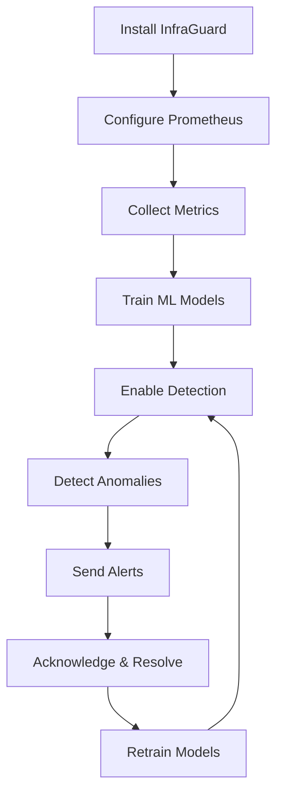

## Welcome to InfraGuard

This guide will walk you through setting up InfraGuard and detecting your first anomaly.

<Card title="What You'll Learn" icon="graduation-cap">
  Installation, configuration, metric collection, anomaly detection, and alerting setup
</Card>

## Prerequisites

<AccordionGroup>
  <Accordion title="System Requirements">
    - Docker 20.10+ or Kubernetes 1.20+
    - 2GB RAM minimum (4GB recommended)
    - 10GB disk space
    - Python 3.9+ (for SDK usage)
  </Accordion>
  
  <Accordion title="Required Services">
    - Prometheus (for metric collection)
    - Slack workspace (for notifications)
    - Optional: Jira, PagerDuty, Grafana
  </Accordion>
</AccordionGroup>

## Quick Start (5 Minutes)

<Steps>
  <Step title="Deploy with Docker Compose">
    ```bash
    # Download docker-compose.yml
    curl -O https://raw.githubusercontent.com/your-org/infraguard/main/docker-compose.yml
    
    # Start services
    docker-compose up -d
    ```
  </Step>
  
  <Step title="Configure Prometheus">
    ```bash
    # Create config directory
    mkdir -p config
    
    # Create config file
    cat > config/config.yaml <<EOF
    collector:
      prometheus:
        url: "http://prometheus:9090"
        scrape_interval: 60s
    EOF
    ```
  </Step>
  
  <Step title="Verify Installation">
    ```bash
    # Check health
    curl http://localhost:8000/health
    
    # Expected response:
    # {"status": "healthy", "version": "1.0.0"}
    ```
  </Step>
  
  <Step title="Collect First Metrics">
    ```bash
    # Trigger metric collection
    curl -X POST http://localhost:8000/api/collector/collect
    
    # View collected metrics
    curl http://localhost:8000/api/collector/metrics
    ```
  </Step>
  
  <Step title="Train Anomaly Detection Model">
    ```bash
    # Train model for CPU usage
    curl -X POST http://localhost:8000/api/detector/train \
      -H "Content-Type: application/json" \
      -d '{"metric_name": "cpu_usage_percent", "training_days": 7}'
    ```
  </Step>
</Steps>

## Detailed Setup

### 1. Installation

Choose your deployment method:

<CardGroup cols={2}>
  <Card title="Docker" icon="docker" href="/deployment/docker">
    Quick deployment with Docker Compose
  </Card>
  
  <Card title="Kubernetes" icon="dharmachakra" href="/deployment/kubernetes">
    Production deployment on Kubernetes
  </Card>
</CardGroup>

### 2. Configuration

Create a comprehensive configuration file:

```yaml
# config/config.yaml
version: "1.0"

# Metric collection
collector:
  enabled: true
  prometheus:
    url: "http://prometheus:9090"
    scrape_interval: 60s
  
  metrics:
    - name: "cpu_usage_percent"
      query: "100 - (avg by (instance) (rate(node_cpu_seconds_total{mode='idle'}[5m])) * 100)"
      labels: ["instance"]
    
    - name: "memory_usage_percent"
      query: "(1 - (node_memory_MemAvailable_bytes / node_memory_MemTotal_bytes)) * 100"
      labels: ["instance"]

# Anomaly detection
detector:
  enabled: true
  algorithm: "isolation_forest"
  thresholds:
    anomaly_score: 0.7

# Alerting
alerting:
  enabled: true
  routing:
    - name: "critical_alerts"
      severity: "critical"
      channels:
        - type: "slack"
          webhook_url: "${SLACK_WEBHOOK_URL}"
          channel: "#ops-alerts"
```

### 3. Integration Setup

<Tabs>
  <Tab title="Slack">
    ```bash
    # Set Slack webhook URL
    export SLACK_WEBHOOK_URL="https://hooks.slack.com/services/YOUR/WEBHOOK/URL"
    
    # Test Slack integration
    curl -X POST http://localhost:8000/api/integrations/slack/test
    ```
  </Tab>
  
  <Tab title="Jira">
    ```bash
    # Set Jira credentials
    export JIRA_URL="https://your-domain.atlassian.net"
    export JIRA_USER_EMAIL="your-email@example.com"
    export JIRA_API_TOKEN="your_api_token"
    
    # Test Jira integration
    curl -X POST http://localhost:8000/api/integrations/jira/test
    ```
  </Tab>
  
  <Tab title="Grafana">
    ```bash
    # Set Grafana API key
    export GRAFANA_URL="http://grafana:3000"
    export GRAFANA_API_KEY="your_api_key"
    
    # Import dashboards
    infraguard grafana import-dashboards
    ```
  </Tab>
</Tabs>

### 4. First Anomaly Detection

<Steps>
  <Step title="Collect Historical Data">
    Wait for at least 1 hour of metric collection (7 days recommended for production)
  </Step>
  
  <Step title="Train Model">
    ```bash
    curl -X POST http://localhost:8000/api/detector/train \
      -H "Content-Type: application/json" \
      -d '{
        "metric_name": "cpu_usage_percent",
        "training_days": 1
      }'
    ```
  </Step>
  
  <Step title="Enable Anomaly Detection">
    InfraGuard will now automatically detect anomalies in real-time
  </Step>
  
  <Step title="View Detected Anomalies">
    ```bash
    curl http://localhost:8000/api/detector/anomalies
    ```
  </Step>
</Steps>

## Workflow Diagram



## Verification Checklist

<AccordionGroup>
  <Accordion title="Installation">
    - [ ] InfraGuard container is running
    - [ ] Health endpoint returns 200 OK
    - [ ] Logs show no errors
    - [ ] API is accessible on port 8000
  </Accordion>
  
  <Accordion title="Metric Collection">
    - [ ] Prometheus connection successful
    - [ ] Metrics are being collected
    - [ ] Metric data visible in API
    - [ ] No collection errors in logs
  </Accordion>
  
  <Accordion title="Anomaly Detection">
    - [ ] Models trained successfully
    - [ ] Detection is running
    - [ ] Anomalies are being detected
    - [ ] Model performance is acceptable
  </Accordion>
  
  <Accordion title="Alerting">
    - [ ] Slack integration working
    - [ ] Alerts are being sent
    - [ ] Alert routing is correct
    - [ ] Acknowledgment works
  </Accordion>
</AccordionGroup>

## Common Issues

<AccordionGroup>
  <Accordion title="Can't Connect to Prometheus">
    ```bash
    # Test Prometheus connectivity
    docker exec infraguard curl http://prometheus:9090/-/healthy
    
    # Check network
    docker network inspect infraguard-network
    
    # Verify Prometheus URL in config
    cat config/config.yaml | grep prometheus
    ```
  </Accordion>
  
  <Accordion title="No Metrics Collected">
    ```bash
    # Check collector logs
    docker logs infraguard | grep collector
    
    # Verify Prometheus queries
    curl "http://localhost:9090/api/v1/query?query=up"
    
    # Trigger manual collection
    curl -X POST http://localhost:8000/api/collector/collect
    ```
  </Accordion>
  
  <Accordion title="Model Training Fails">
    ```bash
    # Check available data
    curl http://localhost:8000/api/collector/metrics?metric_name=cpu_usage
    
    # Verify minimum data points
    # Need at least 100 data points for training
    
    # Check training logs
    docker logs infraguard | grep "train"
    ```
  </Accordion>
</AccordionGroup>

## Next Steps

<CardGroup cols={2}>
  <Card title="Training Models" icon="graduation-cap" href="/guides/training-models">
    Learn how to optimize ML models
  </Card>
  
  <Card title="Custom Metrics" icon="chart-mixed" href="/guides/custom-metrics">
    Add your own metrics to monitor
  </Card>
  
  <Card title="Runbooks" icon="book" href="/guides/runbooks">
    Create runbooks for common issues
  </Card>
  
  <Card title="Troubleshooting" icon="wrench" href="/guides/troubleshooting">
    Debug common problems
  </Card>
</CardGroup>

## Getting Help

<Card title="Need Help?" icon="question">
  - Check the [Troubleshooting Guide](/guides/troubleshooting)
  - Join our [Slack Community](https://slack.infraguard.io)
  - Email [support@infraguard.io](mailto:support@infraguard.io)
  - Open an issue on [GitHub](https://github.com/your-org/infraguard)
</Card>
