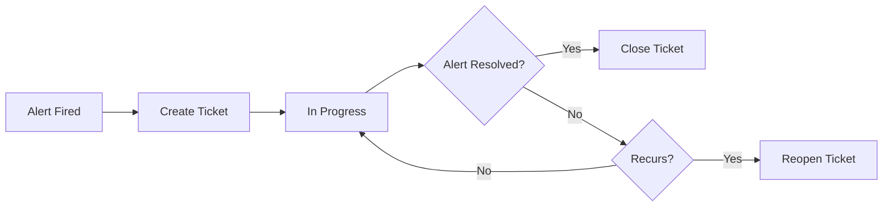

## Overview

InfraGuard automatically creates, updates, and closes Jira tickets for alerts, providing full incident tracking and resolution workflow.

## Setup

<Steps>
  <Step title="Generate API Token">
    1. Go to [id.atlassian.com/manage-profile/security/api-tokens](https://id.atlassian.com/manage-profile/security/api-tokens)
    2. Click "Create API token"
    3. Name it "InfraGuard" and copy the token
  </Step>
  
  <Step title="Configure InfraGuard">
    ```yaml
    integrations:
      jira:
        enabled: true
        url: "https://your-domain.atlassian.net"
        user_email: "your-email@example.com"
        api_token: "${JIRA_API_TOKEN}"
        default_project: "OPS"
    ```
  </Step>
  
  <Step title="Test Connection">
    ```bash
    curl -X POST http://localhost:8000/api/integrations/jira/test
    ```
  </Step>
</Steps>

## Ticket Creation

Tickets are created automatically with full context:

```yaml
alerting:
  routing:
    - name: "infrastructure_alerts"
      channels:
        - type: "jira"
          project: "OPS"
          issue_type: "Incident"
          priority: "High"
          labels: ["infrastructure", "automated"]
          components: ["monitoring"]
```

## Ticket Lifecycle



## Configuration

```yaml
integrations:
  jira:
    # Ticket creation
    ticket_creation:
      auto_create: true
      issue_type: "Bug"
      priority_mapping:
        critical: "Highest"
        warning: "High"
        info: "Medium"
    
    # Lifecycle management
    lifecycle:
      auto_close: true
      close_on_resolution: true
      reopen_on_recurrence: true
      reopen_window_hours: 24
    
    # Custom fields
    custom_fields:
      - field_id: "customfield_10001"
        value: "InfraGuard"
      - field_id: "customfield_10002"
        value_from: "metric_name"
```

## Best Practices

- Use separate projects for different alert types
- Configure priority mapping appropriately
- Enable auto-close to reduce manual work
- Add labels for easy filtering
- Link to runbooks in ticket description

## Next Steps

<CardGroup cols={2}>
  <Card title="Grafana Integration" icon="chart-line" href="/integrations/grafana">
    Visualize metrics in Grafana dashboards
  </Card>
  
  <Card title="Runbooks Guide" icon="book" href="/guides/runbooks">
    Create runbooks for common issues
  </Card>
</CardGroup>
