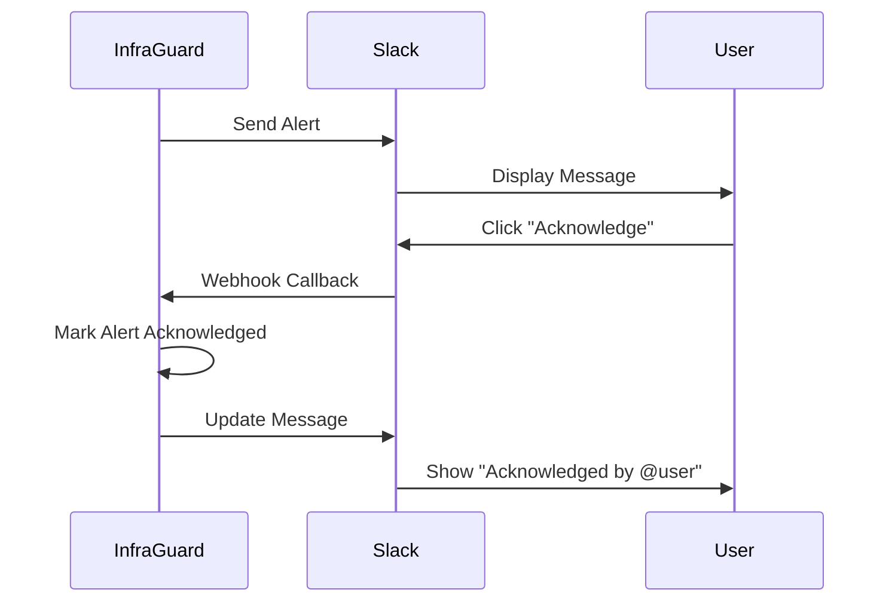

## Overview

InfraGuard integrates with Slack to deliver real-time alerts with rich formatting and interactive buttons for quick response.

<Card title="Features" icon="star">
  Interactive alerts, acknowledgment buttons, metric charts, and runbook links
</Card>

## Setup

<Steps>
  <Step title="Create Slack App">
    1. Go to [api.slack.com/apps](https://api.slack.com/apps)
    2. Click "Create New App"
    3. Choose "From scratch"
    4. Name it "InfraGuard" and select your workspace
  </Step>
  
  <Step title="Enable Incoming Webhooks">
    1. In your app settings, go to "Incoming Webhooks"
    2. Toggle "Activate Incoming Webhooks" to On
    3. Click "Add New Webhook to Workspace"
    4. Select the channel for alerts (e.g., #ops-alerts)
    5. Copy the webhook URL
  </Step>
  
  <Step title="Configure InfraGuard">
    Add webhook URL to your configuration:
    
    ```yaml
    integrations:
      slack:
        enabled: true
        webhook_url: "https://hooks.slack.com/services/YOUR/WEBHOOK/URL"
        default_channel: "#ops-alerts"
        username: "InfraGuard"
        icon_emoji: ":robot_face:"
    ```
  </Step>
  
  <Step title="Test Integration">
    ```bash
    curl -X POST http://localhost:8000/api/integrations/slack/test
    ```
  </Step>
</Steps>

## Alert Message Format

InfraGuard sends rich, structured messages:

```json
{
  "text": "🚨 Critical Alert: High CPU Usage",
  "blocks": [
    {
      "type": "header",
      "text": {
        "type": "plain_text",
        "text": "🚨 High CPU Usage Detected"
      }
    },
    {
      "type": "section",
      "fields": [
        {"type": "mrkdwn", "text": "*Severity:*\nCritical"},
        {"type": "mrkdwn", "text": "*Host:*\nprod-web-01"},
        {"type": "mrkdwn", "text": "*Current Value:*\n94.5%"},
        {"type": "mrkdwn", "text": "*Threshold:*\n90%"}
      ]
    },
    {
      "type": "section",
      "text": {
        "type": "mrkdwn",
        "text": "*Anomaly Score:* 0.95 (3.2 std dev)\n*Expected Range:* 40-70%"
      }
    },
    {
      "type": "actions",
      "elements": [
        {
          "type": "button",
          "text": {"type": "plain_text", "text": "Acknowledge"},
          "style": "primary",
          "action_id": "ack_alert"
        },
        {
          "type": "button",
          "text": {"type": "plain_text", "text": "View Runbook"},
          "url": "https://wiki/runbooks/high-cpu"
        },
        {
          "type": "button",
          "text": {"type": "plain_text", "text": "Dashboard"},
          "url": "https://grafana/d/cpu"
        }
      ]
    }
  ]
}
```

## Channel Routing

Route different alert types to different channels:

```yaml
alerting:
  routing:
    - name: "critical_infrastructure"
      severity: "critical"
      channels:
        - type: "slack"
          webhook_url: "${SLACK_WEBHOOK_URL}"
          channel: "#ops-critical"
          mention: "@channel"
    
    - name: "application_warnings"
      severity: "warning"
      channels:
        - type: "slack"
          webhook_url: "${SLACK_WEBHOOK_URL}"
          channel: "#dev-alerts"
    
    - name: "security_alerts"
      metric_pattern: "^security_.*"
      channels:
        - type: "slack"
          webhook_url: "${SLACK_SECURITY_WEBHOOK}"
          channel: "#security"
          mention: "@security-team"
```

## Interactive Features

### Acknowledgment Buttons

Users can acknowledge alerts directly from Slack:



### Slash Commands

Add custom slash commands for quick actions:

```
/infraguard status
/infraguard silence cpu_usage 1h
/infraguard forecast cpu_usage 24h
```

## Message Customization

Customize alert appearance:

```yaml
integrations:
  slack:
    # Bot identity
    username: "InfraGuard Bot"
    icon_emoji: ":robot_face:"
    icon_url: "https://your-domain.com/logo.png"
    
    # Message formatting
    formatting:
      include_charts: true
      include_context: true
      max_message_length: 3000
    
    # Mentions
    mentions:
      critical: "@channel"
      warning: "@here"
      on_call: "@oncall-engineer"
```

## Rate Limiting

Prevent message flooding:

```yaml
integrations:
  slack:
    rate_limiting:
      enabled: true
      max_messages_per_minute: 10
      burst: 5
      
    # Aggregate similar alerts
    aggregation:
      enabled: true
      window_seconds: 300
      max_alerts: 5
```

## Troubleshooting

<AccordionGroup>
  <Accordion title="Messages Not Appearing">
    ```bash
    # Test webhook directly
    curl -X POST "${SLACK_WEBHOOK_URL}" \
      -H "Content-Type: application/json" \
      -d '{"text": "Test message"}'
    
    # Check InfraGuard logs
    docker logs infraguard | grep slack
    
    # Verify webhook URL
    infraguard config show | grep slack
    ```
  </Accordion>
  
  <Accordion title="Wrong Channel">
    - Webhook URLs are tied to specific channels
    - Create separate webhooks for different channels
    - Use channel routing in configuration
  </Accordion>
  
  <Accordion title="Rate Limited">
    - Slack limits: 1 message per second per webhook
    - Enable aggregation to reduce message volume
    - Use deduplication for similar alerts
  </Accordion>
</AccordionGroup>

## Best Practices

- Use separate channels for different severity levels
- Enable interactive buttons for faster response
- Configure appropriate mentions (@channel, @here)
- Set up aggregation to prevent alert storms
- Include runbook links in all alerts
- Test webhooks before production deployment

## Next Steps

<CardGroup cols={2}>
  <Card title="Jira Integration" icon="jira" href="/integrations/jira">
    Automatically create tickets for alerts
  </Card>
  
  <Card title="Alert Configuration" icon="bell" href="/concepts/alerting">
    Learn about alert routing and escalation
  </Card>
</CardGroup>
