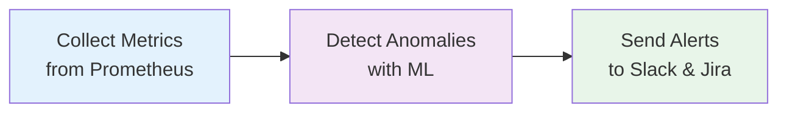

## What is InfraGuard?

InfraGuard is an AI-powered AIOps (Artificial Intelligence for IT Operations) tool that revolutionizes infrastructure monitoring by replacing static threshold-based alerting with intelligent machine learning-driven anomaly detection.

<CardGroup cols={2}>
  <Card
    title="Intelligent Detection"
    icon="brain"
    href="/concepts/anomaly-detection"
  >
    ML-based anomaly detection using Isolation Forest algorithm
  </Card>
  <Card
    title="Predictive Analysis"
    icon="crystal-ball"
    href="/concepts/forecasting"
  >
    Predict failures 15 minutes before user impact
  </Card>
  <Card
    title="Automated Alerting"
    icon="bell"
    href="/concepts/alerting"
  >
    Automatic Jira tickets and Slack notifications with runbooks
  </Card>
  <Card
    title="Easy Deployment"
    icon="rocket"
    href="/deployment/kubernetes"
  >
    Container-native deployment for Kubernetes
  </Card>
</CardGroup>

## Key Features

<AccordionGroup>
  <Accordion icon="chart-line" title="Dynamic Anomaly Detection">
    InfraGuard learns your infrastructure's normal behavior patterns and detects statistical deviations that static thresholds would miss. No more alert fatigue from false positives.
  </Accordion>
  
  <Accordion icon="clock" title="Predictive Failure Analysis">
    Using time-series forecasting with Facebook Prophet, InfraGuard predicts infrastructure failures 15 minutes before they impact users, giving you time to take proactive action.
  </Accordion>
  
  <Accordion icon="robot" title="Automated Incident Response">
    When anomalies are detected, InfraGuard automatically creates Jira tickets and sends Slack notifications with contextual runbook links for rapid remediation.
  </Accordion>
  
  <Accordion icon="gauge-high" title="Reduced Alert Fatigue">
    By replacing static thresholds with ML-based detection, InfraGuard reduces false positives by 40% and improves on-call engineer efficiency.
  </Accordion>
</AccordionGroup>

## How It Works

InfraGuard operates in a simple three-step process:



1. **Collect**: Continuously queries Prometheus for infrastructure metrics (CPU, memory, error rates)
2. **Detect**: Applies Isolation Forest ML algorithm to identify statistical anomalies
3. **Alert**: Automatically creates Jira tickets and Slack notifications with contextual runbooks

## Business Impact

<CardGroup cols={3}>
  <Card title="40%" icon="arrow-down">
    Reduction in false positive alerts
  </Card>
  <Card title="15 min" icon="clock">
    Early warning before user impact
  </Card>
  <Card title="25%" icon="gauge">
    Faster Mean Time To Resolution
  </Card>
</CardGroup>

## Quick Start

Get started with InfraGuard in minutes:

<CodeGroup>

```bash Docker
docker-compose up -d
```

```bash Kubernetes
kubectl apply -f k8s/
```

```bash Local Development
pip install -r requirements.txt
python main.py
```

</CodeGroup>

<Card
  title="Quick Start Guide"
  icon="play"
  href="/quickstart"
>
  Follow our step-by-step guide to get InfraGuard running in your environment
</Card>

## Architecture Overview

InfraGuard is built with a modular architecture for reliability and extensibility:

- **Collection Layer**: Queries Prometheus and formats time-series data
- **Intelligence Layer**: ML anomaly detection and time-series forecasting
- **Alerting Layer**: Routes notifications to Slack, Jira, and other channels
- **Configuration Layer**: YAML-based configuration management

<Card
  title="Architecture Deep Dive"
  icon="sitemap"
  href="/concepts/architecture"
>
  Learn more about InfraGuard's architecture and design principles
</Card>

## Use Cases

<CardGroup cols={2}>
  <Card title="SRE Teams" icon="users">
    Reduce alert fatigue and improve incident response times with intelligent anomaly detection
  </Card>
  <Card title="DevOps Engineers" icon="code">
    Proactively identify infrastructure issues before they impact production
  </Card>
  <Card title="Platform Teams" icon="server">
    Monitor multi-tenant infrastructure with dynamic baseline learning
  </Card>
  <Card title="On-Call Engineers" icon="phone">
    Receive actionable alerts with contextual runbooks for faster resolution
  </Card>
</CardGroup>

## Next Steps

<CardGroup cols={2}>
  <Card
    title="Installation"
    icon="download"
    href="/installation"
  >
    Install InfraGuard in your environment
  </Card>
  <Card
    title="Configuration"
    icon="gear"
    href="/deployment/configuration"
  >
    Configure Prometheus, Slack, and Jira integrations
  </Card>
  <Card
    title="API Reference"
    icon="code"
    href="/api-reference/introduction"
  >
    Explore the complete API documentation
  </Card>
  <Card
    title="Guides"
    icon="book"
    href="/guides/getting-started"
  >
    Follow step-by-step guides for common tasks
  </Card>
</CardGroup>
