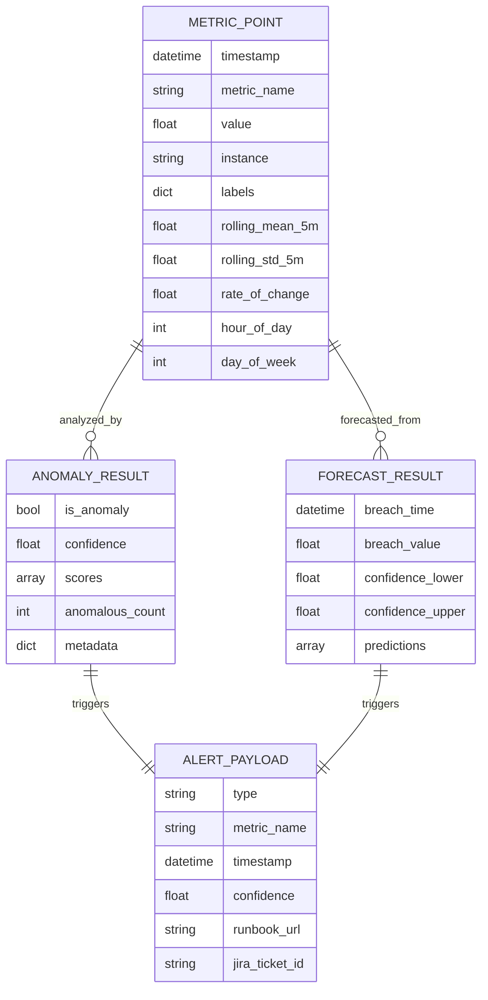
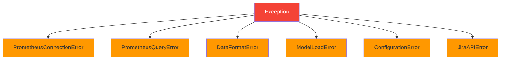

# InfraGuard API Documentation

## Table of Contents
1. [Overview](#overview)
2. [Core Components API](#core-components-api)
3. [Data Models](#data-models)
4. [Configuration Schema](#configuration-schema)
5. [Error Handling](#error-handling)

## Overview

InfraGuard is structured as a modular Python application with clear component interfaces. This document describes the public APIs for each component.

## Core Components API

### 1. Metrics Collector

#### PrometheusCollector

Collects metrics from Prometheus API using PromQL queries.

```python
from src.collector.prometheus import PrometheusCollector

# Initialize
collector = PrometheusCollector({
    'url': 'http://prometheus:9090',
    'queries': {
        'cpu': 'rate(node_cpu_seconds_total[5m])'
    },
    'timeout': 30
})

# Collect metrics
df = collector.collect_metrics()
# Returns: pandas.DataFrame with columns [timestamp, metric_name, value, instance, labels]

# Execute single query
result = collector.execute_query('rate(cpu[5m])')
# Returns: dict (raw Prometheus JSON response)
```

**Methods**:

| Method | Parameters | Returns | Description |
|--------|-----------|---------|-------------|
| `__init__` | `config: dict` | None | Initialize collector with configuration |
| `collect_metrics` | None | `pd.DataFrame` | Execute all configured queries and return formatted data |
| `execute_query` | `query: str` | `dict` | Execute a single PromQL query |

**Exceptions**:
- `ValueError`: If required config fields are missing
- `PrometheusConnectionError`: If API is unreachable
- `PrometheusQueryError`: If query execution fails

#### DataFormatter

Transforms Prometheus JSON responses into ML-ready DataFrames.

```python
from src.collector.formatter import DataFormatter

formatter = DataFormatter()

# Format Prometheus response
df = formatter.format_prometheus_response(prometheus_json)
# Returns: pd.DataFrame with columns [timestamp, metric_name, value, instance, labels]

# Normalize timestamps
df = formatter.normalize_timestamps(df)
# Returns: pd.DataFrame with second-level timestamp precision

# Add feature columns for ML
df = formatter.add_feature_columns(df)
# Returns: pd.DataFrame with additional columns:
#   - rolling_mean_5m
#   - rolling_std_5m
#   - rate_of_change
#   - hour_of_day
#   - day_of_week
```

**Methods**:

| Method | Parameters | Returns | Description |
|--------|-----------|---------|-------------|
| `format_prometheus_response` | `response: dict` | `pd.DataFrame` | Convert Prometheus JSON to DataFrame |
| `normalize_timestamps` | `df: pd.DataFrame` | `pd.DataFrame` | Align timestamps to 1-second precision |
| `add_feature_columns` | `df: pd.DataFrame` | `pd.DataFrame` | Add derived features for ML |

### 2. ML Anomaly Detector

#### IsolationForestDetector

Detects statistical anomalies using the Isolation Forest algorithm.

```python
from src.ml.isolation_forest import IsolationForestDetector

# Initialize
detector = IsolationForestDetector({
    'confidence_threshold': 85.0,
    'model_path': 'models/pretrained/isolation_forest.pkl',
    'contamination': 0.1,
    'n_estimators': 100
})

# Load pre-trained model
detector.load_model()

# Train new model
detector.train(training_data)
detector.save_model()

# Detect anomalies
result = detector.detect_anomalies(metrics_df)
# Returns: AnomalyResult object
```

**Methods**:

| Method | Parameters | Returns | Description |
|--------|-----------|---------|-------------|
| `__init__` | `config: dict` | None | Initialize detector with configuration |
| `load_model` | `path: str = None` | None | Load pre-trained model from disk |
| `train` | `data: pd.DataFrame` | None | Train model on historical data |
| `save_model` | `path: str = None` | None | Serialize trained model to disk |
| `detect_anomalies` | `data: pd.DataFrame` | `AnomalyResult` | Detect anomalies in metrics data |
| `compute_confidence` | `scores: np.ndarray` | `float` | Convert anomaly scores to confidence % |

**Configuration Parameters**:

| Parameter | Type | Default | Description |
|-----------|------|---------|-------------|
| `confidence_threshold` | float | 85.0 | Minimum confidence to trigger alerts (0-100) |
| `model_path` | str | - | Path to model file (.pkl) |
| `contamination` | float | 0.1 | Expected proportion of anomalies |
| `n_estimators` | int | 100 | Number of trees in forest |
| `max_samples` | int | 256 | Samples per tree |
| `random_state` | int | 42 | Random seed for reproducibility |

#### AnomalyResult

Result object from anomaly detection.

```python
@dataclass
class AnomalyResult:
    is_anomaly: bool              # Whether any anomalies were detected
    confidence: float             # Confidence percentage (0-100)
    scores: np.ndarray           # Raw anomaly scores (-1 for anomaly, 1 for normal)
    anomalous_points: pd.DataFrame  # DataFrame containing only anomalous points
    metadata: dict               # Additional context
    
    def to_dict(self) -> dict:
        """Convert result to dictionary for serialization."""
```

### 3. Time-Series Forecaster (Optional)

#### TimeSeriesForecaster

Forecasts future metric values using Facebook Prophet.

```python
from src.ml.forecaster import TimeSeriesForecaster

# Initialize
forecaster = TimeSeriesForecaster({
    'prediction_window_minutes': 15,
    'thresholds': {
        'cpu_utilization': 0.9,
        'memory_utilization': 0.85
    },
    'seasonality_mode': 'additive'
})

# Generate forecast
result = forecaster.forecast(historical_data, 'cpu_utilization')
# Returns: ForecastResult object
```

**Methods**:

| Method | Parameters | Returns | Description |
|--------|-----------|---------|-------------|
| `__init__` | `config: dict` | None | Initialize forecaster |
| `forecast` | `data: pd.DataFrame, metric_name: str` | `ForecastResult` | Generate forecast for prediction window |
| `predict_threshold_breach` | `forecast: pd.DataFrame, threshold: float` | `bool` | Check if predicted values exceed threshold |

#### ForecastResult

Result object from time-series forecasting.

```python
@dataclass
class ForecastResult:
    predictions: pd.DataFrame           # Predictions with confidence intervals
    breach_time: Optional[datetime]     # When threshold breach is predicted
    breach_value: Optional[float]       # Predicted value at breach time
    confidence_interval_lower: Optional[float]  # Lower bound
    confidence_interval_upper: Optional[float]  # Upper bound
    
    def to_dict(self) -> dict:
        """Convert result to dictionary for serialization."""
```

### 4. Alert Manager

#### AlertManager

Manages alert routing to external notification systems.

```python
from src.alerter.alert_manager import AlertManager

# Initialize
manager = AlertManager({
    'slack': {
        'webhook_url': 'https://hooks.slack.com/...',
        'channel': '#ops-alerts'
    },
    'jira': {
        'api_url': 'https://company.atlassian.net',
        'project_key': 'INC',
        'username': 'user@company.com',
        'api_token': 'token'
    },
    'runbooks': {
        'cpu_utilization': {
            'anomaly': 'https://wiki.internal/cpu-spike'
        }
    }
})

# Send anomaly alert
status = manager.send_alert(anomaly_result, 'cpu_utilization')
# Returns: AlertStatus object

# Send forecast alert
status = manager.send_forecast_alert(forecast_result, 'cpu_utilization')
# Returns: AlertStatus object
```

**Methods**:

| Method | Parameters | Returns | Description |
|--------|-----------|---------|-------------|
| `__init__` | `config: dict` | None | Initialize alert manager |
| `send_alert` | `anomaly: AnomalyResult, metric_name: str` | `AlertStatus` | Send anomaly alert to all channels |
| `send_forecast_alert` | `forecast: ForecastResult, metric_name: str` | `AlertStatus` | Send predictive alert |

#### AlertStatus

Status of alert delivery.

```python
@dataclass
class AlertStatus:
    slack_success: bool = False      # Whether Slack notification succeeded
    jira_success: bool = False       # Whether Jira ticket creation succeeded
    jira_ticket_id: Optional[str] = None  # Jira ticket identifier
    errors: list = field(default_factory=list)  # Error messages
    
    def to_dict(self) -> dict:
        """Convert status to dictionary for logging."""
```

### 5. Slack Notifier

#### SlackNotifier

Sends formatted notifications to Slack via webhook.

```python
from src.alerter.slack import SlackNotifier

# Initialize
notifier = SlackNotifier({
    'webhook_url': 'https://hooks.slack.com/...',
    'channel': '#ops-alerts',
    'retry_count': 1
})

# Send message
success = notifier.send_message(alert_payload)
# Returns: bool (True if delivered successfully)
```

**Methods**:

| Method | Parameters | Returns | Description |
|--------|-----------|---------|-------------|
| `__init__` | `config: dict` | None | Initialize Slack notifier |
| `send_message` | `payload: dict` | `bool` | Send formatted message to Slack |

**Message Format**:

Slack messages use Block Kit formatting:

```json
{
  "channel": "#ops-alerts",
  "blocks": [
    {
      "type": "header",
      "text": {
        "type": "plain_text",
        "text": "🔴 InfraGuard Anomaly Detected"
      }
    },
    {
      "type": "section",
      "fields": [
        {"type": "mrkdwn", "text": "*Severity:*\nCRITICAL"},
        {"type": "mrkdwn", "text": "*Confidence:*\n95.0%"},
        {"type": "mrkdwn", "text": "*Metric:*\n`cpu_utilization`"}
      ]
    }
  ]
}
```

### 6. Jira Notifier

#### JiraNotifier

Creates incident tickets in Jira via REST API.

```python
from src.alerter.jira import JiraNotifier

# Initialize
notifier = JiraNotifier({
    'api_url': 'https://company.atlassian.net',
    'project_key': 'INC',
    'username': 'user@company.com',
    'api_token': 'token'
})

# Create ticket
ticket_id = notifier.create_ticket(alert_payload)
# Returns: str (e.g., 'INC-1045')
```

**Methods**:

| Method | Parameters | Returns | Description |
|--------|-----------|---------|-------------|
| `__init__` | `config: dict` | None | Initialize Jira notifier |
| `create_ticket` | `payload: dict` | `str` | Create incident ticket and return ticket ID |

**Ticket Structure**:

```json
{
  "fields": {
    "project": {"key": "INC"},
    "summary": "InfraGuard Anomaly: cpu_utilization (95.0% confidence)",
    "description": {
      "type": "doc",
      "version": 1,
      "content": [...]
    },
    "issuetype": {"name": "Incident"},
    "priority": {"name": "High"},
    "labels": ["infraguard", "anomaly", "automated"]
  }
}
```

### 7. Runbook Mapper

#### RunbookMapper

Maps detected anomalies to remediation runbook URLs.

```python
from src.alerter.runbook_mapper import RunbookMapper

# Initialize
mapper = RunbookMapper({
    'cpu_utilization': {
        'anomaly': 'https://wiki.internal/cpu-spike',
        'prediction': 'https://wiki.internal/cpu-scale'
    },
    'default': 'https://wiki.internal/default'
})

# Get runbook URL
url = mapper.get_runbook('cpu_utilization', 'anomaly')
# Returns: str (runbook URL)

# Load mappings from file
mapper.load_mappings('config/runbooks.yaml')
```

**Methods**:

| Method | Parameters | Returns | Description |
|--------|-----------|---------|-------------|
| `__init__` | `config: dict` | None | Initialize with runbook mappings |
| `get_runbook` | `metric_name: str, anomaly_type: str` | `str` | Retrieve runbook URL (returns default if not found) |
| `load_mappings` | `path: str` | None | Load mappings from YAML file |

### 8. Configuration Manager

#### ConfigurationManager

Manages application configuration from YAML file.

```python
from src.config.settings import ConfigurationManager

# Initialize
config = ConfigurationManager('src/config/settings.yaml')

# Get configuration values
prom_url = config.get('prometheus.url')
threshold = config.get('ml.confidence_threshold', 85.0)

# Get section configs
prom_config = config.get_prometheus_config()
ml_config = config.get_ml_config()
alert_config = config.get_alerting_config()

# Get collection interval
interval = config.get_collection_interval()  # Returns: int (seconds)
```

**Methods**:

| Method | Parameters | Returns | Description |
|--------|-----------|---------|-------------|
| `__init__` | `config_path: str` | None | Load and validate configuration |
| `get` | `key: str, default: Any` | `Any` | Get value by dot-notation key |
| `get_prometheus_config` | None | `dict` | Get Prometheus configuration |
| `get_ml_config` | None | `dict` | Get ML configuration |
| `get_alerting_config` | None | `dict` | Get alerting configuration |
| `get_collection_interval` | None | `int` | Get collection interval in seconds |

## Data Models

### MetricPoint

Represents a single metric data point.

```python
from dataclasses import dataclass
from datetime import datetime
from typing import Dict, Optional

@dataclass
class MetricPoint:
    timestamp: datetime
    metric_name: str
    value: float
    instance: str
    labels: Dict[str, str]
    rolling_mean_5m: Optional[float] = None
    rolling_std_5m: Optional[float] = None
    rate_of_change: Optional[float] = None
    hour_of_day: Optional[int] = None
    day_of_week: Optional[int] = None
```

### Entity Relationship Diagram



## Configuration Schema

### Complete Configuration Structure

```yaml
# Prometheus connection settings
prometheus:
  url: string                    # Required: Prometheus API URL
  timeout_seconds: integer       # Optional: HTTP timeout (default: 30)
  queries:                       # Required: PromQL queries
    <metric_name>: string        # PromQL query string

# Machine Learning settings
ml:
  model_path: string             # Required: Path to model file
  confidence_threshold: float    # Optional: 0-100 (default: 85.0)
  contamination: float           # Optional: 0-1 (default: 0.1)
  n_estimators: integer          # Optional: (default: 100)
  max_samples: integer           # Optional: (default: 256)
  random_state: integer          # Optional: (default: 42)

# Time-series forecasting (optional)
forecasting:
  enabled: boolean               # Optional: (default: false)
  prediction_window_minutes: integer  # Optional: (default: 15)
  thresholds:                    # Optional: metric thresholds
    <metric_name>: float
  seasonality_mode: string       # Optional: 'additive' or 'multiplicative'
  changepoint_prior_scale: float # Optional: (default: 0.05)

# Alerting configuration
alerting:
  slack:                         # Optional
    webhook_url: string          # Required if slack enabled
    channel: string              # Optional: (default: '#ops-alerts')
    retry_count: integer         # Optional: (default: 1)
  
  jira:                          # Optional
    api_url: string              # Required if jira enabled
    project_key: string          # Required if jira enabled
    username: string             # Required if jira enabled
    api_token: string            # Required if jira enabled
  
  runbooks:                      # Optional
    <metric_name>:
      anomaly: string            # Runbook URL for anomalies
      prediction: string         # Runbook URL for predictions
    default: string              # Default runbook URL

# Collection interval
collection_interval_seconds: integer  # Optional: (default: 60)

# Logging configuration
logging:
  level: string                  # Optional: DEBUG, INFO, WARNING, ERROR, CRITICAL
  format: string                 # Optional: Python logging format
  file: string                   # Optional: Log file path
```

### Pydantic Validation Models

```python
from pydantic import BaseModel, HttpUrl, validator
from typing import Dict, Optional

class PrometheusConfig(BaseModel):
    url: HttpUrl
    timeout_seconds: int = 30
    queries: Dict[str, str]
    
    @validator('queries')
    def validate_queries(cls, v):
        if not v:
            raise ValueError("At least one PromQL query is required")
        return v

class MLConfig(BaseModel):
    model_path: str
    confidence_threshold: float = 85.0
    contamination: float = 0.1
    n_estimators: int = 100
    max_samples: int = 256
    random_state: int = 42
    
    @validator('confidence_threshold')
    def validate_threshold(cls, v):
        if not 0 <= v <= 100:
            raise ValueError("Confidence threshold must be between 0 and 100")
        return v

class SlackConfig(BaseModel):
    webhook_url: HttpUrl
    channel: str = '#ops-alerts'
    retry_count: int = 1

class JiraConfig(BaseModel):
    api_url: HttpUrl
    project_key: str
    username: str
    api_token: str

class InfraGuardConfig(BaseModel):
    prometheus: PrometheusConfig
    ml: MLConfig
    alerting: Dict
    collection_interval_seconds: int = 60
    logging: Dict = {
        'level': 'INFO',
        'format': '%(asctime)s - %(name)s - %(levelname)s - %(message)s'
    }
```

## Error Handling

### Exception Hierarchy



### Custom Exceptions

```python
class PrometheusConnectionError(Exception):
    """Raised when Prometheus API is unreachable."""
    pass

class PrometheusQueryError(Exception):
    """Raised when PromQL query execution fails."""
    pass

class DataFormatError(Exception):
    """Raised when data format is invalid."""
    pass

class ModelLoadError(Exception):
    """Raised when model loading fails."""
    pass

class ConfigurationError(Exception):
    """Raised for configuration errors."""
    pass

class JiraAPIError(Exception):
    """Raised for Jira API errors."""
    pass
```

### Error Handling Patterns

#### Retry with Backoff

```python
def retry_with_backoff(func, max_retries=3, base_delay=1):
    """Retry a function with exponential backoff."""
    for attempt in range(max_retries):
        try:
            return func()
        except Exception as e:
            if attempt == max_retries - 1:
                raise
            delay = base_delay * (2 ** attempt)
            time.sleep(delay)
```

#### Circuit Breaker

```python
class CircuitBreaker:
    """Circuit breaker to prevent cascading failures."""
    
    def __init__(self, failure_threshold=5, timeout=60):
        self.failure_threshold = failure_threshold
        self.timeout = timeout
        self.failure_count = 0
        self.state = 'CLOSED'  # CLOSED, OPEN, HALF_OPEN
    
    def call(self, func):
        if self.state == 'OPEN':
            if time.time() - self.last_failure_time > self.timeout:
                self.state = 'HALF_OPEN'
            else:
                raise CircuitBreakerOpenError("Circuit breaker is OPEN")
        
        try:
            result = func()
            self.on_success()
            return result
        except Exception as e:
            self.on_failure()
            raise
```

## Usage Examples

### Complete Workflow Example

```python
from src.config.settings import ConfigurationManager
from src.collector.prometheus import PrometheusCollector
from src.collector.formatter import DataFormatter
from src.ml.isolation_forest import IsolationForestDetector
from src.alerter.alert_manager import AlertManager

# 1. Load configuration
config = ConfigurationManager('config/settings.yaml')

# 2. Initialize components
collector = PrometheusCollector(config.get_prometheus_config())
formatter = DataFormatter()
detector = IsolationForestDetector(config.get_ml_config())
alert_manager = AlertManager(config.get_alerting_config())

# 3. Load pre-trained model
detector.load_model()

# 4. Collect metrics
raw_metrics = collector.collect_metrics()

# 5. Format and add features
formatted_metrics = formatter.add_feature_columns(raw_metrics)

# 6. Detect anomalies
anomaly_result = detector.detect_anomalies(formatted_metrics)

# 7. Send alerts if anomaly detected
if anomaly_result.is_anomaly and anomaly_result.confidence >= detector.confidence_threshold:
    for metric_name in anomaly_result.anomalous_points['metric_name'].unique():
        alert_status = alert_manager.send_alert(anomaly_result, metric_name)
        print(f"Alert sent: {alert_status.to_dict()}")
```

---

**Document Version**: 1.0  
**Last Updated**: 2026-04-06  
**Maintained By**: InfraGuard Team
