# InfraGuard Architecture Documentation

## Table of Contents
1. [System Overview](#system-overview)
2. [High-Level Architecture](#high-level-architecture)
3. [Component Architecture](#component-architecture)
4. [Data Flow](#data-flow)
5. [Deployment Architecture](#deployment-architecture)

## System Overview

InfraGuard is an AI-powered AIOps tool that provides intelligent infrastructure monitoring and predictive failure detection. The system continuously collects metrics from Prometheus, applies machine learning algorithms to detect statistical anomalies, predicts infrastructure failures before user impact, and automatically creates actionable alerts with contextual runbooks.

### Key Features
- Real-time anomaly detection using Isolation Forest ML algorithm
- Predictive failure analysis with 15-minute advance warning
- Automated Jira ticket creation and Slack notifications
- Contextual runbook mapping for rapid incident response
- Containerized deployment for Kubernetes environments

## High-Level Architecture

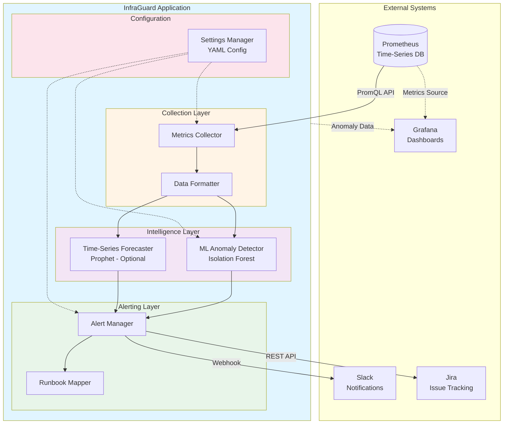

### Architecture Layers

**Collection Layer**
- Queries Prometheus API using PromQL
- Transforms JSON responses to Pandas DataFrames
- Adds derived features for ML processing

**Intelligence Layer**
- Isolation Forest for unsupervised anomaly detection
- Optional Prophet-based time-series forecasting
- Confidence scoring and threshold evaluation

**Alerting Layer**
- Routes alerts to Slack and Jira
- Maps anomalies to contextual runbooks
- Handles delivery failures with retry logic

**Configuration Layer**
- YAML-based configuration management
- Environment variable support
- Runtime validation

## Component Architecture

### Metrics Collector Component

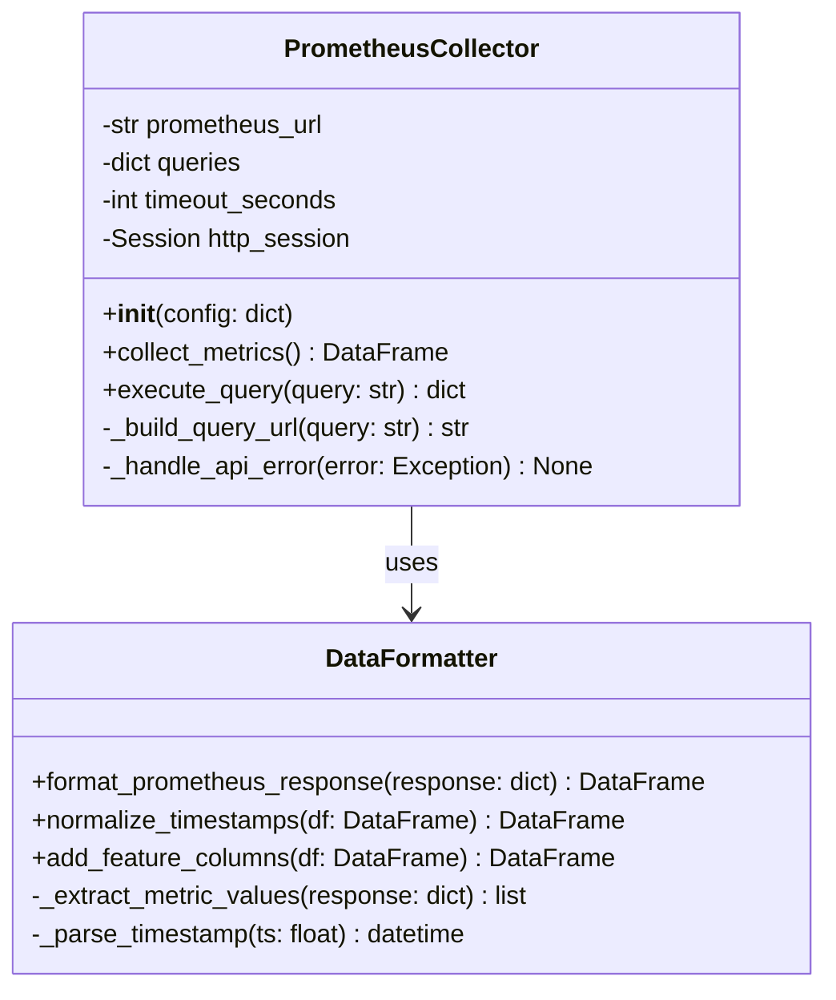

### ML Detection Component

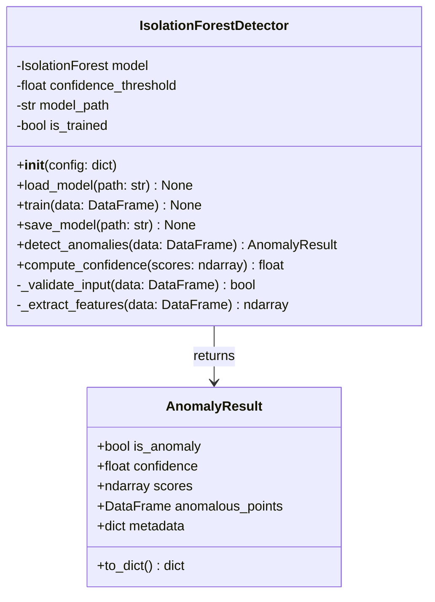

### Alert Management Component

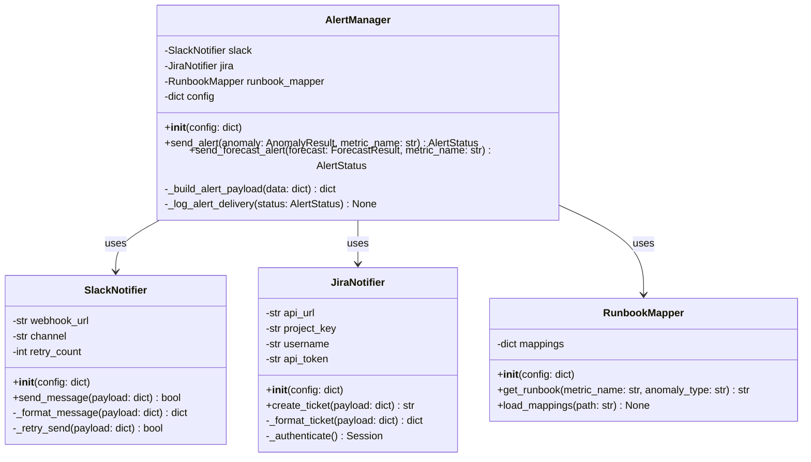

## Data Flow

### End-to-End Data Flow

```mermaid
flowchart LR
    subgraph Input["Data Input"]
        P1[Prometheus<br/>Metrics]
    end
    
    subgraph Transform["Data Transformation"]
        Q1[PromQL<br/>Queries]
        J1[JSON<br/>Response]
        DF[Pandas<br/>DataFrame]
    end
    
    subgraph Process["Processing Pipeline"]
        direction TB
        N1[Normalize<br/>Timestamps]
        N2[Feature<br/>Engineering]
        N3[Sliding<br/>Window]
    end
    
    subgraph ML["ML Pipeline"]
        direction TB
        T1[Load Pre-trained<br/>Model]
        T2[Compute<br/>Anomaly Scores]
        T3[Apply<br/>Threshold]
    end
    
    subgraph Output["Alert Output"]
        direction TB
        A1[Anomaly<br/>Metadata]
        A2[Runbook<br/>Context]
        A3[Alert<br/>Payload]
    end
    
    subgraph Delivery["Delivery Channels"]
        S1[Slack]
        J2[Jira]
    end
    
    P1 --> Q1
    Q1 --> J1
    J1 --> DF
    DF --> N1
    N1 --> N2
    N2 --> N3
    N3 --> T1
    T1 --> T2
    T2 --> T3
    T3 --> A1
    A1 --> A2
    A2 --> A3
    A3 --> S1
    A3 --> J2
    
    style Input fill:#e3f2fd
    style Transform fill:#fff3e0
    style Process fill:#f3e5f5
    style ML fill:#e8f5e9
    style Output fill:#fce4ec
    style Delivery fill:#fff9c4
```

### ML Pipeline Architecture

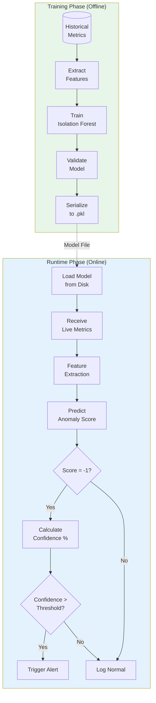

### Alert Routing Flow

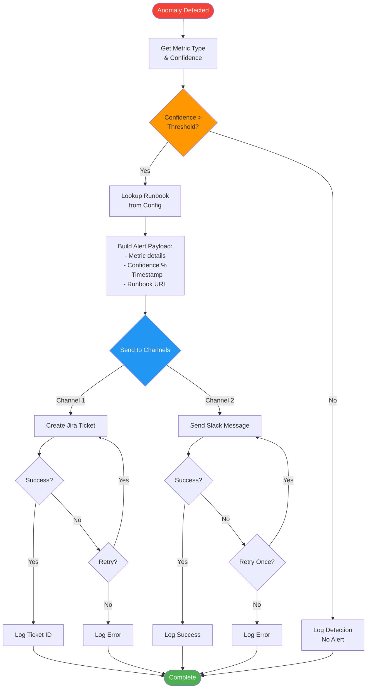

## Deployment Architecture

### Kubernetes Deployment

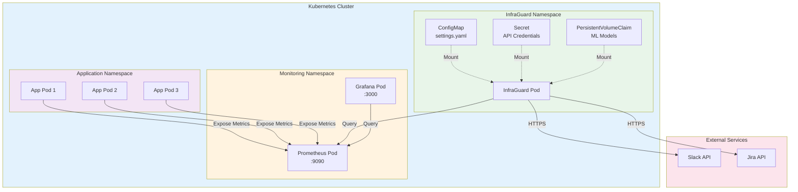

### Local Development Environment

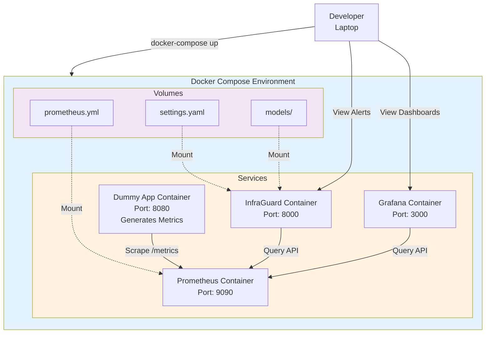

### Component Interaction Sequence

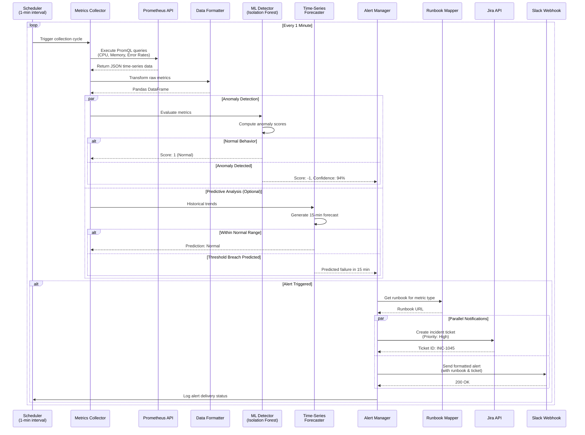

## Data Models

### Entity Relationship Diagram

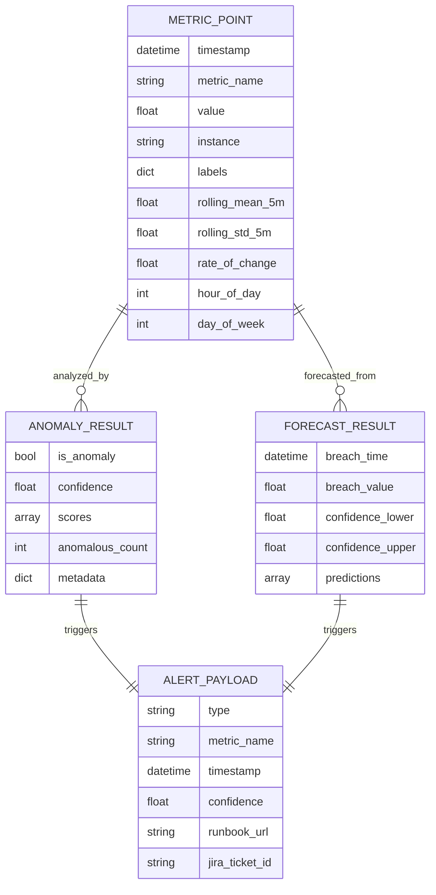

## Technology Stack

### Core Technologies
- **Language**: Python 3.9+
- **ML Framework**: scikit-learn (Isolation Forest)
- **Forecasting**: Facebook Prophet (optional)
- **Data Processing**: Pandas, NumPy
- **API Client**: requests, prometheus-api-client

### Infrastructure
- **Container Runtime**: Docker
- **Orchestration**: Kubernetes
- **Monitoring**: Prometheus, Grafana
- **Configuration**: YAML, environment variables

### External Integrations
- **Alerting**: Slack (webhooks), Jira (REST API)
- **Storage**: Persistent volumes for ML models

## Performance Characteristics

### Scalability
- **Single Instance**: Handles up to 100 metrics at 1-minute intervals
- **CPU**: 250m-500m (0.25-0.5 cores)
- **Memory**: 512Mi-1Gi
- **Storage**: 1-5Gi for models and logs

### Latency
- **Collection Cycle**: < 5 seconds
- **ML Inference**: < 1 second per metric
- **Alert Delivery**: < 3 seconds (parallel)

## Security Considerations

### Authentication & Authorization
- Kubernetes RBAC for pod access
- Secret management for API tokens
- Non-root container execution

### Network Security
- TLS for all external API calls
- Network policies for pod isolation
- Service mesh (optional) for mTLS

### Data Protection
- No PII in logs or metrics
- Encrypted secrets at rest
- Audit logging for alert delivery

## Operational Considerations

### Monitoring
- Self-monitoring via Prometheus metrics
- Health check endpoints
- Structured logging (JSON)

### Maintenance
- Model retraining procedures
- Configuration updates via ConfigMap
- Rolling updates for zero downtime

### Disaster Recovery
- Model backups to persistent storage
- Configuration version control
- Alert delivery retry mechanisms

---

**Document Version**: 1.0  
**Last Updated**: 2026-04-06  
**Maintained By**: InfraGuard Team
