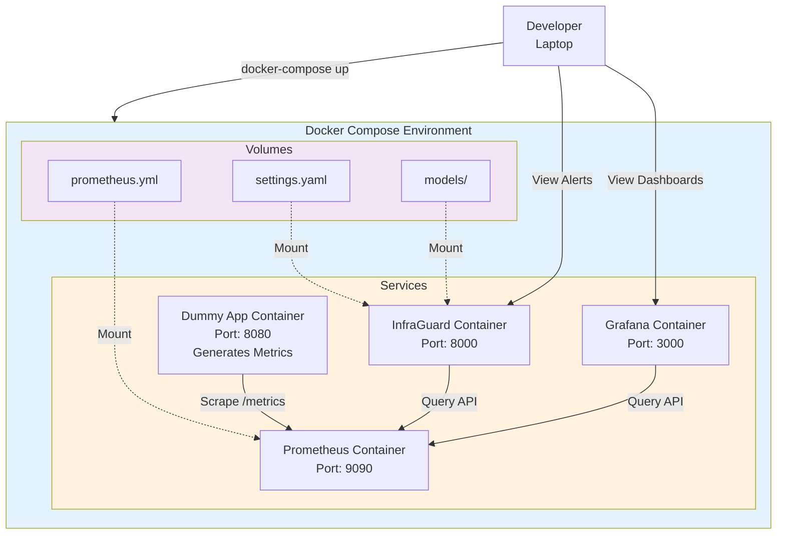
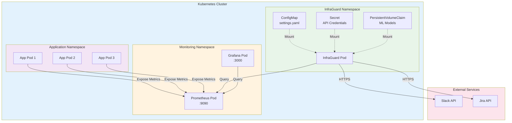
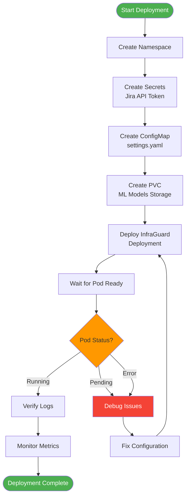
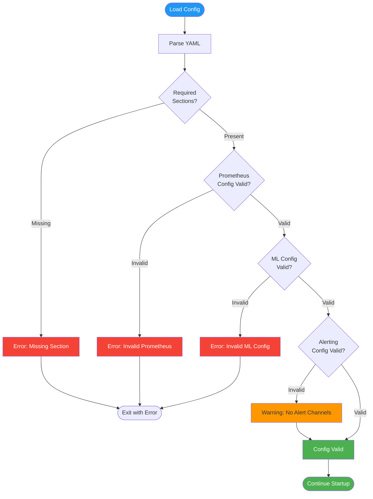

# InfraGuard Deployment Guide

## Table of Contents
1. [Prerequisites](#prerequisites)
2. [Local Development Setup](#local-development-setup)
3. [Kubernetes Deployment](#kubernetes-deployment)
4. [Configuration](#configuration)
5. [Monitoring and Operations](#monitoring-and-operations)

## Prerequisites

### Required Tools
- Docker 20.10+
- Docker Compose 1.29+
- Kubernetes 1.21+ (for production)
- kubectl CLI
- Python 3.9+ (for local development)

### External Services
- Prometheus instance (or use provided docker-compose)
- Slack workspace with webhook access
- Jira instance with API access

## Local Development Setup

### Quick Start with Docker Compose

1. **Clone the repository**
```bash
git clone https://github.com/your-org/infraguard.git
cd infraguard
```

2. **Configure environment variables**
```bash
cp .env.example .env
# Edit .env with your credentials
export JIRA_API_TOKEN="your-jira-token"
export SLACK_WEBHOOK_URL="your-slack-webhook"
```

3. **Start the development environment**
```bash
docker-compose up -d
```

This starts:
- Prometheus (port 9090)
- Dummy metrics application (port 8080)
- InfraGuard (monitoring)
- Grafana (port 3000)

### Docker Compose Architecture



### Docker Compose Configuration

```yaml
# docker-compose.yaml
version: '3.8'

services:
  prometheus:
    image: prom/prometheus:latest
    container_name: infraguard-prometheus
    ports:
      - "9090:9090"
    volumes:
      - ./config/prometheus.yml:/etc/prometheus/prometheus.yml
      - prometheus-data:/prometheus
    command:
      - '--config.file=/etc/prometheus/prometheus.yml'
      - '--storage.tsdb.path=/prometheus'
    networks:
      - infraguard-network

  dummy-app:
    build:
      context: ./dummy-app
      dockerfile: Dockerfile
    container_name: infraguard-dummy-app
    ports:
      - "8080:8080"
    environment:
      - SPIKE_PROBABILITY=0.1
      - SPIKE_MAGNITUDE=2.0
    networks:
      - infraguard-network

  infraguard:
    build:
      context: .
      dockerfile: Dockerfile
    container_name: infraguard-app
    depends_on:
      - prometheus
      - dummy-app
    volumes:
      - ./src/config/settings.yaml:/app/src/config/settings.yaml
      - ./models:/app/models
      - ./logs:/app/logs
    environment:
      - LOG_LEVEL=DEBUG
      - JIRA_API_TOKEN=${JIRA_API_TOKEN}
    networks:
      - infraguard-network

  grafana:
    image: grafana/grafana:latest
    container_name: infraguard-grafana
    ports:
      - "3000:3000"
    volumes:
      - ./dashboards:/etc/grafana/provisioning/dashboards
      - grafana-data:/var/lib/grafana
    environment:
      - GF_SECURITY_ADMIN_PASSWORD=admin
    networks:
      - infraguard-network

networks:
  infraguard-network:
    driver: bridge

volumes:
  prometheus-data:
  grafana-data:
```

### Accessing Services

After starting docker-compose:

- **Prometheus**: http://localhost:9090
- **Grafana**: http://localhost:3000 (admin/admin)
- **Dummy App Metrics**: http://localhost:8080/metrics
- **InfraGuard Logs**: `docker logs -f infraguard-app`

## Kubernetes Deployment

### Deployment Architecture



### Step 1: Create Namespace

```bash
kubectl create namespace infraguard
```

### Step 2: Create Secrets

```bash
# Create secret for Jira API token
kubectl create secret generic infraguard-secrets \
  --from-literal=jira-api-token='your-jira-token' \
  --namespace=infraguard

# Verify secret
kubectl get secret infraguard-secrets -n infraguard
```

### Step 3: Create ConfigMap

```bash
kubectl apply -f k8s/configmap.yaml
```

**k8s/configmap.yaml**:
```yaml
apiVersion: v1
kind: ConfigMap
metadata:
  name: infraguard-config
  namespace: infraguard
data:
  settings.yaml: |
    prometheus:
      url: "http://prometheus-server.monitoring.svc.cluster.local:9090"
      timeout_seconds: 30
      queries:
        cpu_utilization: 'rate(node_cpu_seconds_total{mode!="idle"}[5m])'
        memory_utilization: 'node_memory_Active_bytes / node_memory_MemTotal_bytes'
        http_error_rate: 'rate(http_requests_total{status=~"5.."}[5m])'
    
    ml:
      model_path: "models/pretrained/isolation_forest.pkl"
      confidence_threshold: 85.0
      contamination: 0.1
      n_estimators: 100
    
    alerting:
      slack:
        webhook_url: "https://hooks.slack.com/services/YOUR/WEBHOOK/URL"
        channel: "#ops-alerts"
      jira:
        api_url: "https://your-company.atlassian.net"
        project_key: "INC"
        username: "infraguard@company.com"
        api_token: "${JIRA_API_TOKEN}"
      runbooks:
        cpu_utilization:
          anomaly: "https://wiki.internal/runbooks/cpu-spike"
        memory_utilization:
          anomaly: "https://wiki.internal/runbooks/memory-leak"
        default: "https://wiki.internal/runbooks/default"
    
    collection_interval_seconds: 60
    
    logging:
      level: "INFO"
      format: "%(asctime)s - %(name)s - %(levelname)s - %(message)s"
```

### Step 4: Create Persistent Volume Claim

```bash
kubectl apply -f k8s/pvc.yaml
```

**k8s/pvc.yaml**:
```yaml
apiVersion: v1
kind: PersistentVolumeClaim
metadata:
  name: infraguard-models
  namespace: infraguard
spec:
  accessModes:
    - ReadWriteOnce
  resources:
    requests:
      storage: 1Gi
  storageClassName: standard
```

### Step 5: Deploy InfraGuard

```bash
kubectl apply -f k8s/deployment.yaml
```

**k8s/deployment.yaml**:
```yaml
apiVersion: apps/v1
kind: Deployment
metadata:
  name: infraguard
  namespace: infraguard
  labels:
    app: infraguard
spec:
  replicas: 1
  selector:
    matchLabels:
      app: infraguard
  template:
    metadata:
      labels:
        app: infraguard
    spec:
      containers:
      - name: infraguard
        image: your-registry/infraguard:latest
        imagePullPolicy: Always
        env:
        - name: LOG_LEVEL
          value: "INFO"
        - name: JIRA_API_TOKEN
          valueFrom:
            secretKeyRef:
              name: infraguard-secrets
              key: jira-api-token
        volumeMounts:
        - name: config
          mountPath: /app/src/config/settings.yaml
          subPath: settings.yaml
        - name: models
          mountPath: /app/models/pretrained
        - name: logs
          mountPath: /app/logs
        resources:
          requests:
            memory: "512Mi"
            cpu: "250m"
          limits:
            memory: "1Gi"
            cpu: "500m"
        livenessProbe:
          exec:
            command:
            - python
            - -c
            - "import sys; sys.exit(0)"
          initialDelaySeconds: 30
          periodSeconds: 30
        readinessProbe:
          exec:
            command:
            - python
            - -c
            - "import sys; sys.exit(0)"
          initialDelaySeconds: 10
          periodSeconds: 10
      volumes:
      - name: config
        configMap:
          name: infraguard-config
      - name: models
        persistentVolumeClaim:
          claimName: infraguard-models
      - name: logs
        emptyDir: {}
```

### Step 6: Verify Deployment

```bash
# Check pod status
kubectl get pods -n infraguard

# View logs
kubectl logs -f deployment/infraguard -n infraguard

# Check resource usage
kubectl top pod -n infraguard
```

### Deployment Flow



## Configuration

### Configuration File Structure

```yaml
# src/config/settings.yaml

# Prometheus connection settings
prometheus:
  url: "http://prometheus:9090"
  timeout_seconds: 30
  queries:
    cpu_utilization: 'rate(node_cpu_seconds_total{mode!="idle"}[5m])'
    memory_utilization: 'node_memory_Active_bytes / node_memory_MemTotal_bytes'
    http_error_rate: 'rate(http_requests_total{status=~"5.."}[5m])'
    disk_io_wait: 'rate(node_disk_io_time_seconds_total[5m])'

# Machine Learning settings
ml:
  model_path: "models/pretrained/isolation_forest.pkl"
  confidence_threshold: 85.0  # 0-100
  contamination: 0.1  # Expected proportion of anomalies
  n_estimators: 100  # Number of trees in forest
  max_samples: 256  # Samples per tree
  random_state: 42  # For reproducibility

# Time-series forecasting (optional)
forecasting:
  enabled: false
  prediction_window_minutes: 15
  thresholds:
    cpu_utilization: 0.9
    memory_utilization: 0.85
    http_error_rate: 0.05
  seasonality_mode: 'additive'
  changepoint_prior_scale: 0.05

# Alerting configuration
alerting:
  slack:
    webhook_url: "https://hooks.slack.com/services/YOUR/WEBHOOK/URL"
    channel: "#ops-alerts"
    retry_count: 1
  
  jira:
    api_url: "https://your-company.atlassian.net"
    project_key: "INC"
    username: "infraguard@company.com"
    api_token: "${JIRA_API_TOKEN}"  # Use environment variable
  
  runbooks:
    cpu_utilization:
      anomaly: "https://wiki.internal/runbooks/cpu-spike"
      prediction: "https://wiki.internal/runbooks/cpu-scale"
    memory_utilization:
      anomaly: "https://wiki.internal/runbooks/memory-leak"
      prediction: "https://wiki.internal/runbooks/memory-scale"
    http_error_rate:
      anomaly: "https://wiki.internal/runbooks/http-errors"
      prediction: "https://wiki.internal/runbooks/http-capacity"
    default: "https://wiki.internal/runbooks/general-troubleshooting"

# Collection interval
collection_interval_seconds: 60

# Logging configuration
logging:
  level: "INFO"  # DEBUG, INFO, WARNING, ERROR, CRITICAL
  format: "%(asctime)s - %(name)s - %(levelname)s - %(message)s"
  file: "logs/infraguard.log"
```

### Environment Variables

InfraGuard supports environment variable substitution in configuration:

```bash
# Required
export JIRA_API_TOKEN="your-jira-api-token"

# Optional overrides
export LOG_LEVEL="DEBUG"
export PROMETHEUS_URL="http://custom-prometheus:9090"
export CONFIDENCE_THRESHOLD="90.0"
```

### Configuration Validation

InfraGuard validates configuration at startup:



## Monitoring and Operations

### Health Checks

InfraGuard exposes health check endpoints:

```bash
# Kubernetes liveness probe
kubectl exec -it <pod-name> -n infraguard -- python -c "import sys; sys.exit(0)"

# Check logs for health
kubectl logs -f deployment/infraguard -n infraguard | grep "collection cycle"
```

### Viewing Logs

```bash
# Real-time logs
kubectl logs -f deployment/infraguard -n infraguard

# Last 100 lines
kubectl logs --tail=100 deployment/infraguard -n infraguard

# Logs from specific time
kubectl logs --since=1h deployment/infraguard -n infraguard

# Filter for anomalies
kubectl logs deployment/infraguard -n infraguard | grep "Anomaly detected"
```

### Updating Configuration

```bash
# Edit ConfigMap
kubectl edit configmap infraguard-config -n infraguard

# Or apply updated file
kubectl apply -f k8s/configmap.yaml

# Restart deployment to pick up changes
kubectl rollout restart deployment/infraguard -n infraguard

# Watch rollout status
kubectl rollout status deployment/infraguard -n infraguard
```

### Scaling

InfraGuard currently runs as a single replica (stateful ML model):

```bash
# View current replicas
kubectl get deployment infraguard -n infraguard

# Note: Horizontal scaling not currently supported
# Use vertical scaling for more resources
kubectl set resources deployment infraguard -n infraguard \
  --limits=cpu=1000m,memory=2Gi \
  --requests=cpu=500m,memory=1Gi
```

### Backup and Restore

**Backup ML Models**:
```bash
# Create backup of PVC
kubectl exec -it <pod-name> -n infraguard -- tar czf /tmp/models-backup.tar.gz /app/models/pretrained

# Copy to local
kubectl cp infraguard/<pod-name>:/tmp/models-backup.tar.gz ./models-backup.tar.gz
```

**Restore ML Models**:
```bash
# Copy backup to pod
kubectl cp ./models-backup.tar.gz infraguard/<pod-name>:/tmp/models-backup.tar.gz

# Extract in pod
kubectl exec -it <pod-name> -n infraguard -- tar xzf /tmp/models-backup.tar.gz -C /app/models/pretrained
```

### Troubleshooting

#### Pod Not Starting

```bash
# Check pod events
kubectl describe pod <pod-name> -n infraguard

# Common issues:
# - ConfigMap not found
# - Secret not found
# - PVC not bound
# - Image pull errors
```

#### No Metrics Collected

```bash
# Check Prometheus connectivity
kubectl exec -it <pod-name> -n infraguard -- curl http://prometheus-server.monitoring.svc.cluster.local:9090/-/healthy

# Verify PromQL queries
kubectl exec -it <pod-name> -n infraguard -- curl 'http://prometheus-server.monitoring.svc.cluster.local:9090/api/v1/query?query=up'
```

#### Alerts Not Delivered

```bash
# Check Slack webhook
kubectl exec -it <pod-name> -n infraguard -- curl -X POST <slack-webhook-url> -d '{"text":"test"}'

# Check Jira API
kubectl exec -it <pod-name> -n infraguard -- curl -u <username>:<token> <jira-api-url>/rest/api/3/myself

# Review alert logs
kubectl logs deployment/infraguard -n infraguard | grep "Alert delivery"
```

### Uninstalling

```bash
# Delete deployment
kubectl delete deployment infraguard -n infraguard

# Delete ConfigMap
kubectl delete configmap infraguard-config -n infraguard

# Delete Secret
kubectl delete secret infraguard-secrets -n infraguard

# Delete PVC (WARNING: This deletes ML models)
kubectl delete pvc infraguard-models -n infraguard

# Delete namespace (if no other resources)
kubectl delete namespace infraguard
```

## Production Considerations

### Resource Requirements

**Minimum**:
- CPU: 250m (0.25 cores)
- Memory: 512Mi
- Storage: 1Gi

**Recommended**:
- CPU: 500m (0.5 cores)
- Memory: 1Gi
- Storage: 5Gi

### High Availability

For production, consider:
- Running Prometheus in HA mode
- Using external secret management (Vault, AWS Secrets Manager)
- Implementing backup strategies for ML models
- Setting up monitoring for InfraGuard itself

### Security Hardening

- Use network policies to restrict pod communication
- Enable Pod Security Standards
- Rotate API tokens regularly
- Use read-only root filesystem
- Run as non-root user (already configured)

---

**Document Version**: 1.0  
**Last Updated**: 2026-04-06  
**Maintained By**: InfraGuard Team
