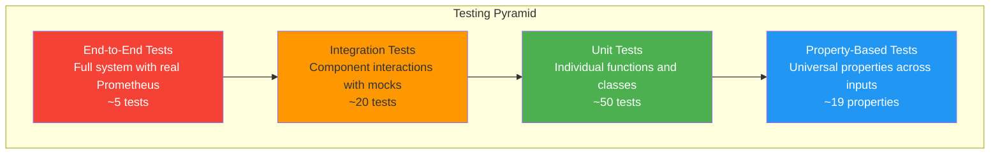
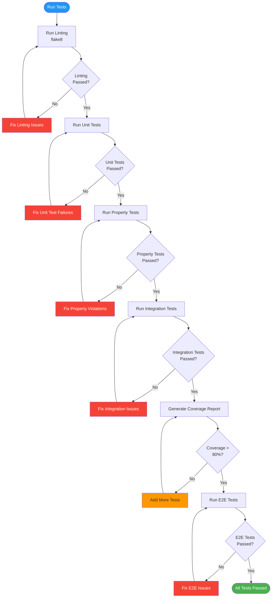

# InfraGuard Testing Guide

## Table of Contents
1. [Testing Strategy](#testing-strategy)
2. [Property-Based Testing](#property-based-testing)
3. [Unit Testing](#unit-testing)
4. [Integration Testing](#integration-testing)
5. [End-to-End Testing](#end-to-end-testing)
6. [Running Tests](#running-tests)

## Testing Strategy

InfraGuard employs a comprehensive testing strategy combining property-based testing, unit testing, integration testing, and end-to-end testing to ensure correctness and reliability.

### Testing Pyramid



### Test Coverage Requirements

- **Overall Coverage**: Minimum 80%
- **Critical Components**: Minimum 90%
  - `src/ml/isolation_forest.py`
  - `src/collector/prometheus.py`
  - `src/alerter/alert_manager.py`

## Property-Based Testing

InfraGuard uses property-based testing to verify universal properties across a wide range of generated inputs using the **Hypothesis** library.

### Installation

```bash
pip install hypothesis pytest
```

### Configuration

```python
# conftest.py
from hypothesis import settings, Verbosity

# Configure Hypothesis for all tests
settings.register_profile("default", max_examples=100, verbosity=Verbosity.normal)
settings.register_profile("ci", max_examples=200, verbosity=Verbosity.verbose)
settings.load_profile("default")
```

### Correctness Properties

InfraGuard defines 19 correctness properties that must hold across all valid inputs:

#### Property 1: Prometheus Response Transformation Preserves Data

```python
from hypothesis import given, strategies as st
import pandas as pd
from src.collector.formatter import DataFormatter

@given(
    timestamps=st.lists(st.datetimes(), min_size=1, max_size=100),
    values=st.lists(st.floats(min_value=0, max_value=100), min_size=1, max_size=100)
)
def test_property_1_prometheus_transformation_preserves_data(timestamps, values):
    """
    Property 1: For any valid Prometheus JSON response, transforming it to a
    Pandas DataFrame SHALL preserve all metric values, timestamps, and labels
    without data loss.
    """
    # Arrange: Create mock Prometheus response
    prometheus_response = {
        "status": "success",
        "data": {
            "resultType": "matrix",
            "result": [
                {
                    "metric": {"__name__": "cpu", "instance": "host1"},
                    "values": [[ts.timestamp(), val] for ts, val in zip(timestamps, values)]
                }
            ]
        }
    }
    
    # Act: Transform to DataFrame
    formatter = DataFormatter()
    df = formatter.format_prometheus_response(prometheus_response)
    
    # Assert: All values preserved
    assert len(df) == len(values)
    assert all(df['value'] == values)
    assert all(df['metric_name'] == 'cpu')
    assert all(df['instance'] == 'host1')
```

#### Property 2: Timestamp Precision Preservation

```python
@given(
    timestamps=st.lists(
        st.datetimes(min_value=datetime(2020, 1, 1), max_value=datetime(2025, 1, 1)),
        min_size=1,
        max_size=100
    )
)
def test_property_2_timestamp_precision_preservation(timestamps):
    """
    Property 2: For any metric timestamp, the transformation pipeline SHALL
    maintain second-level precision throughout all processing stages.
    """
    # Arrange: Create DataFrame with timestamps
    df = pd.DataFrame({
        'timestamp': timestamps,
        'value': [1.0] * len(timestamps)
    })
    
    # Act: Normalize timestamps
    formatter = DataFormatter()
    normalized_df = formatter.normalize_timestamps(df)
    
    # Assert: Second-level precision maintained
    for original, normalized in zip(timestamps, normalized_df['timestamp']):
        assert original.replace(microsecond=0) == normalized
```

#### Property 4: Anomaly Score Computation Completeness

```python
@given(
    data=st.data(),
    n_points=st.integers(min_value=10, max_value=100)
)
def test_property_4_anomaly_score_computation_completeness(data, n_points):
    """
    Property 4: For any formatted metrics DataFrame, the ML_Detector SHALL
    compute an anomaly score for every data point in the input.
    """
    from src.ml.isolation_forest import IsolationForestDetector
    
    # Arrange: Create formatted metrics DataFrame
    df = pd.DataFrame({
        'value': data.draw(st.lists(st.floats(min_value=0, max_value=100), min_size=n_points, max_size=n_points)),
        'rolling_mean_5m': data.draw(st.lists(st.floats(min_value=0, max_value=100), min_size=n_points, max_size=n_points)),
        'rolling_std_5m': data.draw(st.lists(st.floats(min_value=0, max_value=10), min_size=n_points, max_size=n_points)),
        'rate_of_change': data.draw(st.lists(st.floats(min_value=-10, max_value=10), min_size=n_points, max_size=n_points)),
        'hour_of_day': data.draw(st.lists(st.integers(min_value=0, max_value=23), min_size=n_points, max_size=n_points)),
        'day_of_week': data.draw(st.lists(st.integers(min_value=0, max_value=6), min_size=n_points, max_size=n_points))
    })
    
    # Train a simple model
    detector = IsolationForestDetector({'confidence_threshold': 85.0})
    detector.train(df)
    
    # Act: Detect anomalies
    result = detector.detect_anomalies(df)
    
    # Assert: Score computed for every point
    assert len(result.scores) == n_points
```

#### Property 5: Confidence Percentage Validity

```python
@given(
    anomaly_scores=st.lists(st.floats(min_value=-1.0, max_value=1.0), min_size=1, max_size=100)
)
def test_property_5_confidence_percentage_validity(anomaly_scores):
    """
    Property 5: For any anomaly score, the computed confidence percentage
    SHALL be a valid number in the range [0, 100].
    """
    from src.ml.isolation_forest import IsolationForestDetector
    import numpy as np
    
    # Arrange
    detector = IsolationForestDetector({'confidence_threshold': 85.0})
    scores = np.array(anomaly_scores)
    
    # Act
    confidence = detector.compute_confidence(scores)
    
    # Assert
    assert 0 <= confidence <= 100
    assert not np.isnan(confidence)
    assert not np.isinf(confidence)
```

#### Property 6: Threshold-Based Alert Triggering

```python
@given(
    confidence=st.floats(min_value=0, max_value=100),
    threshold=st.floats(min_value=0, max_value=100)
)
def test_property_6_threshold_based_alert_triggering(confidence, threshold):
    """
    Property 6: For any anomaly result with confidence C and threshold T,
    an alert SHALL be triggered if and only if C >= T.
    """
    # Act: Determine if alert should trigger
    should_trigger = confidence >= threshold
    
    # Assert: Verify comparison logic
    assert should_trigger == (confidence >= threshold)
```

### Property Test Organization

```
tests/property/
├── test_data_transformation.py    # Properties 1-3
├── test_ml_properties.py          # Properties 4-10
├── test_alert_properties.py       # Properties 11-16
└── test_config_properties.py      # Properties 17-19
```

### Running Property Tests

```bash
# Run all property tests with default profile (100 examples)
pytest tests/property/ -v

# Run with CI profile (200 examples)
pytest tests/property/ -v --hypothesis-profile=ci

# Run specific property test
pytest tests/property/test_data_transformation.py::test_property_1_prometheus_transformation_preserves_data -v

# Show Hypothesis statistics
pytest tests/property/ -v --hypothesis-show-statistics
```

## Unit Testing

Unit tests verify specific behaviors of individual components with concrete examples.

### Example Unit Tests

#### Collector Tests

```python
# tests/unit/test_collector.py
import pytest
from src.collector.prometheus import PrometheusCollector, PrometheusConnectionError

def test_collector_initialization():
    """Test PrometheusCollector initializes correctly."""
    config = {
        'url': 'http://prometheus:9090',
        'queries': {'cpu': 'rate(cpu[5m])'},
        'timeout': 30
    }
    collector = PrometheusCollector(config)
    
    assert collector.prometheus_url == 'http://prometheus:9090'
    assert 'cpu' in collector.queries
    assert collector.timeout_seconds == 30


def test_collector_missing_url_raises_error():
    """Test PrometheusCollector raises error when URL is missing."""
    config = {'queries': {'cpu': 'rate(cpu[5m])'}}
    
    with pytest.raises(ValueError, match="prometheus_url is required"):
        PrometheusCollector(config)


def test_execute_query_with_mock_response(mocker):
    """Test execute_query with mocked Prometheus response."""
    config = {
        'url': 'http://prometheus:9090',
        'queries': {'cpu': 'rate(cpu[5m])'}
    }
    collector = PrometheusCollector(config)
    
    # Mock requests.get
    mock_response = mocker.Mock()
    mock_response.status_code = 200
    mock_response.json.return_value = {
        'status': 'success',
        'data': {'result': []}
    }
    mocker.patch('requests.get', return_value=mock_response)
    
    # Execute query
    result = collector.execute_query('rate(cpu[5m])')
    
    assert result['status'] == 'success'
```

#### ML Detector Tests

```python
# tests/unit/test_ml_detector.py
def test_detector_load_model_file_not_found():
    """Test detector raises error when model file doesn't exist."""
    from src.ml.isolation_forest import IsolationForestDetector, ModelLoadError
    
    detector = IsolationForestDetector({'model_path': 'nonexistent.pkl'})
    
    with pytest.raises(ModelLoadError, match="Model file not found"):
        detector.load_model()


def test_detector_confidence_calculation():
    """Test confidence percentage calculation."""
    from src.ml.isolation_forest import IsolationForestDetector
    import numpy as np
    
    detector = IsolationForestDetector({'confidence_threshold': 85.0})
    
    # Very anomalous scores (very negative)
    scores = np.array([-0.5, -0.4, -0.3])
    confidence = detector.compute_confidence(scores)
    assert confidence >= 90  # Should be high confidence
    
    # Normal scores (positive)
    scores = np.array([0.3, 0.4, 0.5])
    confidence = detector.compute_confidence(scores)
    assert confidence <= 20  # Should be low confidence
```

### Unit Test Organization

```
tests/unit/
├── test_collector.py
├── test_formatter.py
├── test_ml_detector.py
├── test_forecaster.py
├── test_alert_manager.py
├── test_slack.py
├── test_jira.py
└── test_runbook_mapper.py
```

### Running Unit Tests

```bash
# Run all unit tests
pytest tests/unit/ -v

# Run specific test file
pytest tests/unit/test_collector.py -v

# Run specific test
pytest tests/unit/test_collector.py::test_collector_initialization -v

# Run with coverage
pytest tests/unit/ --cov=src --cov-report=html
```

## Integration Testing

Integration tests verify component interactions with mocked external dependencies.

### Example Integration Tests

#### Collection Pipeline Test

```python
# tests/integration/test_collection_pipeline.py
import pytest
from src.collector.prometheus import PrometheusCollector
from src.collector.formatter import DataFormatter

def test_collection_to_formatting_pipeline(mocker):
    """Test full pipeline from collection to formatted DataFrame."""
    # Mock Prometheus response
    mock_response = mocker.Mock()
    mock_response.status_code = 200
    mock_response.json.return_value = {
        'status': 'success',
        'data': {
            'resultType': 'matrix',
            'result': [
                {
                    'metric': {'__name__': 'cpu', 'instance': 'host1'},
                    'values': [[1609459200, '0.5'], [1609459260, '0.6']]
                }
            ]
        }
    }
    mocker.patch('requests.get', return_value=mock_response)
    
    # Collect metrics
    collector = PrometheusCollector({
        'url': 'http://prometheus:9090',
        'queries': {'cpu': 'rate(cpu[5m])'}
    })
    raw_metrics = collector.collect_metrics()
    
    # Format metrics
    formatter = DataFormatter()
    formatted_metrics = formatter.add_feature_columns(raw_metrics)
    
    # Verify pipeline output
    assert not formatted_metrics.empty
    assert 'value' in formatted_metrics.columns
    assert 'rolling_mean_5m' in formatted_metrics.columns
    assert 'hour_of_day' in formatted_metrics.columns
```

#### Alert Delivery Test

```python
# tests/integration/test_alert_delivery.py
def test_alert_delivery_to_slack_and_jira(mocker):
    """Test alert delivery to both Slack and Jira."""
    from src.alerter.alert_manager import AlertManager
    from src.ml.isolation_forest import AnomalyResult
    import pandas as pd
    import numpy as np
    
    # Mock Slack webhook
    mock_slack_response = mocker.Mock()
    mock_slack_response.status_code = 200
    
    # Mock Jira API
    mock_jira_response = mocker.Mock()
    mock_jira_response.status_code = 201
    mock_jira_response.json.return_value = {'key': 'INC-1045'}
    
    mocker.patch('requests.post', side_effect=[mock_jira_response, mock_slack_response])
    
    # Create alert manager
    config = {
        'slack': {'webhook_url': 'https://hooks.slack.com/test', 'channel': '#test'},
        'jira': {
            'api_url': 'https://jira.test',
            'project_key': 'INC',
            'username': 'test',
            'api_token': 'token'
        },
        'runbooks': {'cpu_utilization': {'anomaly': 'https://wiki.test/cpu'}}
    }
    manager = AlertManager(config)
    
    # Send alert
    anomaly = AnomalyResult(
        is_anomaly=True,
        confidence=95.0,
        scores=np.array([-0.5]),
        anomalous_points=pd.DataFrame({'value': [1.0]}),
        metadata={}
    )
    
    status = manager.send_alert(anomaly, 'cpu_utilization')
    
    # Verify both channels succeeded
    assert status.slack_success
    assert status.jira_success
    assert status.jira_ticket_id == 'INC-1045'
```

### Integration Test Organization

```
tests/integration/
├── test_collection_pipeline.py
├── test_ml_pipeline.py
└── test_alert_delivery.py
```

### Running Integration Tests

```bash
# Run all integration tests
pytest tests/integration/ -v

# Run with mocking verification
pytest tests/integration/ -v --strict-markers
```

## End-to-End Testing

E2E tests verify the complete system with real Prometheus (in Docker).

### Docker Test Environment

```yaml
# tests/e2e/docker-compose.test.yml
version: '3.8'

services:
  prometheus:
    image: prom/prometheus:latest
    ports:
      - "9090:9090"
    volumes:
      - ./prometheus.yml:/etc/prometheus/prometheus.yml

  dummy-app:
    build: ../../dummy-app
    ports:
      - "8080:8080"
```

### Example E2E Test

```python
# tests/e2e/test_full_system.py
import pytest
import time
import docker

@pytest.fixture(scope="module")
def docker_environment():
    """Start Prometheus and dummy app in Docker."""
    client = docker.from_env()
    
    # Start Prometheus
    prometheus = client.containers.run(
        'prom/prometheus:latest',
        detach=True,
        ports={'9090/tcp': 9090},
        volumes={
            './tests/e2e/prometheus.yml': {'bind': '/etc/prometheus/prometheus.yml', 'mode': 'ro'}
        }
    )
    
    # Wait for Prometheus to be ready
    time.sleep(5)
    
    yield prometheus
    
    # Cleanup
    prometheus.stop()
    prometheus.remove()


def test_full_anomaly_detection_cycle(docker_environment, mocker):
    """Test complete cycle from metrics collection to alert delivery."""
    from main import InfraGuard
    
    # Mock alert delivery to avoid external calls
    mock_slack = mocker.patch('src.alerter.slack.SlackNotifier.send_message', return_value=True)
    mock_jira = mocker.patch('src.alerter.jira.JiraNotifier.create_ticket', return_value='INC-TEST')
    
    # Create InfraGuard instance
    app = InfraGuard('tests/e2e/test_config.yaml')
    
    # Execute one collection cycle
    app._execute_collection_cycle()
    
    # Verify metrics were collected
    assert True  # Placeholder for actual verification
```

### Running E2E Tests

```bash
# Start test environment
docker-compose -f tests/e2e/docker-compose.test.yml up -d

# Run E2E tests
pytest tests/e2e/ -v

# Cleanup
docker-compose -f tests/e2e/docker-compose.test.yml down
```

## Running Tests

### Test Execution Flow



### Quick Commands

```bash
# Run all tests
pytest

# Run with coverage
pytest --cov=src --cov-report=html --cov-report=term

# Run specific test type
pytest tests/unit/ -v
pytest tests/property/ -v
pytest tests/integration/ -v
pytest tests/e2e/ -v

# Run with markers
pytest -m "not slow"  # Skip slow tests
pytest -m "critical"  # Run only critical tests

# Run in parallel (requires pytest-xdist)
pytest -n auto

# Run with verbose output
pytest -vv

# Stop on first failure
pytest -x

# Show local variables on failure
pytest -l
```

### CI/CD Pipeline

```yaml
# .github/workflows/ci.yml
name: InfraGuard CI

on: [push, pull_request]

jobs:
  test:
    runs-on: ubuntu-latest
    
    steps:
      - uses: actions/checkout@v2
      
      - name: Set up Python
        uses: actions/setup-python@v2
        with:
          python-version: '3.9'
      
      - name: Install dependencies
        run: |
          pip install -r requirements.txt
          pip install pytest pytest-cov hypothesis pytest-mock
      
      - name: Run linting
        run: flake8 src/ tests/
      
      - name: Run unit tests
        run: pytest tests/unit/ -v
      
      - name: Run property-based tests
        run: pytest tests/property/ -v --hypothesis-profile=ci
      
      - name: Run integration tests
        run: pytest tests/integration/ -v
      
      - name: Generate coverage report
        run: pytest --cov=src --cov-report=xml --cov-report=term
      
      - name: Upload coverage to Codecov
        uses: codecov/codecov-action@v2
        with:
          file: ./coverage.xml
      
      - name: Build Docker image
        run: docker build -t infraguard:test .
      
      - name: Run E2E tests
        run: |
          docker-compose -f tests/e2e/docker-compose.test.yml up -d
          pytest tests/e2e/ -v
          docker-compose -f tests/e2e/docker-compose.test.yml down
```

### Coverage Report

```bash
# Generate HTML coverage report
pytest --cov=src --cov-report=html

# Open in browser
open htmlcov/index.html

# Generate terminal report
pytest --cov=src --cov-report=term-missing

# Check coverage threshold
pytest --cov=src --cov-fail-under=80
```

### Test Markers

```python
# conftest.py
import pytest

def pytest_configure(config):
    config.addinivalue_line("markers", "slow: marks tests as slow")
    config.addinivalue_line("markers", "critical: marks tests as critical")
    config.addinivalue_line("markers", "integration: marks integration tests")
    config.addinivalue_line("markers", "e2e: marks end-to-end tests")
```

```python
# Using markers in tests
@pytest.mark.slow
def test_long_running_operation():
    pass

@pytest.mark.critical
def test_critical_functionality():
    pass
```

---

**Document Version**: 1.0  
**Last Updated**: 2026-04-06  
**Maintained By**: InfraGuard Team
